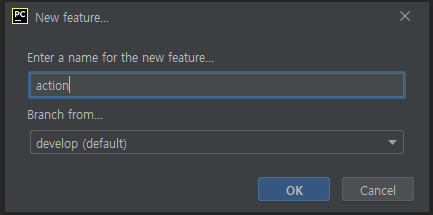
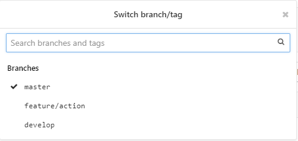
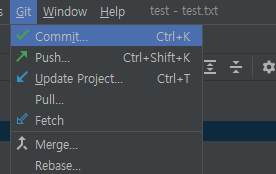

### Init Repo

- 저장소 생성시 기본 master브랜치만 존재하기 때문에 init repo를 통해 git flow에 맞는 브랜치를 구성

- 완료 되고 나면 develop브랜치로 바뀐다.

- 현재는 로컬에서만 gitflow가 적용되었으므로 git push를 통해 기본 브랜치를 깃랩에 적용

### 기능 개발은 feature

- Start Feature를 클릭하여 새로운 브랜치를 생성합니다.

- 기능의 이름과 베이스가 될 브랜치를 선택하고 ok를 눌러줍니다.

- Git -> Show Git Log를 선택하면 현재 로컬의 브랜치를 알 수 있습니다.
- 여기까지 진행하면 로컬에선 feature가 있지만, 깃랩에는 feature/print-hello가 없는 상태이므로 git push를 하여 깃랩 저장소에도 브랜치가 등록되도록 합니다.

- 코드 추가

- 커밋

- Push tags 체크

### merge의 두 가지 방법

> 깃랩을 이용해 create merge request와 merge를 진행하고나면 파이참에서 Finish Feature를 눌렀을 때 오류가 나는 것 같다. 어떻게 해야하는지 물어보자!

1. 깃랩이용

- merge하려는 브랜치를 잘 확인합시다.
- develop을 merge할 시 Delete체크박스를 해제합니다.
  - 병합 후 브랜치를 삭제하겠다는 내용입니다.

2. Finish Feature 이용(깃랩에서 merge만들어서 하는게 충돌 확인 때매 좋을것 같다고 생각들었습니다.)

- Finish Feature를 누르면 로컬에서 자동으로 develop브랜치에 merge됩니다.
- feature/action 브랜치는 삭제됩니다.

- develop에 merge되었으니 push를 통해 git lab에 반영합니다.

