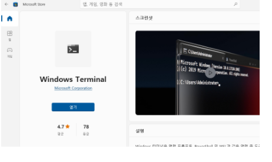
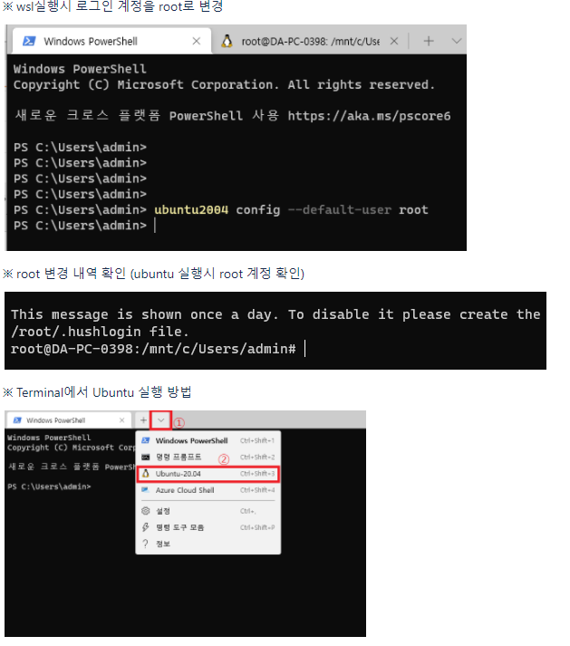
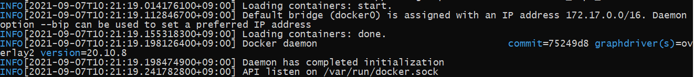

기업에서 도커 데스크톱 유료화로 인해 WSL2에 docker-cli 설치하여 로컬 개발환경 설정 방법입니다.

해당 설정방법은 [Windows10 Home에서 도커 설치 (WSL2)](https://wiki.danawa.com/pages/viewpage.action?pageId=74553768) 에서 Ubuntu 20.04 설치까지 진행해주셔야 됩니다.


**① 도커 데스크톱 삭제**

'프로그램 추가/제거'에서 Docker Desktop 삭제

삭제시 docker desktop에 빌드된 이미지와 컨테이너는 모두 삭제됩니다.


**② Windows Terminal 설치**

윈도우 기본설치되어있는 PowerShell로도 wsl을 사용할 수 있지만 편의성을 위해 Windows Terminal을 사용합니다.

설치 경로: https://www.microsoft.com/store/productId/9N0DX20HK701




**③ Windows Terminal 실행 및 설정**

**ubuntu 기본 계정 설정**

```
// wsl실행시 로그인 계정을 root로 변경
ubuntu2004 config --default-user root
```



**④ Ubuntu 패키지 업데이트 및 부가 설정 (선택)**

해당 작업은 안해도 크게 상관없지만 가독성 및 편의성을 위하여 진행하였습니다.

아래 웹페이지 순서대로 진행하시면 됩니다.

[Ubuntu 설치 후에 처음 할 일 - WSL 시작하기 (wslhub.com)](https://wslhub.com/wsl-firststep/firststep/ubuntu/)


**⑤ WSL2(Ubuntu)내 docker 설치**

**ubuntu**

```
//필요 패키지 설치
sudo apt-get install apt-transport-https ca-certificates curl gnupg lsb-release
sudo apt-get update
 
//docker 공식 GPG 키
curl -fsSL https://download.docker.com/linux/ubuntu/gpg | sudo apt-key add
 
//docker stable repo 사용
sudo add-apt-repository "deb [arch=amd64] https://download.docker.com/linux/ubuntu $(lsb_release -cs) stable"
 
//docker 설치
sudo apt install docker-ce docker-ce-cli containerd.io
sudo curl -L "https://github.com/docker/compose/releases/download/1.29.2/docker-compose-$(uname -s)-$(uname -m)" -o /usr/local/bin/docker-compose
sudo chmod +x /usr/local/bin/docker-compose
```


**⑥ WSL2내 도커 정상 설치 확인**

**ubuntu**

```
sudo dockerd
```

아래와 같은 메세지 출력시 정상




아래 명령어 실행 후 오류메세지 발생시 docker 설치에 문제가 있는지 확인 필요

**WSL(Ubuntu)**

```
//WSL(ubuntu)내에서 실행
docker run hello-world
docker-compose --help
```

**PowerShell**

```
//PowerShell에서 실행
wsl docker run hello-world
wsl docker-compose --help
```


**⑦ dockerfile 수정**

[PriceCompare / Dockerfile · GitLab (danawa.com)](https://gitlab.danawa.com/pricecompare/dockerfile) master 브랜치로 pull 받아 사용

해당 폴더내 .env 파일 수정

**.env**

```

####################################
### VOLUME 변수
####################################
#- 본인의 환경 구성에 맞게 주석 처리 (첫번째줄 도커데스크톱, 두번째줄 wsl, 세번째줄 vm)
#HOST_BASE_DIR= "/c/danawa"
HOST_BASE_DIR= "/mnt/c/danawa"
#HOST_BASE_DIR= "/media/sf_danawa"
```


**⑧ 로컬 서버 실행**

**WSL (Ubuntu)**

```
//git pull 받은 경로로 이동
cd /mnt/c/danawa/dockerfile
 
//docker compose 실행
docker-compose up -d
 
//컨테이너 정상 동작 확인
docker ps -a
```


**⑨ 사용 방법**

PC 재부팅시 자동으로 docker가 실행되는 도커 데스크톱과 다르게 WSL2는 수동 실행이 필요합니다 (윈10 기준)

1. Windows Terminal 실행
2. WSL2(Ubuntu) 실행
3. service docker start 입력 후 실행 (Ubuntu)

한번 실행 후에는 터미널을 종료해도 상관없습니다.


윈도우 시작프로그램에 스크립트를 만들어서 WSL까지는 자동실행하게 할 수 있으나 docker 데몬은 수동실행 해줘야됩니다.

윈11부터는 WSL 기동시 docker 자동실행이 가능해집니다.


※ 출처

[유료화 정책 단행이 예정된 Windows용 도커 데스크톱을 대체할 수 있는 방법을 알아봅니다. | WSLHUB](https://blog.wslhub.com/유료로-전환되는-도커-데스크톱-대안-찾기-윈도우-사용자-74f1a261eb32)

[Docker Desktop 없이 Windows에서 Docker 사용하기 | VNTG 기술블로그 (vntgcorp.github.io)](https://vntgcorp.github.io/DockerWithoutDesktop/)

[Ubuntu 설치 후에 처음 할 일 - WSL 시작하기 (wslhub.com)](https://wslhub.com/wsl-firststep/firststep/ubuntu/)


※ 임시

https://www.bearpooh.com/92

https://blog.dalso.org/linux/wsl2/11306

https://www.ownsoft.xyz/2019/01/portainer.html