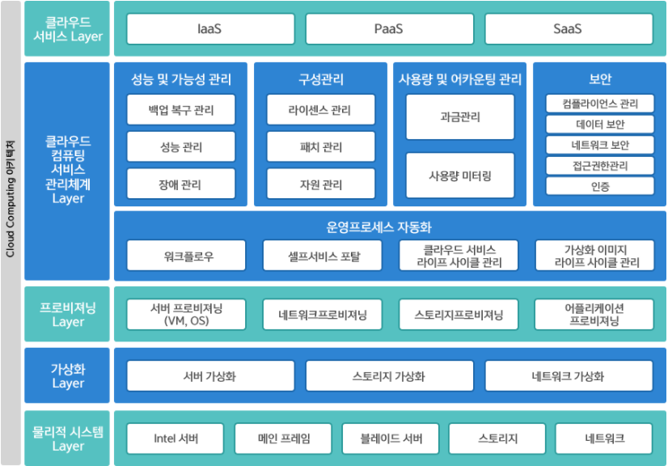

# 참고 자료 : 도커, 컨테이너 빌드업!

# 1. 클라우드 컴퓨팅

## 1.1 클라우드 컴퓨팅 개요

### 1.1.1 클라우드 컴퓨팅이란?

> 인터넷 기술을 이용해서 다수의 사용자에게 하나의 서비스로서 방대한 IT 능력을 제공하는 컴퓨팅 방식

- 클라우드 컴퓨팅 = 그리드 컴퓨팅 + 유틸리티 컴퓨팅
  - 그리드 컴퓨팅 : 가상 네트워크를 이용하여 분산된 컴퓨팅 자원을 공유하도록 하는 기술 방식
  - 유틸리티 컴퓨팅 : 다양한 컴퓨팅 자원에 대한 사용량에 따라 요금을 부과하는 종량제 방식의 기술 기반으로, 필요할 때 가져다 쓴다는 온-디맨드(on-demand) 컴퓨팅 방식(기업 중심의 서비스)
  - 클라우드 컴퓨팅 : 기술적으로는 그리드 컴퓨팅을 따르고, 비용적으로는 유틸리티 컴퓨팅을 혼합한 포괄적인 패러다임. 약간의 차이점은 다음과 같다.
    - 기업과 개인이 모두 사용 가능한 서비스
    - 클라우드 서비스를 제공하는 사업자의 컴퓨팅 자원 이용

- 특징
  - 주문형 셀프서비스(on-demand self-service) : 고객이 IT 서비스 제공자의 개입 없이 원하는 시점에 바로 서비스를 사용할 수 있다.
  - 광대역 네트워크 접근(broad network access) : 각 클라우드 서비스 업체가 제공하는 광대역 네트워크를 이용하여 다양한 클라이언트 플랫폼이 빠르게 접속할 수 있따.
  - 신속한 탄력성과 확장성(rapid elasticity and scalability) : 자동 조정 기능을 통해 몇 분 안에 신속한 확장과 축소를 조정할 수 있따.
  - 자원의 공동관리(resource pooling) : 물리적 및 가상화된 자원을 풀로 관리하며, 탄력적으로 사용자 요구에 따라 동적으로 할당 또는 재할당된다.
  - 측정 가능한 서비스()measured service : 자원 사용량이 실시간으로 수집되는 요금산정 기능을 통해 비용이 발생한다.

### 1.1.2 클라우드 컴퓨팅 구조

