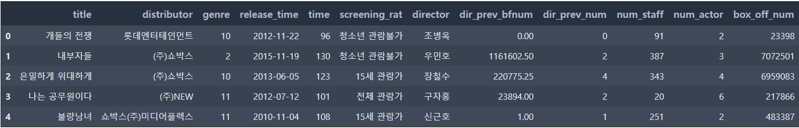
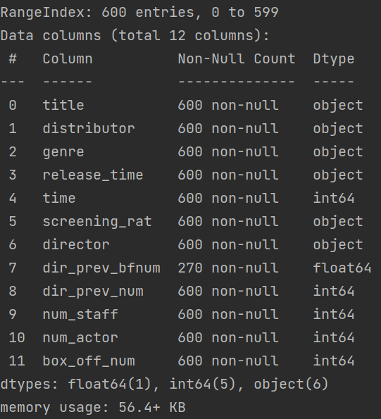
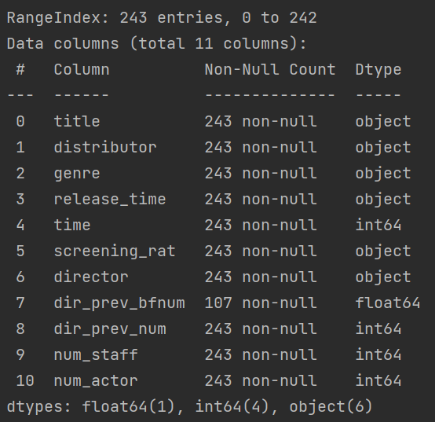
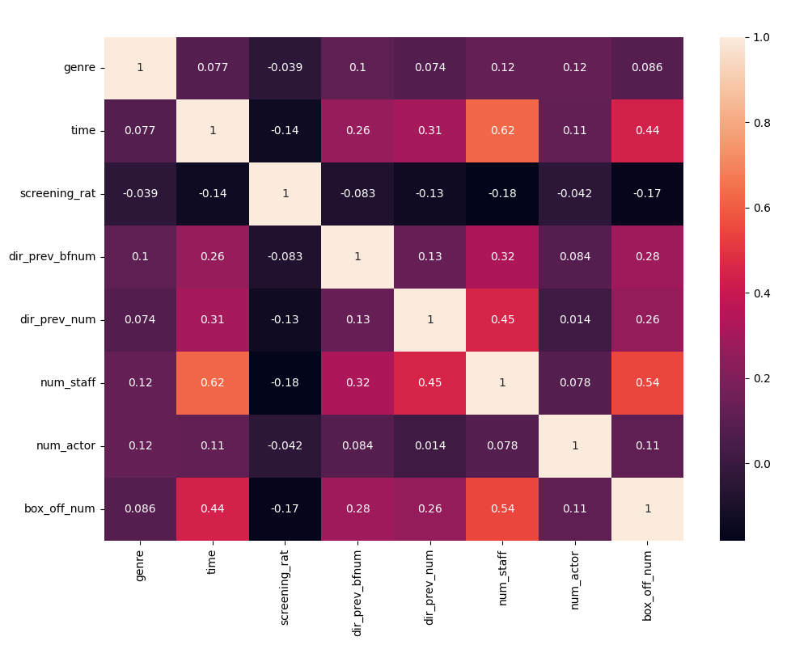
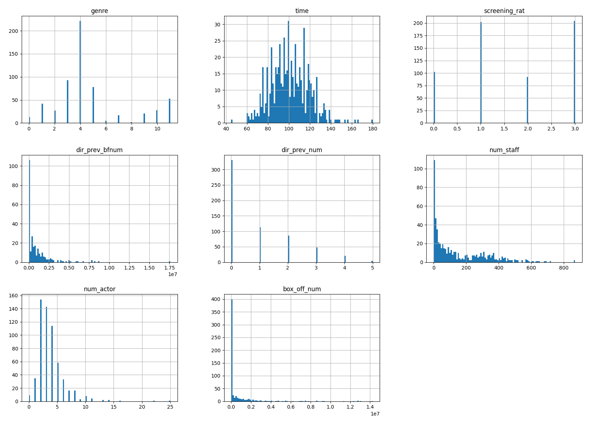
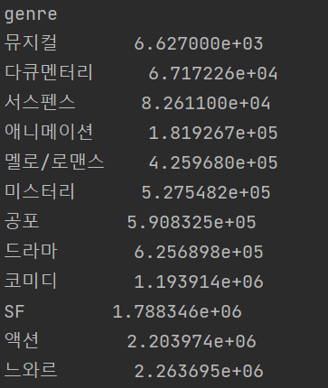
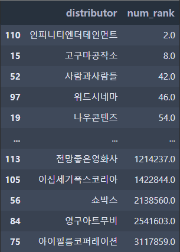
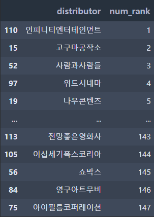

## 데이터 분석

### 데이터

- title : 영화의 제목
- distributor : 배급사
- genre : 장르
- release_time : 개봉일
- time : 상영시간(분)
- screening_rat : 상영등급
- director : 감독이름
- dir_prev_bfnum : 해당 감독이 이 영화를 만들기 전 제작에 참여한 영화에서의 평균 관객수(단 관객수가 알려지지 않은 영화 제외)
- dir_prev_num : 해당 감독이 이 영화를 만들기 전 제작에 참여한 영화의 개수(단 관객수가 알려지지 않은 영화 제외)
- num_staff : 스텝수
- num_actor : 주연배우수
- box_off_num : 관객수


### 분석

- head()를 통해 데이터를 보자



- 제목은 제외하자.

- 결측치 : dir_prev_bfnum이 train에서는 330개, test에서는 136개의 결측치가 존재
- train



- test



- 원핫 인코딩 - distributor, genre, release_time, screening_rat, director
  - 주의점: distributor와 director, release_time을 인트형으로 바꿔서 하면 test데이터에 train데이터에는 없는 데이터가 들어있어서 결측치 문제가 발생한다. 그에 따른 방안을 생각해보자.

- 상관관계



- 분포도



- 장르별 영화 관객수 평균값



- 배급사별 영화 관객수 중위값 기준



- 순차적 코딩



- 상영등급은 더미 변수로 만든다.

```python
train_input = pd.get_dummies(columns = ['screening_rat'], data = train_input)
```

