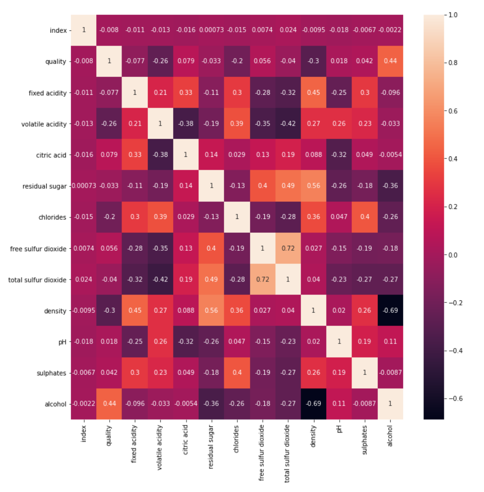
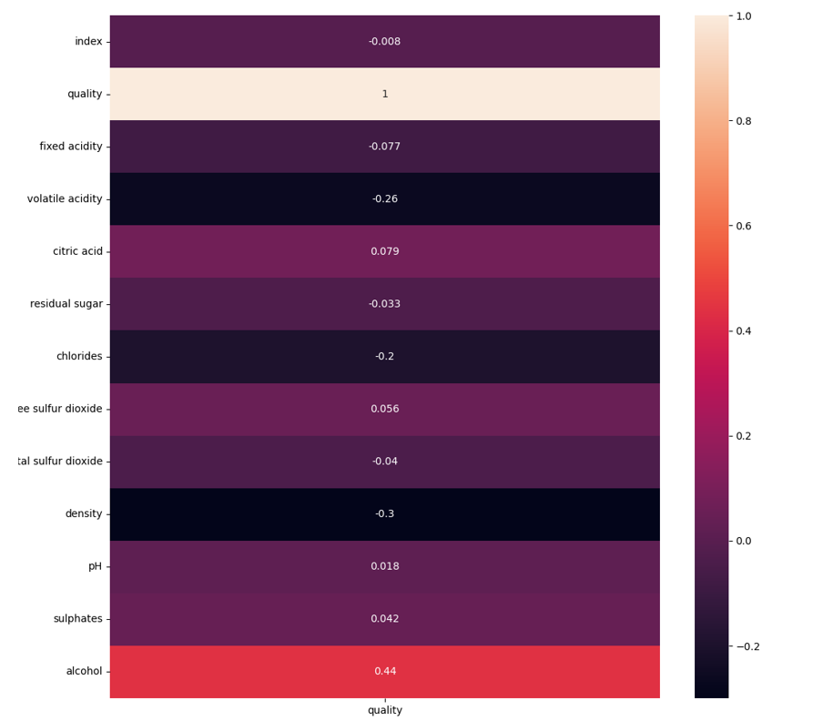
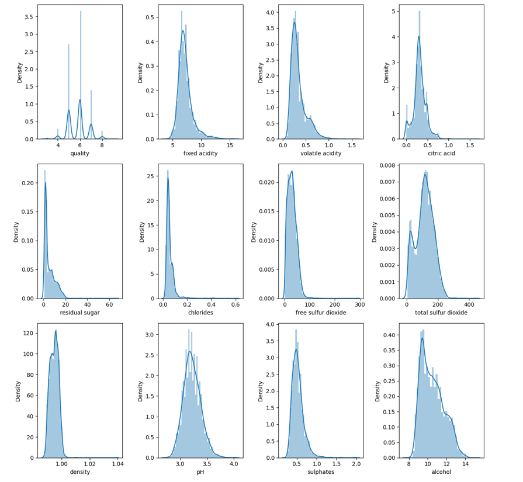
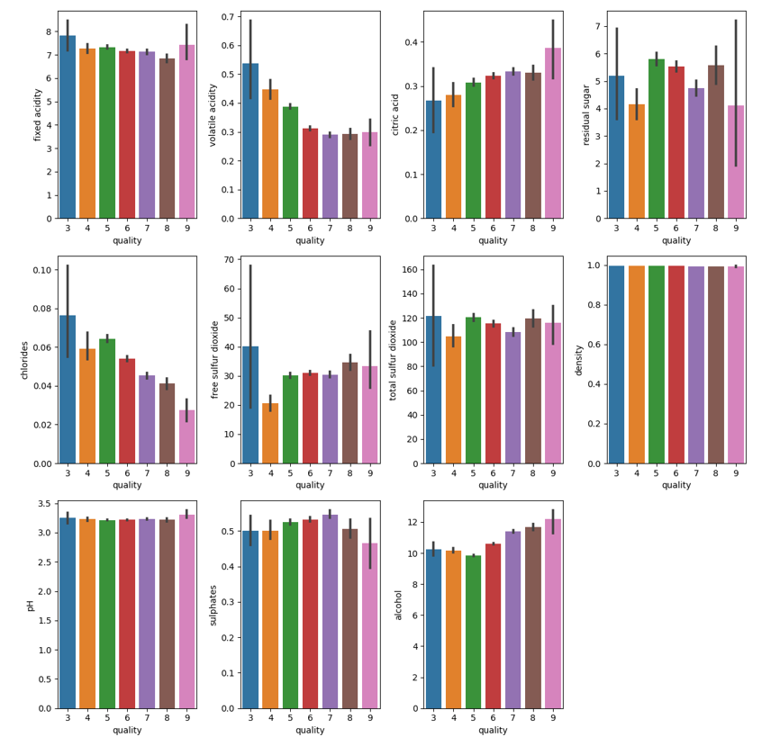

# 참고 사항

### [DACON](https://dacon.io/competitions/open/235610/overview/description)에서 진행한 와인 품질 분류 학습

### 느낀점

사이킷런(sklearn), pandas, numpy라이브러리를 이용하였습니다.

처음엔 랜덤 서치, 랜덤 포레스트, 엑스트라 트리, 그레디언트 부스팅, 히스토그램 기반 그레디언트 부스팅 등 다양한 머신러닝 지도학습 알고리즘에 대입해 보았습니다.

교차 검증을 통해 측정하였는데 모든 알고리즘에 과대적합 측정치가 나와서 다른 방법을 시도해 보았습니다.

1. 랜덤 포레스트에서 하이퍼 파라미터를 변경해 가면서 과대적합을 줄이며 예측치를 높일 수 있도록 하였습니다.

2. 히스토그램 기반 그래디언트 부스팅의 하이퍼 파라미터를 변경해 가며 과대적합을 줄이는 노력을 했습니다.

3. 예측치를 원하는 quality 피쳐와 상관계수가 높은 피쳐들을 가지고 데이터 분석을 진행하는 과정을 거쳤습니다.

생각보다 예측치가 높게 나오지 않아 과대적합을 줄이고 예측점수를 높이는 방법을 생각해 보고 노력을 해야 할 것 같습니다.


### 사용 모듈

```python
import sys

import pandas as pd
import numpy as np
from scipy.stats import uniform, randint
import matplotlib.pyplot as plt
import seaborn as sns

from sklearn.inspection import permutation_importance
from sklearn.tree import DecisionTreeClassifier
from sklearn.ensemble import HistGradientBoostingClassifier, GradientBoostingClassifier, ExtraTreesClassifier, RandomForestClassifier
from sklearn.preprocessing import LabelEncoder, StandardScaler
from sklearn.model_selection import cross_validate, StratifiedKFold, RandomizedSearchCV
```


### 본문 코드

```python
if __name__ == '__main__':
    train_csv = ""
    test_csv = ""
    submission_path = ""
    if len(sys.argv) == 5:
        train_csv = sys.argv[1]
        test_csv = sys.argv[2]
        submission_path = sys.argv[3]
        target = sys.argv[4]
        print("data_setting complete")
    else:
        print("usage : $ python main.py <train_csv> <train_csv> <train_csv> <train_csv>")
        exit(0)

    features = [
        'index',
        'fixed acidity',
        'volatile acidity',
        # 'citric acid',
        'residual sugar',
        # 'chlorides',
        'free sulfur dioxide',
        'total sulfur dioxide',
        # 'density',
        'pH',
        'sulphates',
        # 'alcohol',
        # 'type'
    ]

    # 1. 데이터 불러오기
    train, test = read_csv(train_csv, test_csv)

    # 2. 데이터를 분석
    data = DataAnalysis(train, test)    # 그래프 클래스
    data.feature_correlation()    # 상관관계 그래프
    # data.distribution()   # 분포도 그래프
    # data.distribute_between(target)   # 원하는 속성과 나머지 속성들의 분포도

    # 3. 데이터 전처리
    prep = PreProcessor(train, test)    # 데이터 전처리 클래스
    a, b = prep.object_to_int('type')
    train_input, train_target, test_input = prep.feature_data(features)
    # pd.set_option('display.max_columns', None)
    # print(train_input.head(1))

    # 4.모델 학습
    lm = ModelFactory(train_input, train_target)
    params = {'min_impurity_decrease': uniform(0.0001, 0.001),
                  'max_depth': randint(100, 1000),
                  'min_samples_split': randint(2, 20),
                  'min_samples_leaf': randint(1, 20)}
    model = lm.hist_gradient()
    # model = lm.random_forest()
    # model = lm.random_search(params)
    # model = lm.extra_tree()
    # model = lm.gradient_boosting()

    # 5.교차 검증 및 속성 중요도
    valid = cross_validation(model, train_input, train_target)  # 교차 검증
    print(valid)
    imt = feature_importance(model, train_input, train_target)  # 속성 중요도 검사
    print(imt)
    # print(np.mean(valid['train_score']), np.mean(valid['test_score']))

    # 6. 예측값 만들기
    test_target = predict_data(model, test_input)
    # print(test_target)

    # 7.파일로 저장
    generate_submission(submission_path, test_target)
```


# 데이터 분석

### train 데이터

- quality 품질
- fixed acidity 산도
- volatile acidity 휘발성산
- citric acid 시트르산
- residual sugar 잔당 : 발효 후 와인 속에 남아있는 당분
- chlorides 염화물
- free sulfur dioxide 독립 이산화황
- total sulfur dioxide 총 이산화황
- density 밀도
- pH 수소이온농도
- sulphates 황산염
- alcohol 도수
- type 종류


### 데이터 불러오기

```python
def read_csv(train_csv, test_csv):
    # 학습할 훈련 데이터와 테스트 데이터 불러오기
    train = pd.read_csv(train_csv)
    test = pd.read_csv(test_csv)
    return train, test
```

### 데이터의 종류와 특징

- 5497개 훈련 데이터
- 결측치 없음
- 입력 : quality를 제외한 나머지 특성
- 타깃 : quality
- 13개의 column - index제외 12개


### 데이터 그래프 분석

- index는 제외

- quality를 기준으로 보자

- alchol: 양의 상관관계

- density : 음의 상관관계

- alchol은 quality가 증가할 때 유사한 경향으로 증가

- density는 qulity가 감소할 때 유사한 경향으로 감소

```python
class DataAnalysis:
    # 데이터 분석 클래스
    plt.figure(figsize=(12, 12))
    def __init__(self, train, test):
        self.train = train
        self.test = test

    def feature_correlation(self):
        # 속성간 상관관계 그래프
        sns.heatmap(data=self.train.corr(), annot=True)
        plt.show()

    def distribution(self):
        # 각 피쳐 별 분포도
        for i in range(1, 13):
            plt.subplot(3, 4, i)
            # train의 i번째열의 전체 행
            sns.distplot(self.train.iloc[:, i])
        plt.tight_layout()
        plt.show()

    def distribute_between(self, feature):
        # train 데이터에서 각 변수와 param 사이 분포 그래프
        for i in range(2, 13):
            plt.subplot(3, 4, i - 1)
            sns.barplot(x=feature, y=self.train.columns[i], data=self.train)
        plt.tight_layout()
        plt.show()
```

- 속성간 상관관계 그래프





- 각 변수별 분포



- train에서 각 변수와 quality 변수 사이 분포 확인



### 데이터 전처리

```python
class PreProcessor:
    # 데이터 전처리 클래스
    def __init__(self, train, test):
        self.train = train
        self.test = test

    def object_to_int(self, feature):
        # 오브젝트 타입을 숫자로 변환 하는 함수
        # 현재 type이 오브젝트로 되어있으므로 Red = 1, white = 0로 변경
        enc = LabelEncoder()
        enc.fit(self.train[feature])
        train[feature] = enc.transform(self.train[feature])
        test[feature] = enc.transform(self.test[feature])
        # self.train['type'] = self.train['type'].map({'white':0, 'red':1}).astype(int)
        # self.test['type'] = self.test['type'].map({'white':0, 'red':1}).astype(int)
        return train, test

    def feature_data(self, features):
        # 테스트 인풋, 학습 인풋, 학습 타겟 데이터 속성 조절 및 정규화 함수
        # feature : 속성값 리스트
        train_target = self.train['quality'].copy()
        train_input = self.train.drop(features + ['quality'], axis=1)
        test_input = self.test.drop(features, axis=1)
        # 이 방식으로도 가능
        # train_input = pd.concat([train['alcohol'], train['density']], axis=1)
        # test_input = pd.concat([test['alcohol'], test['density']], axis=1)

        # 표준점수 = (값 - 평균) / 분산
        # ss = StandardScaler()
        # ss.fit(train_input)
        # train_scale = ss.transform(train_input)
        # test_scale = ss.transform(test_input)
        return train_input, train_target, test_input
```


### 모델 학습

```python
class ModelFactory:
    # 학습 모델 클래스
    def __init__(self, train_input, train_target):
        # train_input : 훈련 입력 데이터
        # train_target : 훈련 정답 데이터
        self.train_input = train_input
        self.train_target = train_target

    def hist_gradient(self):
        # 히스토그램 그래디언트 부스팅 학습 모델
        hgb = HistGradientBoostingClassifier()
        hgb.fit(self.train_input, self.train_target)
        return hgb

    def random_forest(self):
        # 랜덤 포레스트 학습 모델
        rf = RandomForestClassifier()
        rf.fit(self.train_input, self.train_target)
        return rf

    def random_search(self, params):
        # 랜덤 서치 학습 모델
        rs = RandomizedSearchCV(DecisionTreeClassifier(), params)
        rs.fit(self.train_input, self.train_target)
        return rs

    def extra_tree(self):
        # 엑스트라 트리 학습 모델
        et = ExtraTreesClassifier(params)
        et.fit(self.train_input, self.train_target)
        return et

    def gradient_boosting(self):
        # 그래디언트 부스팅 모델
        gb = GradientBoostingClassifier()
        gb.fit(self.train_input, self.train_target)
        return gb
```


### 교차 검증 및 속성 중요도

```python
def cross_validation(model, train_input, train_target):
    # 교차 검증 함수
    # model : 데이터 학습 모델
    # train_input : 학습 입력 데이터
    # train_target : 학습 정답 데이터
    return cross_validate(model, train_input, train_target,
                          return_train_score=True,
                          cv=StratifiedKFold(shuffle=True),
                          n_jobs=-1)

def feature_importance(model, train_input, train_target):
    # 속성값 중요도 검사 함수
    # model : 데이터 학습 모델
    # train_input : 학습 입력 데이터
    # train_target : 학습 정답 데이터
    return permutation_importance(model, train_input, train_target,
                                  n_repeats=1, n_jobs=-1)
```


### 예측값 반환

```python
def predict_data(model, test_input):
    # 예측값 반환 함수
    # model : 학습된 모델
    # test_input : 테스트 입력 데이터
    return model.predict(test_input)
```


### 모델의 test 예측값 파일 생성

```python
def generate_submission(submission_path ,test_target):
    # 모델의 test 예측값 파일 생성 함수
    submission = pd.read_csv(submission_path)
    submission['quality'] = test_target
    submission.to_csv(submission_path, index=False)
```
