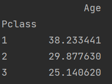
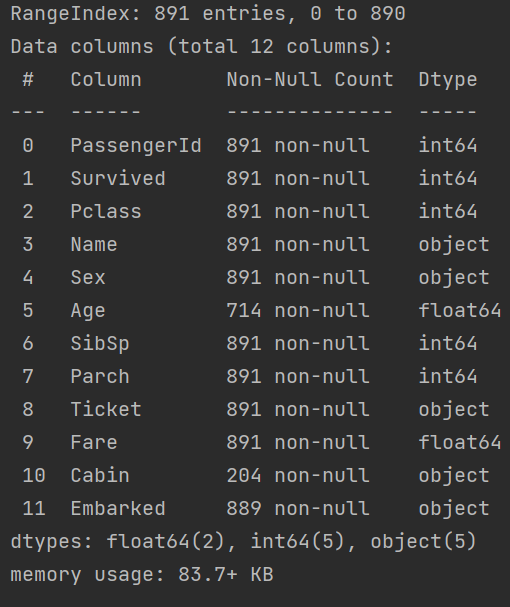
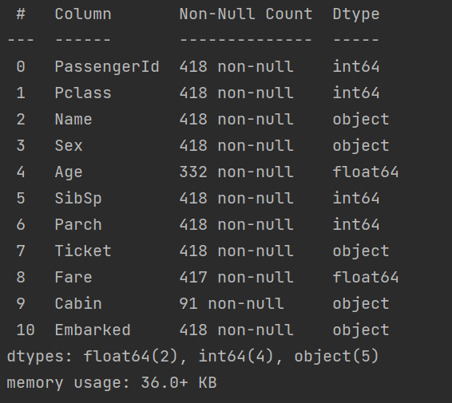
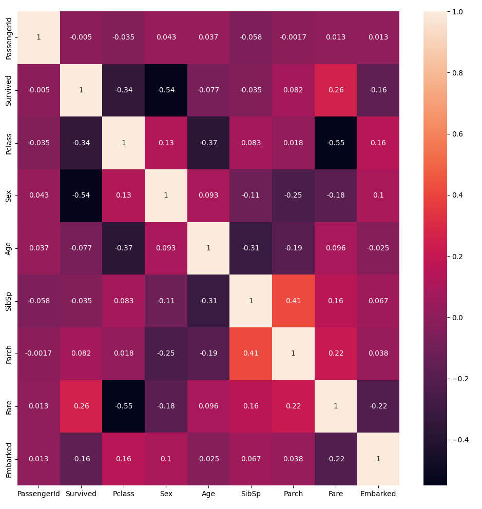
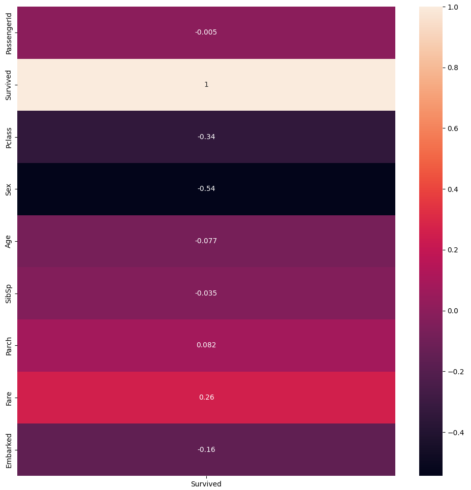
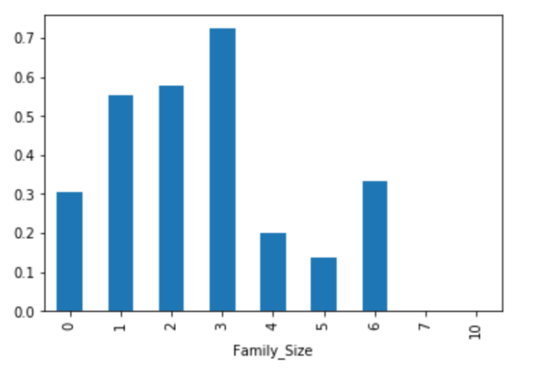

# 참고 사항

### [DACON 타이타닉 생존자 구하기](https://dacon.io/competitions/open/235539/overview/description)에 대한 데이터 분석 및 예측입니다.


### 사용 모듈

```python
import sys

import pandas as pd
import numpy as np
import matplotlib.pyplot as plt
import seaborn as sns

from lightgbm import LGBMClassifier

from sklearn.preprocessing import LabelEncoder
from sklearn.linear_model import LogisticRegression
from sklearn.tree import DecisionTreeClassifier
from sklearn.ensemble import HistGradientBoostingClassifier, GradientBoostingClassifier, ExtraTreesClassifier, RandomForestClassifier
from sklearn.model_selection import cross_validate, StratifiedKFold, RandomizedSearchCV
from sklearn.inspection import permutation_importance
```


### 본문 코드

```python
if __name__ == "__main__":
    train_csv = ""
    test_csv = ""
    submission_path = ""
    save_path = ""
    if len(sys.argv) == 5:
        train_csv = sys.argv[1]
        test_csv = sys.argv[2]
        submission_path = sys.argv[3]
        save_path = sys.argv[4]
    else:
        print("usage : $ python analysis.py <train_csv> <train_csv> <train_csv> <train_csv>")
        exit(0)

# 1. 데이터 읽어오기
    train, test = read_csv(train_csv, test_csv)
    train = train.drop(['PassengerId', 'Name', 'Ticket', 'Cabin'], axis=1)
    test = test.drop(['PassengerId', 'Name', 'Ticket', 'Cabin'], axis=1)

# 2. 데이터 전처리 및 분석
    # 2-1) 결측치 채우기
    pre = PreProcessor(train, test)
        # 2-1-1) 평균값으로 채움
    # train, test = pre.fill_value()
    # pre.train, pre.test = train, test
        # 2-1-2) 제거해서 해보자
    # train, test = pre.del_nul()
    # pre.train, pre.test = train, test
        # 2-1-3) Age: Pclass에 따라 평균 채우기
    train, test = pre.Age_mean()
    pre.train, pre.test = train, test

    # 집단에 대한 통계량 확인
    # Pclass 컬럼값에 따른 Fare값의 평균
    # train[['Pclass', 'Fare']].groupby('Pclass').mean()
    # Pclass 컬럼값에 따른 Embarked의 평균균
    # print(train.pivot_table(values='Embarked', index='Pclass', aggfunc='mean'))
    # 2-2) 오브젝트를 인트형으로 바꾸는 작업
    train, test = pre.object_to_int('Sex', 'Embarked')
    pre.train, pre.test = train, test

    # 2-3) 그래프 확인
    analyze = DataAnalyzer(train, test)  # 데이터 그래프 클래스
    # analyze.correlation()   # 상관관계 그래프

    # 2-4) 필요없는 속성 제거
    features = [
        'SibSp',
        'Parch',
        # 'Sex',
        # 'Pclass',
        # 'Age',
        'Fare',
        'Embarked',
        # 'Family_size'
    ]
    train_input, train_target, test_input = pre.feature_data(features)
    pd.set_option('display.max_columns', None)
    print(train_input.head(0))

# 3. 모델 훈련
    lm = ModelFactory(train_input, train_target)
    # model = lm.logistic_reg()
    model = lm.hist_gradient()
    # model = lm.light_gbm()
    # model = lm.random_forest()


# 4. 교차 검증 및 속성 중요도 파악
    valid = cross_validation(model, train_input, train_target)  # 교차 검증
    print(np.mean(valid['train_score']), np.mean(valid['test_score']))
    # print(valid)
    imt = feature_importance(model, train_input, train_target)  # 속성 중요도 검사
    print(imt['importances_mean'])

# 5. 예측값 만들기
    test_target = predict_data(model, test_input)

# 6. 파일로 저장
    generate_submission(submission_path, test_target, save_path)
```


## 데이터 분석

### train 데이터

- PassengerID : 탑승객 고유 아이디
- Survival : 탑승객 생존 유무 (0: 사망, 1: 생존)
- Pclass : 등실의 등급
- Name : 이름
- Sex : 성별
- Age : 나이
- Sibsp : 함께 탐승한 형제자매, 아내, 남편의 수
- Parch : 함께 탐승한 부모, 자식의 수
- Ticket :티켓 번호
- Fare : 티켓의 요금
- Cabin : 객실번호
- Embarked : 배에 탑승한 항구 이름 ( C = Cherbourn, Q = Queenstown, S = Southampton)


### 데이터 불러오기

```python
def read_csv(train_csv, test_csv):
    return pd.read_csv(train_csv), pd.read_csv(test_csv)
```


### 데이터 분석

- 891개의 훈련 데이터

- 결측치 존재(Age, cabin, Embarked)
  1. cabin : 정보가 너무 적으므로 제외

  2. 평균으로 채운다.
     1. 예측률 : 81점대로 보류

  3. Age의 결측치를 예측해서 채운다.
     1. Age와 Embarked는 상관관계 그래프 상에서도 큰 상관관계를 갖지 않는 수치를 보인다.
     2. 그렇다면 Age를 먼저 학습 할 때 ->Embarked를 제외
     3. 마지막으로 survived를 예측

     - 교차검증 하였을 때 Age 예측률이 너무 낮아 기각

  4. 제거해서 해본다.

     - 2번과 예측률의 큰 차이가 없어서 보류

  5. 컬럼 대비 평균을 구해보자

     1. 상관관계그래프 확인
     2. Age와 가장 상관관계가 있는 컬럼은 Pclass(등실의 등급)이다.
     3. pclass(1,2,3으로 이루어짐)에 따른 Age 평균을 내서 채워주자.
     4. 

- Age를 그룹으로 나누어서 예측해본다.

- 필요없는 컬럼 정리
  - PassengerId
  - Ticket
  - Cabin
  - Name

- 문자열 -> 인트로 전환
  - Sex
  - Embarked

- 훈련 데이터 셋



- 테스트 셋



### 그래프 클래스

```python
class DataAnlysis:
    # 데이터 분석, 그래프 클래스
    plt.figure(figsize=(12, 12))

    def __init__(self, train, test):
        self.train = train
        self.test = test

    def correlation(self):
        # 상관관계 그래프 생성
        sns.heatmap(data=self.train.corr(), annot=True)
        plt.show()
```


- 상관관계 그래프





- Family_Size 분석
  - 대가족일 수록 생존률이 낮다.
  - 그룹으로 묶어서 생각할 만한다.




### 데이터 불러오기

```python
def read_csv(train_csv, test_csv):
    return pd.read_csv(train_csv), pd.read_csv(test_csv)
```


### 데이터 분석

```python
class DataAnalyzer:
    plt.figure(figsize=(12, 12))
    def __init__(self, train, test):
        self.train = train
        self.test = test

    # 상관관계 그래프 생성
    def correlation(self):
        sns.heatmap(data=self.train.corr(), annot=True)
        plt.show()
```


### 전처리 클래스

```python
class PreProcessor:
    def __init__(self, train, test):
        self.train = train
        self.test = test

    # object를 int형으로 바꾼다.
    def object_to_int(self, *features):
        # female: 0, male: 1
        # C: 0, Q: 1, S: 2
        enc = LabelEncoder()
        for feature in features:
            enc.fit(self.train[feature])
            train[feature] = enc.transform(self.train[feature])
            test[feature] = enc.transform(self.test[feature])
        return train, test

    # 결측치 처리 : 평균으로 결측치 채우기
    def fill_value(self):
        train = self.train.fillna(round(self.train.mean()))
        test = self.test.fillna(round(self.test.mean()))
        return train, test

    # 결측치 처리 : 빈값 제거
    def del_nul(self):
        # 빈값제거
        train = self.train.dropna(axis=0)
        test = self.train.dropna(axis=0)
        return train, test

    # 결측치처리
    # Age : Pclass에 따른 평균으로 채운다.
    # Embarked 다수인 S로 채운다.
    # test의 Fare: Pclass 3의 평균인 12로 채운다.
    def Age_mean(self):
        # 결측값을 갖는 df 생성
        train_age_null = self.train[self.train.Age.isnull()]
        test_age_null = self.test[self.test.Age.isnull()]

        # 데이터를 1, 2, 3으로 나눈다.
        train_firstclass = train_age_null[train_age_null.Pclass == 1]
        train_secondclass = train_age_null[train_age_null.Pclass == 2]
        train_thirdclass = train_age_null[train_age_null.Pclass == 3]
        test_firstclass = test_age_null[test_age_null.Pclass == 1]
        test_secondclass = test_age_null[test_age_null.Pclass == 2]
        test_thirdclass = test_age_null[test_age_null.Pclass == 3]

        # 각 테이블에 결측치를 채운다.
        train_firstclass = train_firstclass.fillna(value='38')
        train_secondclass = train_secondclass.fillna(value='30')
        train_thirdclass = train_thirdclass.fillna(value='25')
        test_firstclass = test_firstclass.fillna(value='41')
        test_secondclass = test_secondclass.fillna(value='29')
        test_thirdclass = test_thirdclass.fillna(value='24')

        # train의 Age의 결측값을 포함하는 행을 삭제
        train_drop = self.train.dropna(subset=['Age'])
        test_drop = self.test.dropna(subset=['Age'])
        train = pd.concat([train_drop, train_firstclass, train_secondclass, train_thirdclass])
        test = pd.concat([test_drop, test_firstclass, test_secondclass, test_thirdclass])
        # 인트형 전환
        train = train.astype({'Age': 'int'})
        test = test.astype({'Age': 'int'})
        # # Embarked, Fare : 결측치 채우기
        test["Fare"].fillna(12, inplace=True)
        # train["Embarked"].fillna('S', inplace=True)
        # Embarked, Fare : 결측치 삭제
        train = train.dropna(subset=['Embarked'])

        # SibSp와 Parch를 더해서 가족의 수 컬럼을 새로 만든다.
        train['Family_Size'] = train['SibSp'] + train['Parch']
        test['Family_Size'] = test['SibSp'] + test['Parch']
        # survibed의 내용에 따라 그룹으로 묶는다.
        train['Family_Size'].apply(lambda x: 0 if x == 0 else x)
        train['Family_Size'].apply(lambda x: 0 if 0 < x <= 3 else x)
        train['Family_Size'].apply(lambda x: 0 if 3 < x else x)
        test['Family_Size'].apply(lambda x: 0 if x == 0 else x)
        test['Family_Size'].apply(lambda x: 0 if 0 < x <= 3 else x)
        test['Family_Size'].apply(lambda x: 0 if 3 < x else x)
        # Fare는 표준편차가 너무 크므로 Log를 씌워주자.
        train['Fare'] = np.log1p(train['Fare'])
        test['Fare'] = np.log1p(test['Fare'])
        return train, test

    # 필요없는 속성값 제거 후 입력과 타깃 데이터 나누기
    def feature_data(self, features):
        train_target = self.train['Survived'].copy()
        train_input = self.train.drop(features + ['Survived'], axis=1)
        test_input = self.test.drop(features, axis=1)
        return train_input, train_target, test_input

    # Age 평균을 위해 데이터 슬라이싱
    # 예측률이 너무 낮아 기각
    def slice_data(self, feature):
        id = self.train[self.train['Age'].isnull()]['PassengerId'].copy()
        train_target = self.train['Age'].copy().dropna().astype({'Age':'int'})
        train_input = self.train.drop(feature, axis=1).dropna().drop('Age', axis=1)
        test_input = self.train[self.train['Age'].isnull()].drop(feature + ['Age'], axis=1)
        return id, train_input, train_target, test_input
```


### 학습 모델 클래스

```python
class ModelFactory:
    def __init__(self, train_input, train_target):
        # train_input : 훈련 입력 데이터
        # train_target : 훈련 정답 데이터
        self.train_input = train_input
        self.train_target = train_target

    # 히스토그램 그래디언트 부스팅 학습 모델
    def hist_gradient(self):
        hgb = HistGradientBoostingClassifier()
        hgb.fit(self.train_input, self.train_target)
        return hgb

    # 랜덤 포레스트 학습 모델
    def random_forest(self):
        rf = RandomForestClassifier()
        rf.fit(self.train_input, self.train_target)
        return rf

    # 랜덤 서치 학습 모델
    def random_search(self, params):
        rs = RandomizedSearchCV(DecisionTreeClassifier(), params)
        rs.fit(self.train_input, self.train_target)
        return rs

    # 엑스트라 트리 학습 모델
    def extra_tree(self):
        et = ExtraTreesClassifier()
        et.fit(self.train_input, self.train_target)
        return et

    # 그래디언트 부스팅 모델
    def gradient_boosting(self):
        gb = GradientBoostingClassifier()
        gb.fit(self.train_input, self.train_target)
        return gb

    # LightGBM 모델
    def light_gbm(self):
        lgbm = LGBMClassifier()
        lgbm.fit(self.train_input, self.train_target)
        return lgbm
    
    # 로지스틱 회귀
    def logistic_reg(self):
        lr = LogisticRegression()
        lr.fit(self.train_input, self.train_target)
        return lr
```


### 교차검증/ 속성 중요도/ 예측값 생성/ 파일 생성

```python
# 교차 검증 함수
def cross_validation(model, train_input, train_target):
    # model : 데이터 학습 모델
    # train_input : 학습 입력 데이터
    # train_target : 학습 정답 데이터
    return cross_validate(model, train_input, train_target,
                          return_train_score=True,
                          cv=StratifiedKFold(shuffle=True),
                          n_jobs=-1)

# 속성값 중요도 검사 함수
def feature_importance(model, train_input, train_target):
    # model : 데이터 학습 모델
    # train_input : 학습 입력 데이터
    # train_target : 학습 정답 데이터
    return permutation_importance(model, train_input, train_target,
                                  n_repeats=1, n_jobs=-1)

# 예측값 반환 함수
def predict_data(model, test_input):
    # model : 학습된 모델
    # test_input : 테스트 입력 데이터
    return model.predict(test_input)

# 모델의 test 예측값 파일 생성 함수
def generate_submission(submission_path ,test_target, save_path):
    submission = pd.read_csv(submission_path)
    submission['Survived'] = test_target
    submission.to_csv(save_path, index=False)
```

