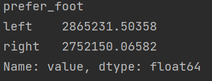

# 참고사항

### [데이콘-해외축구선수이적료예측](https://dacon.io/competitions/open/235538/overview/description)


# 데이터

-  id : 선수 고유의 아이디
-  name : 이름
-  age : 나이
-  continent : 선수들의 국적이 포함되어 있는 대륙입니다
-  contract_until : 선수의 계약기간이 언제까지인지 나타내어 줍니다
-  position : 선수가 선호하는 포지션입니다. ex) 공격수, 수비수 등
-  prefer_foot : 선수가 선호하는 발입니다. ex) 오른발
-  reputation : 선수가 유명한 정도입니다. ex) 높은 수치일 수록 유명한 선수
-  stat_overall : 선수의 현재 능력치 입니다.
-  stat_potential : 선수가 경험 및 노력을 통해 발전할 수 있는 정도입니다.
-  stat_skill_moves : 선수의 개인기 능력치 입니다.
-  value : FIFA가 선정한 선수의 이적 시장 가격 (단위 : 유로) 입니다

#### train 데이터

```python
train.info()
```


#### test 데이터

```python
test.info()
```


### 들어가기 전에 생각해볼 것

- 먼저 결측치 체크 - 결측치 없음

```python
print(np.sum(pd.isnull(train)))
```


```python
print(np.sum(pd.isnull(test)))
```


- name : 필요할 것인가?
  - id가 있으므로 아니라고 생각한다.
- continent : 선수들의 국적이 포함되어 있는 대륙인데 group by로 이적료 평균을 매겨보자

```python
print(train.groupby(['continent'], as_index=True).mean().sort_values())
# 몇개의 요소가 있는지 확인
print(train['continent'].value_counts())
```


- contract_until : 선수의 계약기간이 언제까지 인지여부
  - 보기 어렵다.

```python
print(train['value'].groupby(train['contract_until']).mean().sort_values())
print(train['contract_until'].value_counts())
```


- 년도별로 묶어보자.


- 이제 년도 -> 1,2,3 숫자로 변경!


- position : 선수가 선호하는 포지션 - 인트형으로 바꿔주자

```python
# 조회
print(train['value'].groupby(train['position']).mean().sort_values())
```


- 변환


- prefer_foot(선호하는 발) : 값이 비등하므로 보류

```python
print(train['value'].groupby(train['prefer_foot']).mean())
```



- 다시한번 데이터 전체 조회


### 데이터 분석

- 상관관계


- 두 특성의 산점도


- 변경


### value를 log씌웠을 때의 상관관계


### value를 log 씌웠을 때의 분포도


## 데이터 전처리 첫번째 시도 후 예측

```python
import sys
import pandas as pd
import numpy as np
import matplotlib.pyplot as plt
import seaborn as sns

from xgboost import XGBRFRegressor
from lightgbm import LGBMRegressor
from sklearn.ensemble import RandomForestRegressor, HistGradientBoostingRegressor, GradientBoostingRegressor
from sklearn.inspection import permutation_importance
from sklearn.model_selection import cross_validate, StratifiedKFold


def read_csv(train, test):
    return pd.read_csv(train), pd.read_csv(test)


# 전처리 클래스
class PreProcessor:
    def __init__(self, train, test):
        self.train = train
        self.test = test

    # continent : 선수들의 국적이 포함되어 있는 대륙
    # 인트형으로 변환
    def conversion_continent(self):
        self.test['continent'] = self.test['continent'].map({'oceania': 1, 'asia': 2, 'africa': 3, 'europe': 4, 'south america': 5})
        self.train['continent'] = self.train['continent'].map({'oceania': 1, 'asia': 2, 'africa': 3, 'europe': 4, 'south america': 5})
        return self.train, self.test

    # contract_until : 이적 시기
    # 인트형으로 변환
    def conversion_contract_until(self):
        def dis(x):
            if '2018' in x:
                return 1
            elif '2019' in x:
                return 2
            elif '2020' in x:
                return 3
            elif '2021' in x:
                return 4
            elif '2022' in x:
                return 5
            elif '2023' in x:
                return 6
            elif '2024' in x:
                return 7
            elif '2025' in x:
                return 8
            elif '2026' in x:
                return 9
        self.train['contract_until'] = self.train.contract_until.apply(dis)
        self.test['contract_until'] = self.test.contract_until.apply(dis)
        return self.train, self.test

    # position : 선수가 선호하는 포지션
    def conversion_position(self):
        self.train['position'] = self.train['position'].map({'GK': 1, 'DF': 2, 'MF': 3, 'ST': 4})
        self.test['position'] = self.test['position'].map({'GK': 1, 'DF': 2, 'MF': 3, 'ST': 4})
        return self.train, self.test

    # prefer_foot : 선수가 선호하는 발
    def conversion_prefer_foot(self):
        self.train['prefer_foot'] = self.train['prefer_foot'].map({'right': 0, 'left': 1})
        self.test['prefer_foot'] = self.test['prefer_foot'].map({'right': 0, 'left': 1})
        return self.train, self.test

    # train_input, train_target, test_input 데이터 만들기
    def feature_data(self, feature):
        train_target = np.log1p(self.train['value'])
        train_input = self.train[feature]
        test_input = self.test[feature]
        return train_input, train_target, test_input


# 데이터 분석 클래스
class DataAnalyzer:
    def __init__(self, train):
        self.train = train

    plt.figure(figsize=(10, 10))
    # 분포도
    def hist(self):
        self.train.hist(bins=100)
        plt.show()

    # 상관관계
    def correlation(self, *feature):
        if feature:
            sns.heatmap(data=self.train.corr()[[feature[0]]], annot=True)
        else:
            sns.heatmap(data=self.train.corr(), annot=True)
        plt.show()

    # 각 피쳐와 관객수 사이의 분포 그래프
    def distribute_between(self, feature, *features):
        for i in range(len(features[0])):
            plt.subplot(3, 3, i+1)
            plt.scatter(self.train[features[0][i]], self.train[feature], alpha=0.2)
            plt.ylabel(feature)
            plt.xlabel(features[0][i])
            # sns.histplot(x=self.train[features[0][i]], y=self.train[feature])

            # sns.stripplot(x=self.train[features[0][i]], y=self.train[feature])
        plt.tight_layout()
        plt.show()


class ModelFactory:
    def __init__(self, train_input, train_target):
        self.train_input = train_input
        self.train_target = train_target

    def light_gbm(self):
        model = LGBMRegressor()
        return model.fit(self.train_input, self.train_target)

    def xgboost(self):
        model = XGBRFRegressor()
        return model.fit(self.train_input, self.train_target)

    def hist_gbm(self):
        model = HistGradientBoostingRegressor()
        return model.fit(self.train_input, self.train_target)

    def random_forest(self):
        model = RandomForestRegressor()
        return model.fit(self.train_input, self.train_target)

    def gradient(self):
        model = GradientBoostingRegressor()
        return model.fit(self.train_input, self.train_target)


def cross_validation(model, train_input, train_target):
    return cross_validate(model, train_input, train_target,
                          cv=5,
                          return_train_score=True,
                          scoring='neg_mean_squared_error',
                          n_jobs=-1
                          )

def feature_importance(model, train_input, train_target):
    return permutation_importance(model, train_input, train_target,
                                  n_repeats=1, n_jobs=-1)


def predict_data(model, test_input):
    # model : 학습된 모델
    # test_input : 테스트 입력 데이터
    return np.expm1(model.predict(test_input))

def generate_submission(submission_path ,test_target, save_path):
    submission = pd.read_csv(submission_path)
    submission['value'] = test_target
    submission.to_csv(save_path, index=False)


if __name__ == "__main__":
    train, test = read_csv('FIFA_train.csv', 'FIFA_test.csv')
    # e표현 없애기
    pd.options.display.float_format = '{:.5f}'.format
    np.set_printoptions(precision=6, suppress=True)

    # 1. 데이터 전처리
    # 1-1) continent를 인트형으로 변환
    pre = PreProcessor(train, test)
    train, test = pre.conversion_continent()
    pre.train, pre.test = train, test
    # 1-2) contract_until을 인트형으로 변환
    train, test = pre.conversion_contract_until()
    pre.train, pre.test = train, test
    # 1-3) position을 인트형으로 변환
    train, test = pre.conversion_position()
    pre.train, pre.test = train, test
    # 1-4) prefer_foot : 값이 비등하므로 보류
    train, test = pre.conversion_prefer_foot()
    # 1-5) train_input, train_target, test_input 데이터 생성
    temp = [
        'age',
        'continent',
        'contract_until',
        'position',
        'prefer_foot',
        'reputation',
        'stat_overall',
        'stat_potential',
        'stat_skill_moves'
    ]
    train_input, train_target, test_input = pre.feature_data(temp)

    # 3. 모델링 및 교차검증
    print(train_input.head(0))
    lr = ModelFactory(train_input, train_target)
    lgbm = lr.light_gbm()
    valid = cross_validation(lgbm, train_input, train_target)
    print(np.sqrt(-1 * valid['train_score']).mean(), end=", ")
    print(np.sqrt(-1 * valid['test_score']).mean())

    hgb = lr.hist_gbm()
    valid = cross_validation(hgb, train_input, train_target)
    print(np.sqrt(-1 * valid['train_score']).mean(), end=", ")
    print(np.sqrt(-1 * valid['test_score']).mean())

    xgbm = lr.xgboost()
    valid = cross_validation(xgbm, train_input, train_target)
    print(np.sqrt(-1 * valid['train_score']).mean(), end=", ")
    print(np.sqrt(-1 * valid['test_score']).mean())

    rf = lr.random_forest()
    valid = cross_validation(rf, train_input, train_target)
    print(np.sqrt(-1 * valid['train_score']).mean(), end=", ")
    print(np.sqrt(-1 * valid['test_score']).mean())

    gbm = lr.gradient()
    valid = cross_validation(gbm, train_input, train_target)
    print(np.sqrt(-1 * valid['train_score']).mean(), end=", ")
    print(np.sqrt(-1 * valid['test_score']).mean())

    # 4. 모델을 통해 test_input을 예측하기
    lgbm_test_target = predict_data(lgbm, test_input)
    hgb_test_target = predict_data(hgb, test_input)
    # xgbm_test_target = predict_data(xgbm, test_input)
    # rf_test_target = predict_data(rf, test_input)
    gbm_test_target = predict_data(gbm, test_input)

    test_target = (lgbm_test_target + hgb_test_target + gbm_test_target) / 3
    test_target = test_target.round()

    # 5. test_input을 파일로 만들기
    generate_submission('submission.csv', hgb_test_target, 'predict.csv')
```


### 두번째 도전

```python
import sys
import pandas as pd
import numpy as np
import matplotlib.pyplot as plt
import seaborn as sns

from xgboost import XGBRFRegressor
from lightgbm import LGBMRegressor
from sklearn.ensemble import RandomForestRegressor, HistGradientBoostingRegressor, GradientBoostingRegressor, ExtraTreesRegressor
from sklearn.inspection import permutation_importance
from sklearn.model_selection import cross_validate, StratifiedKFold
from ngboost import NGBRegressor

def read_csv(train, test):
    return pd.read_csv(train), pd.read_csv(test)


# 전처리 클래스
class PreProcessor:
    def __init__(self, train, test):
        self.train = train
        self.test = test

    # continent : 선수들의 국적이 포함되어 있는 대륙
    # 인트형으로 변환
    def conversion_continent(self):
        self.test['continent'] = self.test['continent'].map({'oceania': 1, 'asia': 2, 'africa': 3, 'south america': 4, 'europe': 5})
        self.train['continent'] = self.train['continent'].map({'oceania': 1, 'asia': 2, 'africa': 3, 'south america': 4, 'europe': 5})
        return self.train, self.test

    # contract_until : 이적 시기
    # 인트형으로 변환
    def conversion_contract_until(self):
        def dis(x):
            if x == 'Dec 31, 2018':
                return '2019'
            elif x == 'Jun 30, 2020':
                return '2020.5'
            elif x == 'Jun 30, 2019':
                return '2019.5'
            elif x == 'May 31, 2020':
                return '2020.3333'
            elif x == 'May 31, 2019':
                return '2019.3333'
            elif x == 'Jan 31, 2019':
                return '2019.0833'
            elif x == 'Jan 1, 2019':
                return '2019'
            elif x == 'Jan 12, 2019':
                return '2019.034'
            elif x == 'Dec 31, 2019':
                return '2020'
            elif x == 'Jun 1, 2019':
                return '2019.416'
            else:
                return x
        self.train['contract_until'] = self.train.contract_until.apply(dis).astype('float64') - 2018
        self.test['contract_until'] = self.test.contract_until.apply(dis).astype('float64') - 2018
        return self.train, self.test


    # train_input, train_target, test_input 데이터 만들기
    def feature_data(self, feature):
        train_target = self.train['value']
        train_input = self.train[feature]
        train_input = pd.get_dummies(columns=['continent', 'position'], data=train_input)
        test_input = self.test[feature]
        test_input = pd.get_dummies(columns=['continent', 'position'], data=test_input)
        return train_input, train_target, test_input


# 데이터 분석 클래스
class DataAnalyzer:
    def __init__(self, train):
        self.train = train

    plt.figure(figsize=(10, 10))
    # 분포도
    def hist(self):
        self.train.hist(bins=100)
        plt.show()

    # 상관관계
    def correlation(self, *feature):
        if feature:
            sns.heatmap(data=self.train.corr()[[feature[0]]], annot=True)
        else:
            sns.heatmap(data=self.train.corr(), annot=True)
        plt.show()

    # 각 피쳐와 관객수 사이의 분포 그래프
    def distribute_between(self, feature, *features):
        for i in range(len(features[0])):
            plt.subplot(3, 3, i+1)
            plt.scatter(self.train[features[0][i]], self.train[feature], alpha=0.2)
            plt.ylabel(feature)
            plt.xlabel(features[0][i])
        plt.tight_layout()
        plt.show()


class ModelFactory:
    def __init__(self, train_input, train_target):
        self.train_input = train_input
        self.train_target = train_target

    def light_gbm(self):
        model = LGBMRegressor()
        return model.fit(self.train_input, self.train_target)

    def xgboost(self):
        model = XGBRFRegressor()
        return model.fit(self.train_input, self.train_target)

    def hist_gbm(self):
        model = HistGradientBoostingRegressor()
        return model.fit(self.train_input, self.train_target)

    def random_forest(self):
        model = RandomForestRegressor()
        return model.fit(self.train_input, self.train_target)

    def gradient(self):
        model = GradientBoostingRegressor()
        return model.fit(self.train_input, self.train_target)

    def ngboost(self):
        model = NGBRegressor()
        return model.fit(self.train_input, self.train_target)


def cross_validation(model, train_input, train_target):
    return cross_validate(model, train_input, train_target,
                          cv=5,
                          return_train_score=True,
                          scoring='neg_mean_squared_error',
                          n_jobs=-1
                          )

def feature_importance(model, train_input, train_target):
    return permutation_importance(model, train_input, train_target,
                                  n_repeats=1, n_jobs=-1)


def predict_data(model, test_input):
    # model : 학습된 모델
    # test_input : 테스트 입력 데이터
    return np.expm1(model.predict(test_input))

def generate_submission(submission_path ,test_target, save_path):
    submission = pd.read_csv(submission_path)
    submission['value'] = test_target
    submission.to_csv(save_path, index=False)

if __name__ == "__main__":
    train, test = read_csv('FIFA_train.csv', 'FIFA_test.csv')
    # e표현 없애기
    pd.options.display.float_format = '{:.5f}'.format
    np.set_printoptions(precision=6, suppress=True)
    train['value'] = np.log1p(train['value'])

    # 1. 데이터 전처리
    # 1-1) continent를 인트형으로 변환
    pre = PreProcessor(train, test)
    # 1-2) contract_until을 인트형으로 변환
    train, test = pre.conversion_contract_until()
    pre.train, pre.test = train, test
    # 1-3) prefer_foot : 값이 비등하므로 보류
    train, test = pre.conversion_prefer_foot()
    pre.train, pre.test = train, test
    # 1-4) train_input, train_target, test_input 데이터 생성
    train[['age', 'stat_potential']] = np.log1p(train[['age', 'stat_potential']])
    test[['age', 'stat_potential']] = np.log1p(test[['age', 'stat_potential']])
    temp = [
        'age',
        'continent',
        'contract_until',
        'position',
        # 'prefer_foot',
        'reputation',
        'stat_overall',
        'stat_potential',
        'stat_skill_moves'
    ]
    train_input, train_target, test_input = pre.feature_data(temp)
    # 3. 모델링 및 교차검증
    print(train_input.head(0))
    lr = ModelFactory(train_input, train_target)
    lgbm = lr.light_gbm()
    valid = cross_validation(lgbm, train_input, train_target)
    print(np.sqrt(-1 * valid['train_score']).mean(), end=", ")
    print(np.sqrt(-1 * valid['test_score']).mean())

    hgb = lr.hist_gbm()
    valid = cross_validation(hgb, train_input, train_target)
    print(np.sqrt(-1 * valid['train_score']).mean(), end=", ")
    print(np.sqrt(-1 * valid['test_score']).mean())

    xgbm = lr.xgboost()
    valid = cross_validation(xgbm, train_input, train_target)
    print(np.sqrt(-1 * valid['train_score']).mean(), end=", ")
    print(np.sqrt(-1 * valid['test_score']).mean())

    rf = lr.random_forest()
    valid = cross_validation(rf, train_input, train_target)
    print(np.sqrt(-1 * valid['train_score']).mean(), end=", ")
    print(np.sqrt(-1 * valid['test_score']).mean())

    gbm = lr.gradient()
    valid = cross_validation(gbm, train_input, train_target)
    print(np.sqrt(-1 * valid['train_score']).mean(), end=", ")
    print(np.sqrt(-1 * valid['test_score']).mean())

    ngb = lr.ngboost()
    valid = cross_validation(ngb, train_input, train_target)
    print(np.sqrt(-1 * valid['train_score']).mean(), end=", ")
    print(np.sqrt(-1 * valid['test_score']).mean())

    # 4. 모델을 통해 test_input을 예측하기
    lgbm_test_target = predict_data(lgbm, test_input)
    hgb_test_target = predict_data(hgb, test_input)
    # xgbm_test_target = predict_data(xgbm, test_input)
    rf_test_target = predict_data(rf, test_input)
    gbm_test_target = predict_data(gbm, test_input)
    ngb_test_target = predict_data(ngb, test_input)

    # 5. test_input을 파일로 만들기
    generate_submission('submission.csv', gbm_test_target, 'predict.csv')
```


### 제일 점수 잘나온 것

```python
import sys
import pandas as pd
import numpy as np
import matplotlib.pyplot as plt
import seaborn as sns

from sklearn.model_selection import KFold
from sklearn.metrics import mean_squared_error
from ngboost import NGBRegressor


def read_csv(train, test):
    return pd.read_csv(train), pd.read_csv(test)


# 전처리 클래스
class PreProcessor:
    def __init__(self, train, test):
        self.train = train
        self.test = test

    # continent : 선수들의 국적이 포함되어 있는 대륙
    # 인트형으로 변환
    def conversion_continent(self):
        self.test['continent'] = self.test['continent'].map({'oceania': 1, 'asia': 2, 'africa': 3, 'south america': 4, 'europe': 5})
        self.train['continent'] = self.train['continent'].map({'oceania': 1, 'asia': 2, 'africa': 3, 'south america': 4, 'europe': 5})
        return self.train, self.test

    # contract_until : 이적 시기
    # 인트형으로 변환
    def conversion_contract_until(self):
        def dis(x):
            if x == 'Dec 31, 2018':
                return '2019'
            elif x == 'Jun 30, 2020':
                return '2020.5'
            elif x == 'Jun 30, 2019':
                return '2019.5'
            elif x == 'May 31, 2020':
                return '2020.3333'
            elif x == 'May 31, 2019':
                return '2019.3333'
            elif x == 'Jan 31, 2019':
                return '2019.0833'
            elif x == 'Jan 1, 2019':
                return '2019'
            elif x == 'Jan 12, 2019':
                return '2019.034'
            elif x == 'Dec 31, 2019':
                return '2020'
            elif x == 'Jun 1, 2019':
                return '2019.416'
            else:
                return x
        self.train['contract_until'] = self.train.contract_until.apply(dis).astype('float64') - 2018
        self.test['contract_until'] = self.test.contract_until.apply(dis).astype('float64') - 2018
        return self.train, self.test

    # train_input, train_target, test_input 데이터 만들기
    def feature_data(self, feature):
        train_target = np.log1p(self.train['value'])
        train_input = self.train[feature]
        test_input = self.test[feature]
        # 더미 데이터 생성
        train_input = pd.get_dummies(columns=['continent', 'position'], data=train_input)
        test_input = pd.get_dummies(columns=['continent', 'position'], data=test_input)
        return train_input, train_target, test_input


# 데이터 분석 클래스
class DataAnalyzer:
    def __init__(self, train):
        self.train = train

    plt.figure(figsize=(10, 10))
    # 분포도
    def hist(self):
        self.train.hist(bins=100)
        plt.show()

    # 상관관계
    def correlation(self, *feature):
        if feature:
            sns.heatmap(data=self.train.corr()[[feature[0]]], annot=True)
        else:
            sns.heatmap(data=self.train.corr(), annot=True)
        plt.show()

    # 각 피쳐와 관객수 사이의 분포 그래프
    def distribute_between(self, feature, *features):
        for i in range(len(features[0])):
            plt.subplot(3, 3, i+1)
            plt.scatter(self.train[features[0][i]], self.train[feature], alpha=0.2)
            plt.ylabel(feature)
            plt.xlabel(features[0][i])
            # sns.histplot(x=self.train[features[0][i]], y=self.train[feature])

            # sns.stripplot(x=self.train[features[0][i]], y=self.train[feature])
        plt.tight_layout()
        plt.show()


class ModelFactory:
    def __init__(self, train_input, train_target, test_input):
        self.train_input = train_input
        self.train_target = train_target
        self.test_input = test_input

    def ngboost(self):
        kf = KFold(n_splits=10, random_state=521, shuffle=True)
        ngb = NGBRegressor(random_state=521, verbose=500, n_estimators=500)
        ngb_pred = np.zeros((self.test_input.shape[0]))
        rmse_list = []
        for tr_idx, val_idx in kf.split(self.train_input, self.train_target):
            tr_x, tr_y = self.train_input.iloc[tr_idx], self.train_target.iloc[tr_idx]
            val_x, val_y = self.train_input.iloc[val_idx], self.train_target.iloc[val_idx]

            ngb.fit(tr_x, tr_y)
            pred = np.expm1([0 if x < 0 else x for x in ngb.predict(val_x)])

            rmse = np.sqrt(mean_squared_error(np.expm1(val_y), pred))
            rmse_list.append(rmse)

            sub_pred = np.expm1([0 if x < 0 else x for x in ngb.predict(self.test_input)]) / 10
            ngb_pred += sub_pred
        print(f'{ngb.__class__.__name__}의 10fold 평균 RMSE는 {np.mean(rmse_list)}')
        return ngb_pred, rmse_list

def generate_submission(submission_path ,test_target, save_path):
    submission = pd.read_csv(submission_path)
    submission['value'] = test_target
    submission.to_csv(save_path, index=False)

if __name__ == "__main__":
    train, test = read_csv('FIFA_train.csv', 'FIFA_test.csv')
    # e표현 없애기
    pd.options.display.float_format = '{:.5f}'.format
    np.set_printoptions(precision=6, suppress=True)

    # 1. 데이터 전처리
    pre = PreProcessor(train, test)
    # 1-1) contract_until을 인트형으로 변환
    train, test = pre.conversion_contract_until()
    pre.train, pre.test = train, test
    # 1-2) log Transformation
    train[['age', 'stat_potential']] = np.log1p(train[['age', 'stat_potential']])
    test[['age', 'stat_potential']] = np.log1p(test[['age', 'stat_potential']])
    # 1-5) train_input, train_target, test_input 데이터 생성
    temp = [
        'age',
        'continent',
        'contract_until',
        'position',
        # 'prefer_foot',
        'reputation',
        'stat_overall',
        'stat_potential',
        'stat_skill_moves'
    ]
    train_input, train_target, test_input = pre.feature_data(temp)

    # 모델링 및 예측
    lr = ModelFactory(train_input, train_target, test_input)
    ngb_pred, rmse_list = lr.ngboost()
    print(ngb_pred)
    print(rmse_list)

    # 5. test_input을 파일로 만들기
    generate_submission('submission.csv', ngb_pred, 'predict.csv')

```

