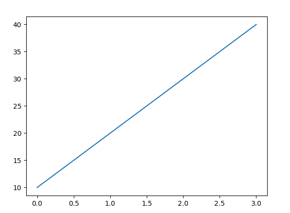
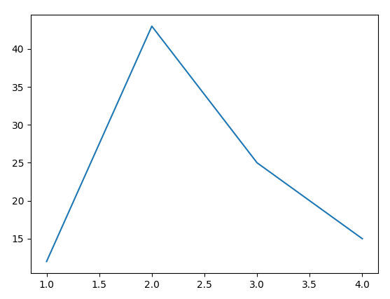
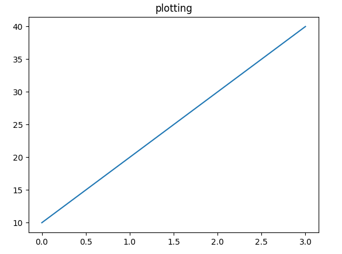
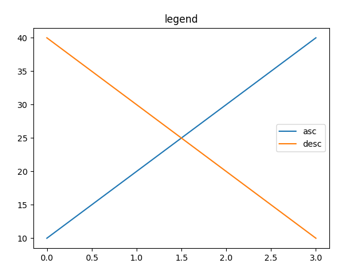
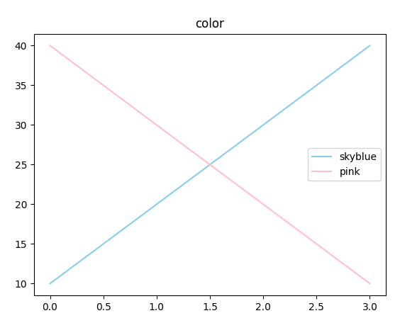
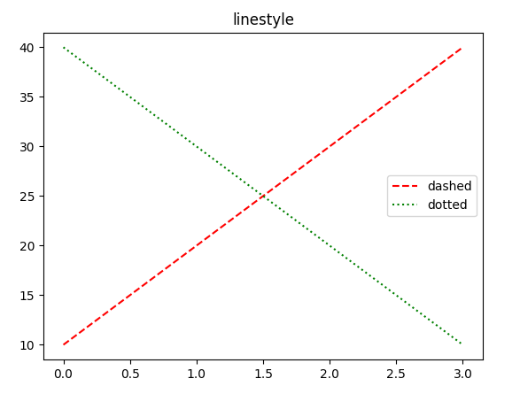
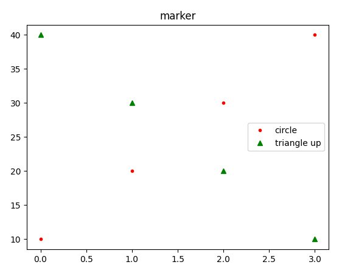
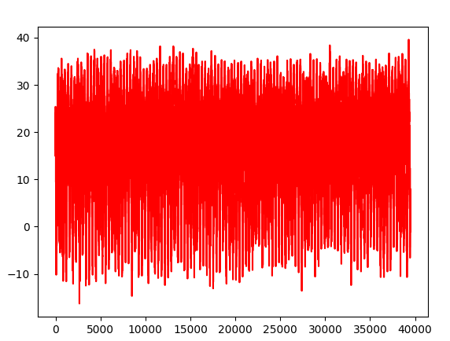
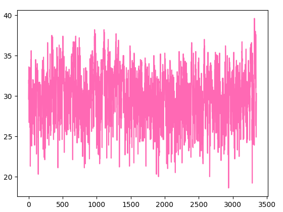

# 01/04

# 기온 공공 데이터

## 1. 기온 데이터 분석 시작하기

### 1-1) 기온 공공데이터 살펴보기

- [기상자료개방포털](https://data.kma.go.kr)

1. 2002 6월 1일 ~ 30일 기온 확인하기


2. CSV다운로드 하기

- CSV : 'Comma-Separated Values'의 약자로 각가의 데이터 값을 콤마(,)로 구분하는 파일 형식


## 2. 서울의 기온 데이터 분석하기

### 2-1) CSV파일에서 데이터 읽어오기

>  파이썬의 CSV모듈 이용
>
> - csv.reader() : CSV 파일에서 데이터를 읽어오는 함수
> - csv.writer() : CSV 파일에 데이터를 저장하는 함수

1. 1904/01/01 ~ 2019/01/17 , 서울의 기온 CSV파일 다운로드
2. 데이터 분석에 불필요한 1~7행 삭제(내용만 지우는 것이 아닌 행삭제를 해야함)

```python
import csv
# open : 파일 생성, 열기, 작성, 추가 등 python 내장함수
# r : 읽기모드-파일을 읽기만 할 때 사용
# w : 쓰기모드-파일에 내용을 쓸 때 사용 - 해당 파일이 이미 존재할 경우 원래 있던 내용이 모두 사라지고, 해당 파일이 존재하지 않으면 새로운 파일이 생성됨.
# a : 추가모드-파일의 마지막에 새로운 내용을 추가 시킬 때 사용
# 현재 경로에 seoul.csv가 있기 때문에 파일명을 적었지만
# 경로가 다르다면 경로를 적어줘야 한다.
# "C:/python/seoul.csv" 혹은 "C:\\python\\seoul.csv" 혹은 r"C:\python\seoul.csv"와 같이 경로지정을 해주어야 한다.
# cp949: 윈도우 한글 인코딩 방식
f = open('seoul.csv', 'r', encoding='cp949')
# delimiter는 구분자로 생략가능
data = csv.reader(f, delimiter=',')
print(data)
f.close()

# <_csv.reader object at 0x000001CE3BD04B20>
```


### 2-2) 데이터 출력하기

> for문을 이용하여 한줄씩 읽는다.

```python
f = open('seoul.csv', 'r', encoding='cp949')
data = csv.reader(f)
for row in data:
	print(row)
f.close()
```

1. 각 행이 리스트로 출력됨 -> 인덱싱과 슬라이싱 가능
2. 각 행의 데이터가 ''로 둘러싸여있음 -> string이다
3. 누락된 데이터가 존재


### 2-3) 헤더 저장하기

> 헤더는 데이터의 첫 줄에 위치하여 두번째 줄부터 나타나는 데이터의 속성을 설명한다.

```python
f = open('seoul.csv', 'r', encoding='cp949')
data = csv.reader(f)
# next() : 첫 번째 데이터 행을 읽어오면서 데이터의 탐색 위치를 다음 행으로 이동시키는 함수
header = next(data)
print(header)
f.close()
# ['날짜', '지점', '평균기온(℃)', '최저기온(℃)', '최고기온(℃)']
```

```python
f = open('seoul.csv', 'r', encoding='cp949')
data = csv.reader(f)
header = next(data)
for row in data:
    print(row)
f.close()
# ['날짜', '지점', '평균기온(℃)', '최저기온(℃)', '최고기온(℃)'] 가 출력되지 않고 두번째 행부터 출력된다.
```


## 3. 서울의 최고 기온이 가장 높았던 날과 기온

> 1. 데이터를 읽어온다.
> 2. 순차적으로 최고 기온을 확인한다.
> 3. 최고 기온이 가장 높았던 날짜의 데이터를 저장한다.
> 4. 최종 저장된 데이터를 출력한다.

### 3-1) 문자열 -> 실수, 누락데이터 변환 구현

```python
import csv

f = open('seoul.csv')
data = csv.reader(f)
# 헤더를 제외하고
header = next(data)
for row in data:
    # 누락 데이터 체크 후 제외하자
    if row[-1] == '':
        row[-1] = -999
    row[-1] = float(row[-1])
    print(row)
f.close()
```


### 3-2) 코드 구현

```python
import csv

f = open('seoul.csv')
data = csv.reader(f)
# 헤더를 제외하고
header = next(data)
# 최고 기온과 해당 날자를 담을 변수 초기화
max_temp, max_date = -999, ''
for row in data:
    # 누락 데이터 체크 후 제외하는 작업
    if row[-1] == '':
        row[-1] = -999
    # 문자열 -> 실수
    row[-1] = float(row[-1])
    # 현재 조회된 최고기온이 지금까지 최고기온보다 크다면
    # 해당 데이터를 담는다
    if row[-1] > max_temp:
        max_date = row[0]
        max_temp = row[-1]
f.close()
print(max_date, max_temp)

# 2018-08-01 39.6
```


# 데이터 시각화 기초

## 4. 기본 그래프 그리기

### 4-1) matplotlib 라이브러리란?

> 파이썬으로 데이터를 시각화하는 데 가장 많이 사용되는 라이브러리
>
> 자세히 보려면 [matplotlib 홈페이지](https://matplotlib.org) 참조

- matplotlib 라이브러리 중 pyplot이라는 모듈을 주로 사용할 예정
  - pyplot모듈은 공학용 도구로 널리 알려진 MATLAB과 사용법이 유사
- 사용법

```python
# matplotlib.pyplot를 plt라는 이름으로 사용하겠다.
import matplotlib.pyplot as plt
```


### 4-2) 기본 그래프 그리기

- plot() 함수 : 직선 또는 꺽은선 형태의 그래프를 그릴 때 사용

```python
import matplotlib.pyplot as plt
plt.plot([10, 20, 30, 40])
plt.show()

# plot()에 입력된 리스트는 y축을 나타냄.
# x축의 값을 생략할 경우 range(y축 데이터의 개수)로 표현할 수 있다
```




```python
import matplotlib.pyplot as plt

plt.plot([1, 2, 3, 4], [12, 43, 25, 15])
plt.show()
#plot(x축데이터, y축데이터)
```




### 4-3) 그래프에 옵션 추가하기

- 그래프에 제목 넣기
  - title() 함수 이용

```python
import matplotlib.pyplot as plt
plt.title('plotting')
plt.plot([10, 20, 30, 40])
plt.show()
```



- 그래프에 범례 넣기

  - 범례위치 지정 : plt.legend(loc = 숫자), 숫자 : 0~10

  - 범례 위치

    |  2   |  9   |  1   |
    | :--: | :--: | :--: |
    |  6   |  10  | 5,7  |
    |  3   |  8   |  4   |

```python
import matplotlib.pyplot as plt
plt.title('legend')
plt.plot([10, 20, 30, 40], label='asc') # 증가를 의미하는 asc 범례
plt.plot([40, 30, 20, 10], label='desc') # 증가를 의미하는 desc 범례
plt.legend()
plt.show()
```




- 그래프 색상 바꾸기
  - 기본적인 색에 대해서 약자 표기 가능
  - r = red, g = green, b = blue, k = black, y = yellow

```python
import matplotlib.pyplot as plt
# 제목 설정
plt.title('color')
# 그래프 그리기
plt.plot([10, 20, 30, 40], color="skyblue", label='asc')
plt.plot([40, 30, 20, 10], 'pink', label='desc')
# 범례 표시
plt.legend()
plt.show()
```



- 그래프 선 모양 바꾸기
  - <색상><선모양>을 동시에 적는 'r--'로 코드작성 가능

```python
import matplotlib.pyplot as plt
# 제목 설정
plt.title('linestyle')
# 빨간색 dashed 그래프
plt.plot([10, 20, 30, 40], color="r", linestyle='--', label='dashed')
# 초록색 dotted 그래프
plt.plot([40, 30, 20, 10], 'g', ls=':', label='dotted')
# 범례 표시
plt.legend()
plt.show()
```



- 마커 모양 바꾸기
  - '<색상><마커모양><선모양>'순으로 코드작성 가능 plt.plot([1,2,3,4], 'r.--')

```python
import matplotlib.pyplot as plt
plt.title('marker') # 제목 설정
# 빨간색 원형 마커 그래프
plt.plot([10, 20, 30, 40], "r.", label='circle')
# 초록색 삼각형 마커 그래프
plt.plot([40, 30, 20, 10], 'g^', label='triangle up')
# 범례 표시
plt.legend()
plt.show()
```




## 5. 내 생일의 기온 변화를 그래프로 그리기

### 5-1) 데이터에 질문하기

- 최고 기온 데이터를 데이터 리스트에 저장하기

```python
import csv

f = open('../기온공공데이터/seoul.csv')
data = csv.reader(f)
next(data)
result = []
for row in data:
    if row[-1] != '':
        result.append(float(row[-1]))
print(result)
```


### 5-2) 데이터 시각화하기

```python
import csv
import matplotlib.pyplot as plt

f = open('../기온공공데이터/seoul.csv')
data = csv.reader(f)
next(data)
result = []
for row in data:
    if row[-1] != '':
        result.append(float(row[-1]))
plt.plot(result, 'r')
plt.figure(figsize=(10,2))
plt.show()
```



### 5-3) 날짜 데이터 추출하기

- split()함수 이용, 매년 돌아오는 생일을 기준으로 그래프를 그리자!

```python
import csv
import matplotlib.pyplot as plt

f = open('../기온공공데이터/seoul.csv')
data = csv.reader(f)
next(data)
result = []
for row in data:
    if row[-1] != '':
        if row[0].split('-')[1] == '08' and row[0].split('-')[2] == '07':
            result.append(float(row[-1]))
plt.plot(result, 'hotpink')
plt.show()
```



