# 01/04

# 기온 공공 데이터

## 1. 기온 데이터 분석 시작하기

### 1-1) 기온 공공데이터 살펴보기

- [기상자료개방포털](https://data.kma.go.kr)

1. 2002 6월 1일 ~ 30일 기온 확인하기

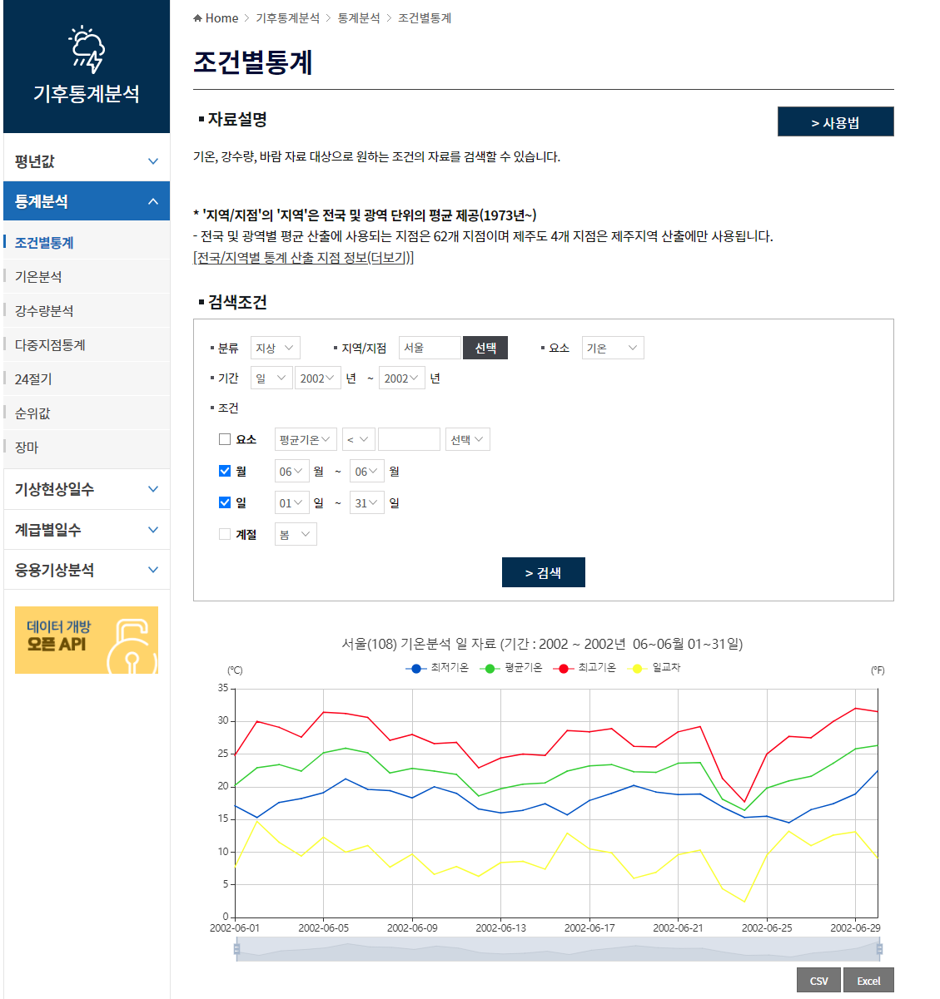

2. CSV다운로드 하기

- CSV : 'Comma-Separated Values'의 약자로 각가의 데이터 값을 콤마(,)로 구분하는 파일 형식

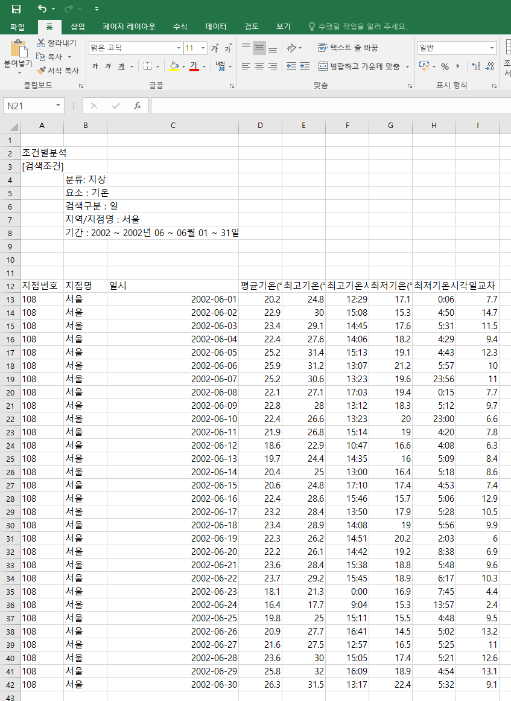


## 2. 서울의 기온 데이터 분석하기

### 2-1) CSV파일에서 데이터 읽어오기

>  파이썬의 CSV모듈 이용
>
> - csv.reader() : CSV 파일에서 데이터를 읽어오는 함수
> - csv.writer() : CSV 파일에 데이터를 저장하는 함수

1. 1904/01/01 ~ 2019/01/17 , 서울의 기온 CSV파일 다운로드
2. 데이터 분석에 불필요한 1~7행 삭제(내용만 지우는 것이 아닌 행삭제를 해야함)

```python
import csv
# open : 파일 생성, 열기, 작성, 추가 등 python 내장함수
# r : 읽기모드-파일을 읽기만 할 때 사용
# w : 쓰기모드-파일에 내용을 쓸 때 사용 - 해당 파일이 이미 존재할 경우 원래 있던 내용이 모두 사라지고, 해당 파일이 존재하지 않으면 새로운 파일이 생성됨.
# a : 추가모드-파일의 마지막에 새로운 내용을 추가 시킬 때 사용
# 현재 경로에 seoul.csv가 있기 때문에 파일명을 적었지만
# 경로가 다르다면 경로를 적어줘야 한다.
# "C:/python/seoul.csv" 혹은 "C:\\python\\seoul.csv" 혹은 r"C:\python\seoul.csv"와 같이 경로지정을 해주어야 한다.
# cp949: 윈도우 한글 인코딩 방식
f = open('seoul.csv', 'r', encoding='cp949')
# delimiter는 구분자로 생략가능
data = csv.reader(f, delimiter=',')
print(data)
f.close()

# <_csv.reader object at 0x000001CE3BD04B20>
```


### 2-2) 데이터 출력하기

> for문을 이용하여 한줄씩 읽는다.

```python
f = open('seoul.csv', 'r', encoding='cp949')
data = csv.reader(f)
for row in data:
	print(row)
f.close()
```

1. 각 행이 리스트로 출력됨 -> 인덱싱과 슬라이싱 가능
2. 각 행의 데이터가 ''로 둘러싸여있음 -> string이다
3. 누락된 데이터가 존재


### 2-3) 헤더 저장하기

> 헤더는 데이터의 첫 줄에 위치하여 두번째 줄부터 나타나는 데이터의 속성을 설명한다.

```python
f = open('seoul.csv', 'r', encoding='cp949')
data = csv.reader(f)
# next() : 첫 번째 데이터 행을 읽어오면서 데이터의 탐색 위치를 다음 행으로 이동시키는 함수
header = next(data)
print(header)
f.close()
# ['날짜', '지점', '평균기온(℃)', '최저기온(℃)', '최고기온(℃)']
```

```python
f = open('seoul.csv', 'r', encoding='cp949')
data = csv.reader(f)
header = next(data)
for row in data:
    print(row)
f.close()
# ['날짜', '지점', '평균기온(℃)', '최저기온(℃)', '최고기온(℃)'] 가 출력되지 않고 두번째 행부터 출력된다.
```


## 3. 서울의 최고 기온이 가장 높았던 날과 기온

> 1. 데이터를 읽어온다.
> 2. 순차적으로 최고 기온을 확인한다.
> 3. 최고 기온이 가장 높았던 날짜의 데이터를 저장한다.
> 4. 최종 저장된 데이터를 출력한다.

### 3-1) 문자열 -> 실수, 누락데이터 변환 구현

```python
import csv

f = open('seoul.csv')
data = csv.reader(f)
# 헤더를 제외하고
header = next(data)
for row in data:
    # 누락 데이터 체크 후 제외하자
    if row[-1] == '':
        row[-1] = -999
    row[-1] = float(row[-1])
    print(row)
f.close()
```


### 3-2) 코드 구현

```python
import csv

f = open('seoul.csv')
data = csv.reader(f)
# 헤더를 제외하고
header = next(data)
# 최고 기온과 해당 날자를 담을 변수 초기화
max_temp, max_date = -999, ''
for row in data:
    # 누락 데이터 체크 후 제외하는 작업
    if row[-1] == '':
        row[-1] = -999
    # 문자열 -> 실수
    row[-1] = float(row[-1])
    # 현재 조회된 최고기온이 지금까지 최고기온보다 크다면
    # 해당 데이터를 담는다
    if row[-1] > max_temp:
        max_date = row[0]
        max_temp = row[-1]
f.close()
print(max_date, max_temp)

# 2018-08-01 39.6
```


# 데이터 시각화 기초

## 4. 기본 그래프 그리기

### 4-1) matplotlib 라이브러리란?

> 파이썬으로 데이터를 시각화하는 데 가장 많이 사용되는 라이브러리
>
> 자세히 보려면 [matplotlib 홈페이지](https://matplotlib.org) 참조

- matplotlib 라이브러리 중 pyplot이라는 모듈을 주로 사용할 예정
  - pyplot모듈은 공학용 도구로 널리 알려진 MATLAB과 사용법이 유사
- 사용법

```python
# matplotlib.pyplot를 plt라는 이름으로 사용하겠다.
import matplotlib.pyplot as plt
```


### 4-2) 기본 그래프 그리기

- plot() 함수 : 직선 또는 꺽은선 형태의 그래프를 그릴 때 사용

```python
import matplotlib.pyplot as plt
plt.plot([10, 20, 30, 40])
plt.show()

# plot()에 입력된 리스트는 y축을 나타냄.
# x축의 값을 생략할 경우 range(y축 데이터의 개수)로 표현할 수 있다
```

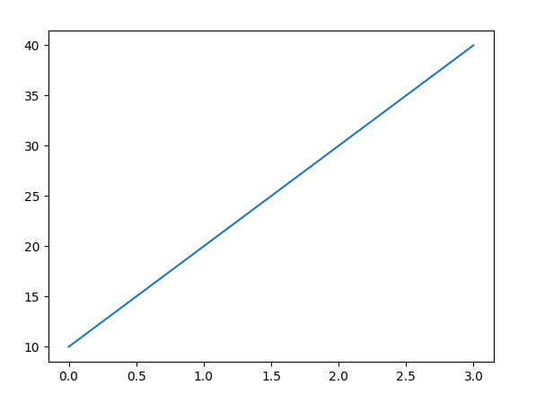


```python
import matplotlib.pyplot as plt

plt.plot([1, 2, 3, 4], [12, 43, 25, 15])
plt.show()
#plot(x축데이터, y축데이터)
```


### 4-3) 그래프에 옵션 추가하기

- 그래프에 제목 넣기
  - title() 함수 이용

```python
import matplotlib.pyplot as plt
plt.title('plotting')
plt.plot([10, 20, 30, 40])
plt.show()
```


- 그래프에 범례 넣기

  - 범례위치 지정 : plt.legend(loc = 숫자), 숫자 : 0~10

  - 범례 위치

    |  2   |  9   |  1   |
    | :--: | :--: | :--: |
    |  6   |  10  | 5,7  |
    |  3   |  8   |  4   |

```python
import matplotlib.pyplot as plt
plt.title('legend')
plt.plot([10, 20, 30, 40], label='asc') # 증가를 의미하는 asc 범례
plt.plot([40, 30, 20, 10], label='desc') # 증가를 의미하는 desc 범례
plt.legend()
plt.show()
```

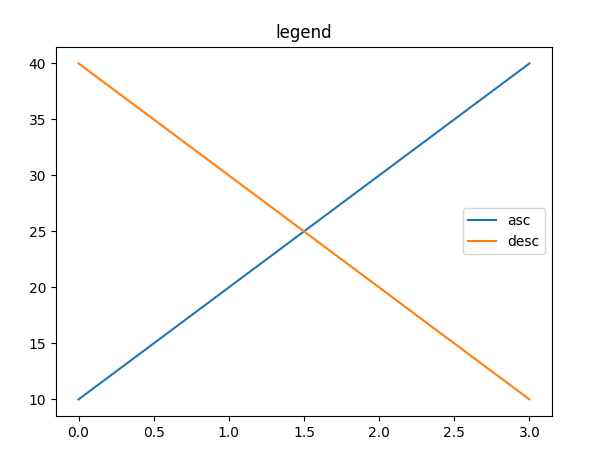


- 그래프 색상 바꾸기
  - 기본적인 색에 대해서 약자 표기 가능
  - r = red, g = green, b = blue, k = black, y = yellow

```python
import matplotlib.pyplot as plt
# 제목 설정
plt.title('color')
# 그래프 그리기
plt.plot([10, 20, 30, 40], color="skyblue", label='asc')
plt.plot([40, 30, 20, 10], 'pink', label='desc')
# 범례 표시
plt.legend()
plt.show()
```

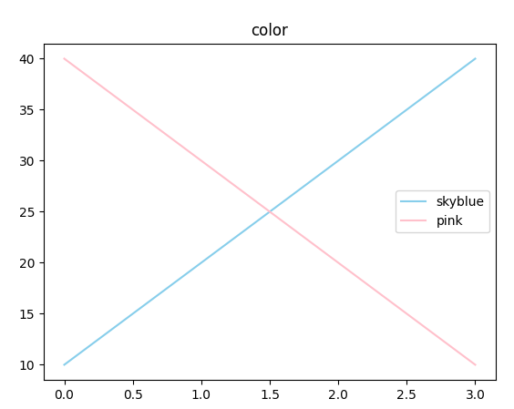

- 그래프 선 모양 바꾸기
  - <색상><선모양>을 동시에 적는 'r--'로 코드작성 가능

```python
import matplotlib.pyplot as plt
# 제목 설정
plt.title('linestyle')
# 빨간색 dashed 그래프
plt.plot([10, 20, 30, 40], color="r", linestyle='--', label='dashed')
# 초록색 dotted 그래프
plt.plot([40, 30, 20, 10], 'g', ls=':', label='dotted')
# 범례 표시
plt.legend()
plt.show()
```


- 마커 모양 바꾸기
  - '<색상><마커모양><선모양>'순으로 코드작성 가능 plt.plot([1,2,3,4], 'r.--')

```python
import matplotlib.pyplot as plt
plt.title('marker') # 제목 설정
# 빨간색 원형 마커 그래프
plt.plot([10, 20, 30, 40], "r.", label='circle')
# 초록색 삼각형 마커 그래프
plt.plot([40, 30, 20, 10], 'g^', label='triangle up')
# 범례 표시
plt.legend()
plt.show()
```


## 5. 내 생일의 기온 변화를 그래프로 그리기

### 5-1) 데이터에 질문하기

- 최고 기온 데이터를 데이터 리스트에 저장하기

```python
import csv

f = open('../기온공공데이터/seoul.csv')
data = csv.reader(f)
next(data)
result = []
for row in data:
    if row[-1] != '':
        result.append(float(row[-1]))
print(result)
```


### 5-2) 데이터 시각화하기

```python
import csv
import matplotlib.pyplot as plt

f = open('../기온공공데이터/seoul.csv')
data = csv.reader(f)
next(data)
result = []
for row in data:
    if row[-1] != '':
        result.append(float(row[-1]))
plt.plot(result, 'r')
plt.figure(figsize=(10,2))
plt.show()
```


### 5-3) 날짜 데이터 추출하기

- split()함수 이용, 매년 돌아오는 생일을 기준으로 그래프를 그리자!

```python
import csv
import matplotlib.pyplot as plt

f = open('../기온공공데이터/seoul.csv')
data = csv.reader(f)
next(data)
result = []
for row in data:
    if row[-1] != '':
        if row[0].split('-')[1] == '08' and row[0].split('-')[2] == '07':
            result.append(float(row[-1]))
plt.plot(result, 'hotpink')
plt.show()
```

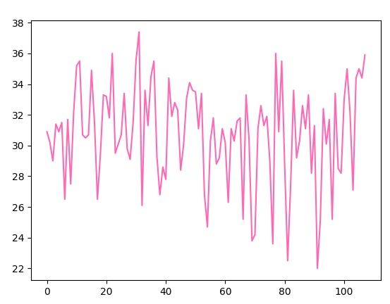

- 1983년 이후 생일날 최저 및 최고기온 그래프를 그리자!

```python
import csv
import matplotlib.pyplot as plt

f = open('../1기온공공데이터/seoul.csv')
data = csv.reader(f)
next(data)
low = []    # 최저 기온 값을 저장할 리스트
high = []   # 최고 기온 값을 저장할 리스트
for row in data:
    if row[-1] != '' and row[-2] != '': # 최고 기온 값과 최저 기온 값이 존재한다면
        if 1983 <= int(row[0].split('-')[0]):   # 1983년 이후라면
            if row[0].split('-')[1] =='08' and row[0].split('-')[2] =='07': # 8월 7일이라면
                high.append(float(row[-1])) # 최고 기온 값을 high에 저장
                low.append(float(row[-2]))  # 최저 기온 값을 low에 저장
plt.rc('font', family='Malgun Gothic')  # 맑은 고딕을 기본 글꼴로 설정
plt.rcParams['axes.unicode_minus'] = False  #마이너스 기호 깨짐 방지
plt.title('내 생일의 기온 변화 그래프')    # 제목 설정
# high 리스트에 저장된 값을 hotpink 색으로 그리고 레이블을 표시
plt.plot(high, 'hotpink', label='high')
# low 리스트에 저장된 값을 skyblue 색으로 그리고 레이블을 표시
plt.plot(low, 'skyblue', label='low')
plt.legend()   # 범례 표시
plt.show()
```

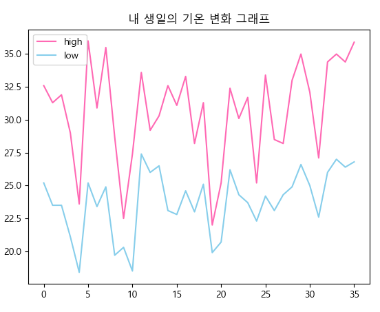


# 01/05

## 6. 기온 데이터를 다양하게 시각화하기

### 6-1) 히스토그램

- hist() 함수

```python
import matplotlib.pyplot as plt
plt.hist([1, 1, 2, 3, 4, 5, 6, 6, 7, 8, 10])
plt.show()
```

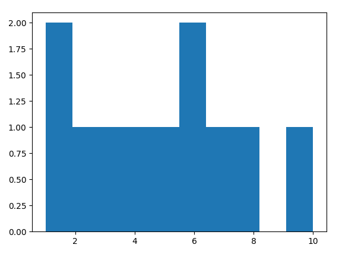

- 주사위 시물레이션
  - 100만번을 던지면 거의 균등한 빈도로 나온것을 알 수 있다.
  - 실험 또는 관찰에 의해 얻은 통계이고 이것을 통계적확률이라 한다.

```python
import matplotlib.pyplot as plt
import random
dice = []
for _ in range(1000000):
    dice.append(random.randint(1, 6))
plt.hist(dice, bins=6)  # bins 옵션은 가로축의 구간 개수를 설정하는 속성
plt.show()
```

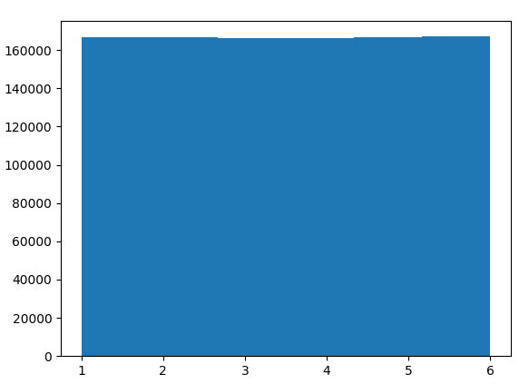


### 6-2) 기온 데이터를 히스토그램으로 표현하기

- 1907년 ~2018년 서울의 최고 기온 데이터를 표현

```python
import matplotlib.pyplot as plt
import csv
f = open('../1기온공공데이터/seoul.csv')
data = csv.reader(f)
next(data)
result = []
for row in data:
    if row[-1] != '':
        result.append(float(row[-1]))
plt.hist(result, bins=100, color='r')
plt.show()
```

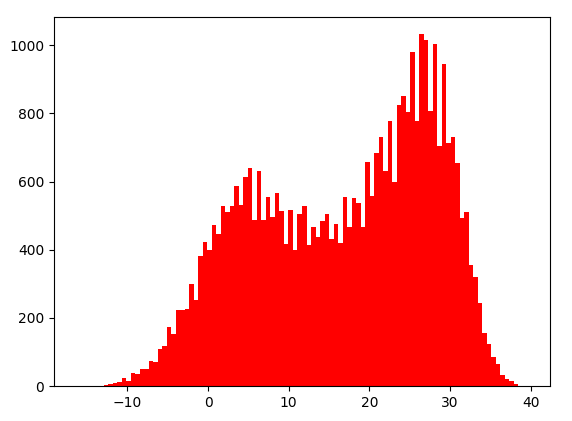


- 8월 달의 최고기온 표현

```python
import matplotlib.pyplot as plt
import csv
f = open('../1기온공공데이터/seoul.csv')
data = csv.reader(f)
next(data)
aug = []
for row in data:
    if row[0].split('-')[1] == '08':
        if row[-1] != '':
            aug.append(float(row[-1]))
plt.hist(aug, bins=100, color='r')
plt.show()
```

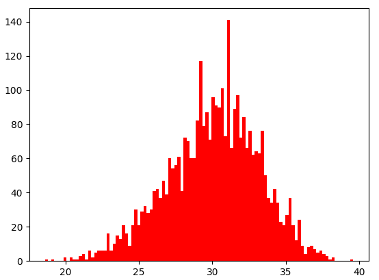

- 1월과 8월의 최고기온 데이터를 히스토그램으로 시각화하기

```python
import matplotlib.pyplot as plt
import csv
f = open('../1기온공공데이터/seoul.csv')
data = csv.reader(f)
next(data)
aug = []
jan = []
for row in data:
    month = row[0].split('-')[1]
    if row[-1] != '':
        # 8월의 최고기온 담기
        if month == '08':
            aug.append(float(row[-1]))
        # 1월의 최고기온 담기
        if month == '01':
            jan.append(float(row[-1]))
# 8월 최고기온 히스토그램 표현
plt.hist(aug, bins=100, color='r', label='Aug')
# 1월 최고기온 히스토그램 표현
plt.hist(jan, bins=100, color='b', label='Jan')
plt.legend()
plt.show()
```

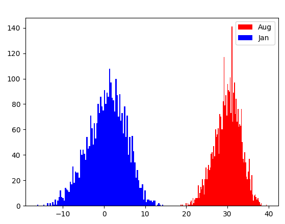


### 6-3) 기온 데이터를 상자 그림으로 표현하기

- #### 상자그림이란?

  - 자료에서 얻어낸 최댓값, 최솟값, 상위 1/4(1사분위), 2/4(중앙값, 2사분위), 3/4(3사분위)에 위치한 값을 보여주는 그래프
  - 데이터의 분포를 한눈에 보기 쉽다

- boxplot()

```python
import matplotlib.pyplot as plt
import random
result = []
for _ in range(13):
    result.append(random.randint(1, 1000))
print(sorted(result))
plt.boxplot(result)
plt.show()
# [152, 157, 225, 354, 517, 605, 711, 833, 855, 894, 913, 926, 940]
```

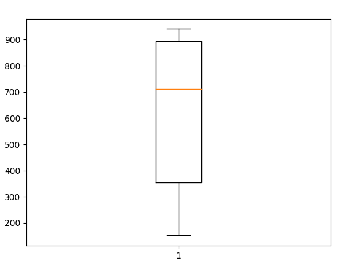

- 서울 최고 기온 데이터를 상자그림으로 그려보자!

```python
import csv
import matplotlib.pyplot as plt
f = open('../1기온공공데이터/seoul.csv')
data = csv.reader(f)
next(data)
result = []
for row in data:
    if row[-1] != '':
        result.append(float(row[-1]))
plt.boxplot(result)
plt.show()
```

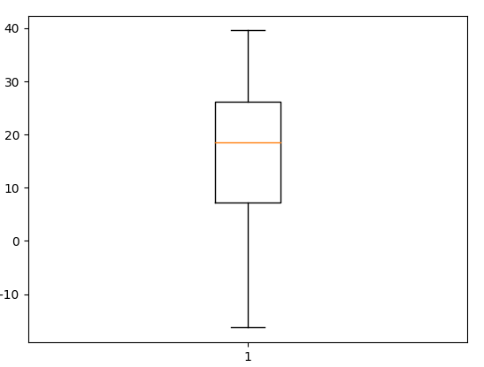

- 1월과 8월의 상자 그림을 함께 그려보자!
  - 상자 그림의 위 아래에 그려진 동그라미는 이상치(outlier) 값을 표현한 것이다.
  - 이상치 : 다른 수치에 비해 너무 크거나 작은 값

```python
import csv
import matplotlib.pyplot as plt
f = open('../1기온공공데이터/seoul.csv')
data = csv.reader(f)
next(data)
aug = []
jan = []
for row in data:
    month = row[0].split('-')[1]
    if row[-1] != '':
        if month == '08':
            aug.append(float(row[-1]))
        if month == '01':
            aug.append(float(row[-1]))
plt.boxplot([aug, jan])
plt.show()
```

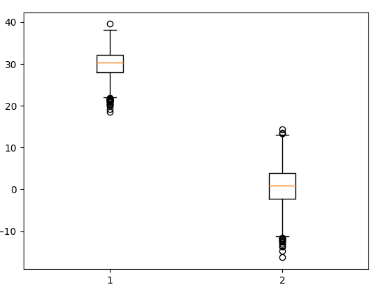

- 월 별 최고 기온 데이터를 표현해보자!

```python
import csv
import matplotlib.pyplot as plt
f = open('../1기온공공데이터/seoul.csv')
data = csv.reader(f)
next(data)
month = [[] for _ in range(12)]
for row in data:
    mon = int(row[0].split('-')[1]) - 1
    if row[-1] != '':
        month[mon].append(float(row[-1]))
plt.boxplot(month)
plt.show()
```

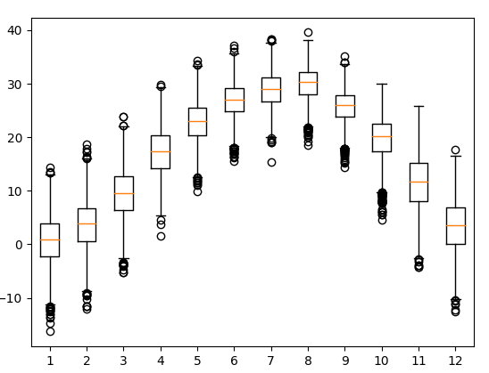

- 8월의 일별 최고기온 데이터를 비교해보자

```python
import csv
import matplotlib.pyplot as plt
f = open('../1기온공공데이터/seoul.csv')
data = csv.reader(f)
next(data)
days = [[] for _ in range(31)]
for row in data:
    day = int(row[0].split('-')[2]) - 1
    if row[-1] != '':
        if row[0].split('-')[1] == '08':
            days[day].append(float(row[-1]))
# 그래프 스타일 지정
plt.style.use('ggplot')
# 그래프 크기 수정
plt.figure(figsize=(10,5), dpi=100)
# 이상치(아웃라이어) 값 생략
plt.boxplot(days, showfliers=False)
plt.show()
```

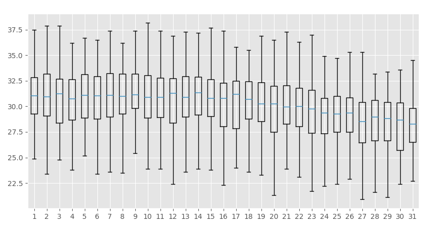


# 인구 공공 데이터

## 7. 우리 동네 인구 구조 시각화하기

> [행정안정부](https://www.mois.go.kr/frt/a01/frtMain.do) 정책자료 -> 통계 -> 주민등록 인구 통계

- 신도림 동 연령별 인구 시각화 하기

```python
import csv
import matplotlib.pyplot as plt

f = open('age.csv')
data = csv.reader(f)
next(data)
result = []
for row in data:
    if '신도림' in row[0]:
        for i in row[3:]:
            result.append(int(i))
print(result)
plt.style.use('ggplot')
plt.plot(result)
plt.show()
```

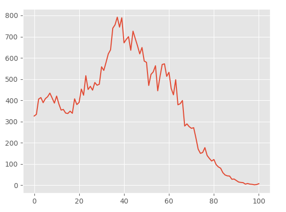


## 8. 인구 구조를 다양한 형태로 시각화하기

- 인구 구조가 알고 싶은 지역의(읍면동 단위)를 입력하면 시각화 하기

```python
import csv
import matplotlib.pyplot as plt

f = open('age.csv')
data = csv.reader(f)
next(data)
result = []
name = input('인구 구조가 알고 싶은 지역의 이름(읍면동 단위)을 입력해주세요 : ')
for row in data:
    if name in row[0]:
        for i in row[3:]:
            result.append(int(i))
plt.style.use('ggplot')
plt.rc('font', family='Malgun Gothic')
plt.title(name+' 지역의 인구 구조')
plt.plot(result)
plt.show()
```

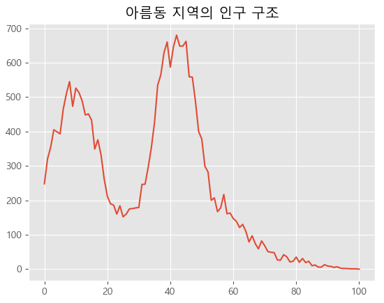

### 8-1) 막대그래프 그리기

- bar() 함수
  - bar(막대를 표시할 위치, 막대의 높이)

```
import csv
import matplotlib.pyplot as plt

f = open('age.csv')
data = csv.reader(f)
next(data)
result = []
name = input('인구 구조가 알고 싶은 지역의 이름(읍면동 단위)을 입력해주세요 : ')
for row in data:
    if name in row[0]:
        for i in row[3:]:
            result.append(int(i))
plt.bar(result)
plt.show()
```

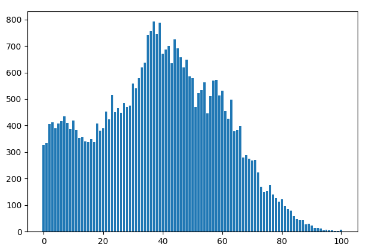

- barh() 함수
  - 수평방향 막대그래프

```python
plt.barh(range(101), result)
```

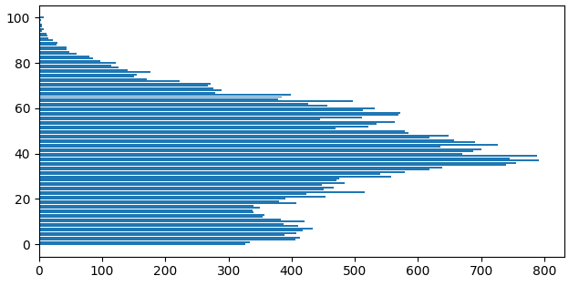

### 8-2) 항아리 모양 그래프 그리기

```python
import csv
import matplotlib.pyplot as plt
f = open('gender.csv')
data = csv.reader(f)
next(data)
result = []
name = input('찾고 싶은 지역의 이름을 알려주세요 : ')
man = []
woman = []
for row in data:
    if name in row[0]:
        for i in range(101):
            man.append(-int(row[i+3]))
            woman.append(int(row[-(i+1)]))
plt.rc('font', family='Malgun Gothic')
plt.rcParams['axes.unicode_minus'] = False
plt.title(name + ' 지역의 남녀 성별 인구 분포')
woman.reverse()
plt.barh(range(101), man, label='남성')
plt.barh(range(101), woman, label='여성')
plt.legend()
plt.show()
```

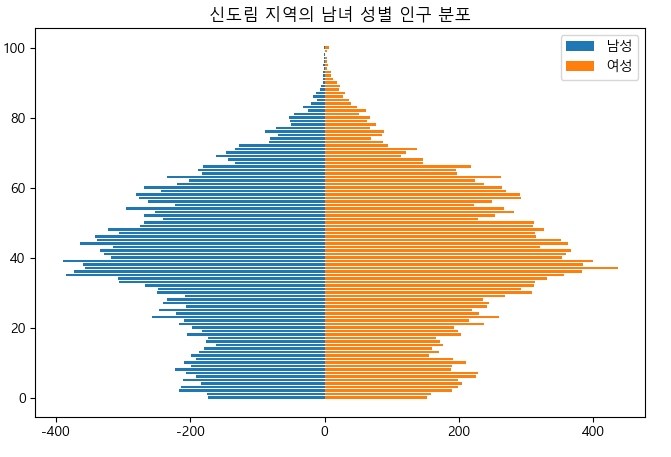


## 9. 우리 동네 인구 구조를 파이 차트로 나타내기

### 9-1) 혈액형 비율 표현하기

- pie()함수를 이용하자!

```python
import matplotlib.pyplot as plt
size = [2441, 2312, 1031, 1233]
label =['A형', 'B형', 'AB형', 'O형']
plt.rc('font', family="Malgun Gothic")
color = ['darkmagenta', 'deeppink', 'hotpink', 'pink']
# 동그란 원
plt.axis('equal')
# autopct는 auto percent를 의미, 소수점 아래 둘째 자리에서 반올림한 값을 표시 : %.f%%
# explode는 돌출효과 표시가능!
plt.pie(size, labels=label, autopct='%.1f%%', colors=color, explode=(0, 0, 0.1, 0))
plt.legend()
plt.show()
```

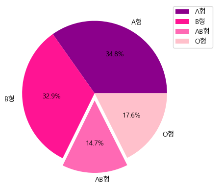

### 9-2) 제주도의 성별 인구 비율 표현하기

```python
import matplotlib.pyplot as plt
import csv

f = open('gender.csv')
data = csv.reader(f)
next(data)
size = []
name = input('찾고 싶은 지역의 이름을 알려주세요 : ')
m = 0
f = 0
for row in data:
    if name in row[0]:
        for i in range(101):
            m += int(row[i+3].replace(',', ''))
            f += int(row[i+106].replace(',', ''))
        break
size.append(m)
size.append(f)
plt.rc('font', family="Malgun Gothic")
color = ['crimson', "darkcyan"]
plt.axis('equal')
plt.pie(size, labels=['남', '여'], autopct='%.1f%%', colors=color, startangle=90)
plt.title(name + ' 지역의 남녀 성별 비율')
plt.show()
```

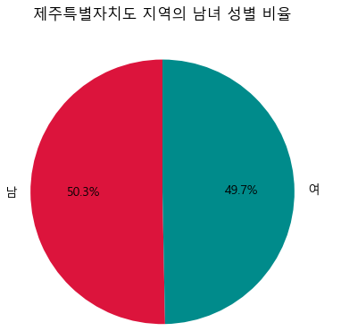


## 10. 우리 동네 인구 구조를 산점도로 나타내기

### 10-1) 꺾은선 그래프로 표현하기

```python
import csv
import matplotlib.pyplot as plt

f = open('gender.csv')
data = csv.reader(f)
next(data)
m, f = [], []
name = input('궁금한 동네를 입렵해 주세요 : ')
for row in data:
    if name in row[0]:
        for i in range(3, 104):
            m.append(int(row[i]))
            f.append(int(row[i+103]))
plt.plot(m, label="Male")
plt.plot(f, label="Femail")
plt.legend()
plt.show()
```


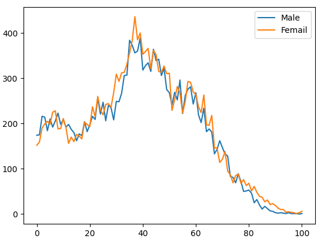

### 10-2) 막대그래프로 표현하기

```python
import csv
import matplotlib.pyplot as plt
f = open('gender.csv')
data = csv.reader(f)
next(data)
result = []
name = input('궁금한 동네를 입렵해 주세요 : ')
for row in data:
    if name in row[0]:
        for i in range(3, 104):
            result.append(int(row[i].replace(',', '')) - int(row[i+103].replace(',', '')))
        break
plt.bar(range(101), result)
plt.show()
```

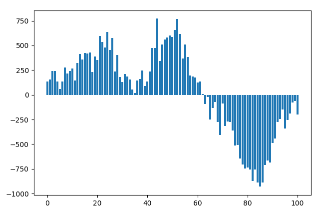


### 10-3) 버블 차트 표현하기

- scatter() 함수로 표현하기

- 산점도의 한 종류라 보면된다.
- 산점도는 두 값의 비교에있다면, 버블차트는 원의 크기 까지 한가지의 변수가 더 있다 보면된다.

```python
import random
x, y, size = [], [], []
for i in range(100):
    x.append(random.randint(50, 100))
    y.append(random.randint(50, 100))
    size.append(random.randint(10, 100))
# s : 원의 크기, c : 색깔, cmap : 컬러바 색상 종류, alpha: 투명도(opacity)
plt.scatter(x, y, s=size, c=size, cmap='jet', alpha=0.7)
# 컬러바
plt.colorbar()
plt.show()
```

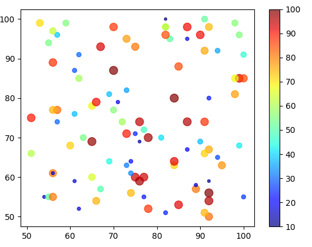


### 10-4) 산점도 표현하기

- scatter()로 표현!

```python
import math
import csv
import matplotlib.pyplot as plt

f = open('gender.csv')
data = csv.reader(f)
next(data)
name = input('궁금한 동네를 입력하세요 : ')
m, f, size = [], [], []
for row in data:
    if name in row[0]:
        for i in range(3, 104):
            m.append(int(row[i].replace(',', '')))
            f.append(int(row[i+103].replace(',', '')))
            size.append(math.sqrt(int(row[i].replace(',', '')) + int(row[i+103].replace(',', ''))))
        break
plt.style.use('ggplot')
plt.rc('font', family="Malgun Gothic")
plt.figure(figsize=(10, 5), dpi=100)
plt.title(name+' 지역의 성별 인구 그래프')
plt.scatter(m, f, s=size, c=range(101), alpha=0.5, cmap='jet')
plt.colorbar()
plt.plot(range(max(m)), range(max(m)), 'g')
plt.xlabel('남성 인구수')
plt.ylabel('여성 인구수')
plt.show()

```

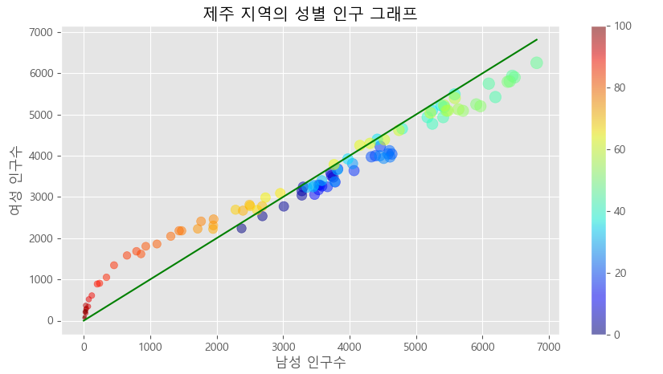

# 대중교통 데이터 프로젝트

## 11. 대중교통 데이터 시각화하기

> [T-money](https://www.t-money.co.kr/) 이용안내 -> 대중교통 통계자료

1. 지하철 유무임별 이용현황 -> subwayfee.csv로 저장
2. 작업일시 데이터 열 삭제

### 11-1) 유임 승차 비율이 가장 높은 역은 어디일까

- 비율 : 유임승차 / 무임승차 + 유임승차
- 무임승차가 없는 곳은 구하지 않는다.
- 유임승차 + 무임승차가 10만건 이상인 곳만 구한다.
- 유임승차 비율이 가장 높은곳과 그 비율을 구한다.

```python
import csv

f = open('subwayfee.csv')
data = csv.reader(f)
next(data)
mx, rate = 0, 0
max_station = ""
for row in data:
    # 1: 호선, 3:역이름 4: 유임승차, 5: 유임하차, 6: 무임승차, 7: 무임하차
    for i in range(4, 8):	# 문자열 -> 정수
        row[i] = int(row[i].replace(',', ''))
    # 무임승차가 있고, 유임승차 + 무임승차가 10만건 이상인 곳
    if row[6] != 0 and (row[4] + row[6]) > 100000:
        # 유임승차 비율
        rate = row[4] / (row[4] + row[6])
        # 만약 유임승차 비율이 현재까지의 가장 높은 비율보다 높다면
        if rate > mx:
            mx = rate	# 교체
            mx_station = row[3] + ' ' + row[1]
# round(x, 2) : 소수점 둘째 자리까지 반올림
print(mx_station, round(mx*100, 2))

# 홍대입구 2호선 95.34
```


### 11-2) 유무임 승하차 인원이 가장 많은 역은 어디일까

```python
import csv
f = open('subwayfee.csv')
data = csv.reader(f)
next(data)

mx = [0] * 4
mx_station = [''] * 4
label = ['유임승차', '유임하차', '무임승차', '무임하차']
for row in data:
    for i in range(4, 8):
        if int(row[i].replace(',', '')) > mx[i-4]:
            mx[i-4] = int(row[i].replace(',', ''))
            mx_station[i-4] = row[3] + ' ' + row[1]
for i in range(4):
    print(label[i]+' : ' + mx_station[i], mx[i])
    
# 유임승차 : 강남 2호선 3153418
# 유임하차 : 강남 2호선 3210437
# 무임승차 : 종로3가 1호선 387062
# 무임하차 : 제기동 1호선 400607
```


### 11-3) 모든 역의 유무임 승하차 비율은 어떻게 될까

> 파이 차트로 나타내기
>
> 파이 차트를 이미지로 저장하기

```python
import csv
import matplotlib.pyplot as plt

f = open('subwayfee.csv')
data = csv.reader(f)
next(data)
label = ['유임승차', '유임하차', '무임승차', '무임하차']
c = ['#14CCC0', '#389993', '#FF1C6A', '#CC14AF']
plt.rc('font', family='Malgun Gothic')
for row in data:
    for i in range(4, 8):
        row[i] = int(row[i].replace(',', ''))
    plt.title(row[3] + ' ' + row[1])
    plt.pie(row[4:8], labels=label, colors=c, autopct="%1.f%%")
    plt.axis('equal')
    # savefig() : 파일 저장
    plt.savefig(row[3] + ' ' + row[1]+'.png')
    plt.show()
```


## 12. 지하철 시간대별 데이터 시각화하기

### 12-1) 출근 시간대 사람들이 가장 많이 타고 내리는 역은 어디일까

- 오전 7~9시 승차 인원 합계의 최댓값 찾기
- 오전 7~9시 하차 인원 합계의 최댓값 찾기

```python
import csv

# 12-1 출근 시간대 사람들이 가장 많이 타고 내리는 역은 어디일까
f = open('subwaytime.csv')
data = csv.reader(f)
next(data)
next(data)
mx, mx_station = 0, ''
my, my_station = 0, ''
for row in data:
    for i in range(4, len(row)):
        row[i] = int(row[i].replace(',', ''))
    # 10, 12, 14 : 7시, 8시, 9시 승차 인원
    # 11, 13, 15 : 7시, 8시, 9시 하차 인원
    in_people = row[10:15:2]
    out_people = row[11:16:2]
    if sum(in_people) > mx:
        mx = sum(in_people)
        mx_station = row[3] + '(' + row[1] + ')'
    if sum(out_people) > my:
        my = sum(out_people)
        my_station = row[3] + '(' + row[1] + ')'
print(mx_station, mx)
print(my_station, my)

# 신림(2호선) 809541
# 강남(2호선) 984427
```


### 12-2) 밤 11시에 사람들이 가장 많이 타는 역은 어디일까

- 입력 받은 시간의 가장 승차 인원이 많은 곳을 찾자
- 입력 받은 시간으로 해당 시간의 승차인원 인덱스를 구하자
- 첫 승차 시작 인덱스는 4이고, + 2 씩 늘어간다
- 시작 시간이 4시이다
- idx = 시작시간 + (해당 시간-시작시간) * 2
- idx = 4(시작시간) + (t-4) * 2

```python
import csv

f = open('subwaytime.csv')
data = csv.reader(f)
next(data)
next(data)
mx, mx_station = 0, ''
t = int(input('몇 시의 승차인원이 가장 많은 역이 궁금하세요? : '))
for row in data:
    for i in range(4, len(row)):
        row[i] = int(row[i].replace(',', ''))
    idx = 4 + (t-4) * 2
    if row[idx] > mx:
        mx = row[idx]
        mx_station = row[3] + '(' + row[1] + ')'
print(mx_station, mx)

# 강남(2호선) 145504
```


### 12-3) 시간대별로 사람들이 가장 많이 타고 내리는 역은 어디일까

- 시간대 별로 승차 인원이 가장 많은 곳은?
- 시간에 해당하는 인덱스를 0~23으로 본다면
- 승차인원 인덱스 = (해당시간 인덱스 * 2)[2씩 증가하므로] + 4(시작시간이 4시부터이므로)

```python
import csv
import matplotlib.pyplot as plt

f = open('subwaytime.csv')
data = csv.reader(f)
next(data)
next(data)

mx, mx_station = [0] * 24, [''] * 24
for row in data:
    for j in range(24):
        idx = j * 2 + 4
        a = int(row[idx].replace(',', ''))
        if mx[j] < a:
            mx[j] = a
            mx_station[j] = row[3] + '(' + str(j+4) + ')'
for i in range(24):
    print(mx_station[i], mx[i])
plt.rc('font', family='Malgun Gothic')
plt.bar(range(24), mx)
plt.xticks(range(24), mx_station, rotation=90)
plt.show()
```

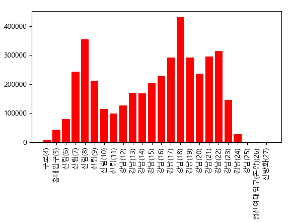


### 12-4) 시간대별로 하차 인원이 가장 많은 역을 찾는 코드

```python
import csv
import matplotlib.pyplot as plt

f = open('subwaytime.csv')
data = csv.reader(f)
next(data)
next(data)
mx, mx_station = [0] * 24, [''] * 24
for row in data:
    for j in range(24):
        idx = j * 2 + 5
        a = int(row[idx].replace(',', ''))
        if mx[j] < a:
            mx[j] = a
            mx_station[j] = row[3] + '(' + str(j+4) + ')'
for i in range(24):
    print(mx_station[i], mx[i])
plt.rc('font', family='Malgun Gothic')
plt.bar(range(24), mx, color='b')
plt.xticks(range(24), mx_station, rotation=90)
plt.show()
```

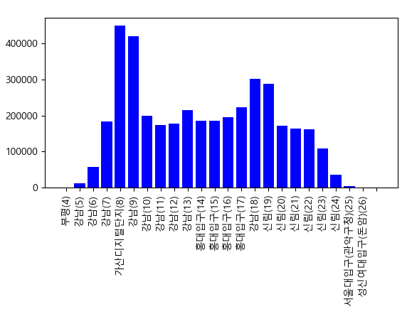

### 12-5) 모든 지하철역에서 시간대별 승하차 인원을 모두 더하면

```python
import csv
import matplotlib.pyplot as plt

f = open('subwaytime.csv')
data = csv.reader(f)
next(data)
next(data)
s_in, s_out = [0] * 24, [0] * 24
for row in data:
    for i in range(24):
        s_in[i] += int(row[(i*2) + 4].replace(',', ''))
        s_out[i] += int(row[(i*2) + 5].replace(',', ''))
plt.rc('font', family="Malgun Gothic")
plt.title("지하철 시간대 별 승하차 인원 추이")
plt.plot(s_in, 'r', label='승차')
plt.plot(s_out, 'b', label='하차')
plt.xticks(range(24), range(4, 28))
plt.legend()
plt.show()
```

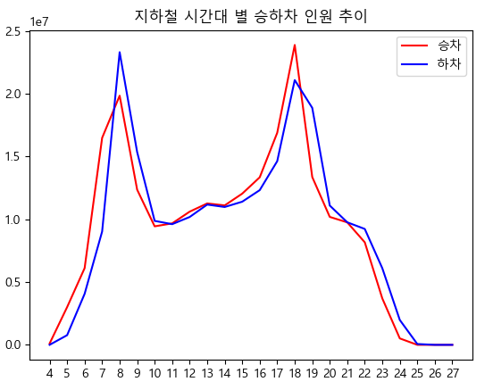


# 01/06

# 파이썬 데이터 분석 라이브러리를 활용한 프로젝트

## 13. 숫자 데이터를 쉽게 다루게 돕는 numpy 라이브러리

### 13-1) numpy 라이브러리 시작하기

```python
import numpy as np

# sqrt() : 제곱근
print(np.sqrt(2))   # 1.4142135623730951

# pi : 파이
print(np.pi)    # 3.141592653589793

# sin(), cos(), tan()와 같은 삼각함수 제공
print(np.sin(0), np.cos(0), np.tan(0))  # 0.0 1.0 0.0

# random 서브 라이브러리
# rand()
# ndarray에서 nd 는 N-Dimensional, 즉 N차원이라는 의미
# 기존 random 라이브러리의 randint() 함수의 실수 버전
a = np.random.rand(5)
print(a)    # [0.62681935 0.25138933 0.56977162 0.22690505 0.1167883 ]
print(type(a))  # <class 'numpy.ndarray'>

# choice()
# 첫번째 인자 : 범위, 두번째 인자 : 뽑을 갯수
print(np.random.choice(6, 10))  # [3 3 2 0 0 4 3 5 2 1]
# 한 번 뽑은 숫자를 다시 뽑지 못하게 하고 싶다면 replace 속성을 False로 설정
print(np.random.choice(10, 6, replace=False))   # [7 5 8 2 1 3]
# p 속성 : 확률을 지정할 수 있다. 인자의 합은 반드시 1이어야 한다.
print(np.random.choice(6, 10, p=[0.1, 0.2, 0.3, 0.2, 0.1, 0.1]))  # [2 1 1 4 0 3 5 5 1 1]
```


### 13-2) numpy 라이브러리를 활용해 그래프 그리기

- 다양한 함수를 보려면 [url](https://docs.scipy.org/doc/numpy-1.13.0/reference/)

- random 라이브러리와 비교하면 numpy를 사용한 코드가 훨씬 간결하고 실행 속도가 빠르다.
- 확률을 지정하고 반복 횟수를 늘리면 설정한 확률에 따라 각각의 값들이 나온것을 확인할 수 있다.

```python
import numpy as np
import matplotlib.pyplot as plt

dice = np.random.choice(6, 1000000, p=[0.1, 0.2, 0.3, 0.2, 0.1, 0.1])
plt.hist(dice, bins=6)
plt.show()
```

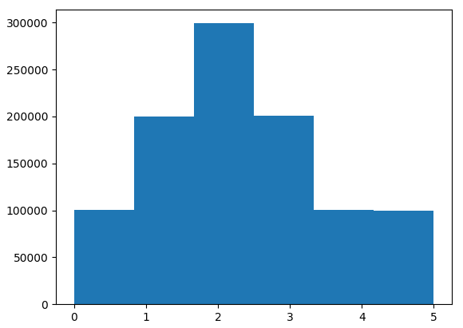

```python
import numpy as np
import matplotlib.pyplot as plt
x = np.random.randint(10, 100, 200)
y = np.random.randint(10, 100, 200)
size = np.random.rand(200) * 100
plt.scatter(x, y, s=size, c=x, cmap='jet', alpha=0.7)
plt.colorbar()
plt.show()
```

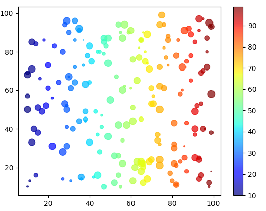

### 13-3) numpy array 생성하기

```python
# ,가 없다.
a = np.array([1, 2, 3, 4])
print(a)    # [1 2 3 4]
# 인덱싱과 슬라이싱이 가능하다.
print(a[1], a[-1])  # 2 4
print(a[1:])    # [2 3 4]
# 한 가지 데이터타입만 저장가능하다.
b = np.array([1, 2, '3', 4])
print(b)    # ['1' '2' '3' '4']
# 배열 생성을 위해 꼭 리스특사 필요한 것은 아니다

# 0 또는 1로 배열을 채울 때 유용한 함수
# 0으로 이루어진 크기가 10인 배열 생성
print(np.zeros(10)) # [0. 0. 0. 0. 0. 0. 0. 0. 0. 0.]
# 1로 이루어진 크가기 10인 배열 생성
print(np.ones(10))  # [1. 1. 1. 1. 1. 1. 1. 1. 1. 1.]
# 3행 X 3열의 단위 배열 생성
# 단위 배열(행렬) : 주대각선상의 요소가 1이며, 그 외 나머지 요소가 0인 배열(행렬)
print(np.eye(3))
#[[1. 0. 0.]
# [0. 1. 0.]
# [0. 0. 1.]]

# arange() 함수
print(np.arange(3)) # [0 1 2]
print(np.arange(3, 7))  # [3 4 5 6]
print(np.arange(3, 7, 2))   # [3 5]

# linspace() 함수
print(np.arange(1, 2, 0.1)) # [1.  1.1 1.2 1.3 1.4 1.5 1.6 1.7 1.8 1.9]
print(np.linspace(1, 2, 11))    # [1.  1.1 1.2 1.3 1.4 1.5 1.6 1.7 1.8 1.9 2. ]
# arange는 간격을 지정하고, linspace는 구간을 지정하는 차이
```


### 13-4) numpy array의 다양한 활용

- 배열 연산을 통한 그래프 그리기

```python
# 배열에 어떤 연산이나 함수를 적용하면 배열의 모든 값이 한꺼번에 계산된다.
a = np.zeros(10) + 5
print(a)    # [5. 5. 5. 5. 5. 5. 5. 5. 5. 5.]
b = np.linspace(1, 2, 11)
print(np.sqrt(b))
# [1.         1.04880885 1.09544512 1.14017543 1.18321596 1.22474487
#  1.26491106 1.30384048 1.34164079 1.37840488 1.41421356]
# -파이 ~ 파이
c = np.arange(-np.pi, np.pi, np.pi/100)
# 사인함수 x: -파이 ~ 파이
plt.plot(c, np.sin(c), label="sin")
plt.plot(c, np.cos(c), label="Cosine")
plt.plot(c+np.pi/2, np.sin(c), label='x-translation')
plt.legend()
plt.show()
```

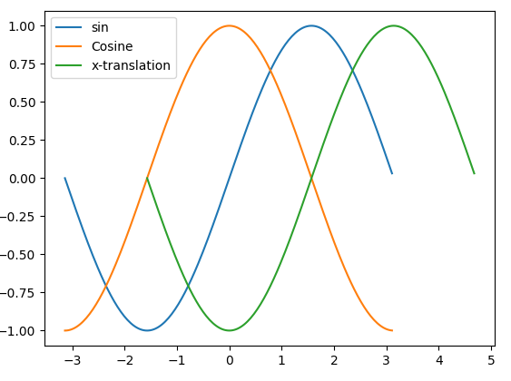

- 마스크(mask) 기능
  - 어떤 조건에 부합하는 데이터만 선별적으로 저장하기 위한 기능

```python
# mask 기능
a = np.arange(-5, 5)
print(a)    # [-5 -4 -3 -2 -1  0  1  2  3  4]
print(a < 0)    # [ True  True  True  True  True False False False False False]
print(a[a < 0]) # [-5 -4 -3 -2 -1]
mask1 = abs(a) > 3
print(a[mask1]) # [-5 -4  4]
mask2 = abs(a) % 2 == 0
# 둘 중 하나의 조건이라도 참일 경우(합집합)
print(a[mask1 + mask2]) # [-5 -4 -2  0  2  4]
# 두 가지 조건 모두 참일 경우(교집합)
print(a[mask1 * mask2]) # [-4  4]

# 버블차트 그리기
x = np.random.randint(-100, 100, 1000) # -100이상 100 미만에서 1000개의 랜덤값 추출
y = np.random.randint(-100, 100, 1000) # -100이상 100 미만에서 1000개의 랜덤값 추출
mask1 = abs(x) > 50
mask2 = abs(y) > 50
x = x[mask1 + mask2]
y = y[mask1 + mask2]
size = np.random.rand(len(x)) * 100
plt.scatter(x, y, s=size, c=x, cmap='jet', alpha=0.7)
plt.colorbar()
plt.show()
```

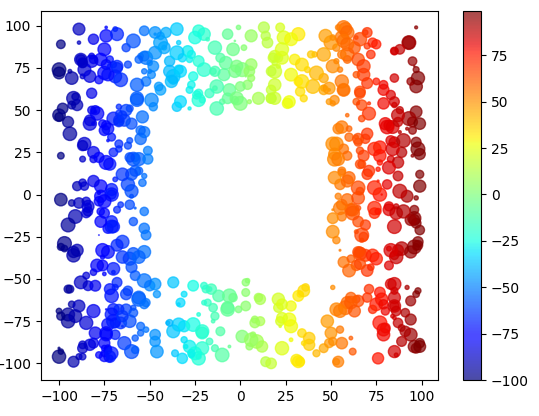


## 14. numpy를 활용한 나만의 프로젝트 만들기

### 14-1) 질문 정하기

- 전국에서 신도림동의 연령별 인구 구조와 가장 형태가 비슷한 지역은 어디일까?


### 14-2) 알고리즘 설계하기

1. 데이터를 읽어온다
2. 궁금한 지역의 이름을 입력받는다.
3. 궁금한 지역의 인구 구조를 저장한다.
4. 궁금한 지역의 인구 구조와 가장 비슷한 인구 구조를 가진 지역을 찾는다.
5. 가장 비슷한 곳의 인구 구조와 궁금한 지역의 인구 구조를 시각화한다.


### 14-3) 알고리즘을 코드로 표현하기

```python
import csv
# 1. 데이터를 읽어온다.
f = open('../3_인구공공데이터/age.csv')
data = csv.reader(f)
next(data)

# 2. 궁금한 지역의 이름을 입력받는다.
name = input('인구 구조가 알고 싶은 지역의 이름(읍면동 단위)을 입력해 주세요 : ')

# 3. 궁금한 지역의 인구 구조를 저장한다.
home = []
for row in data:
    if name in row[0]:
        # for i in row[3:]:
        #     home.append(int(i))
        # 반복문 대신 numpy 이용
        # dtype은 리스트를 numpy배열로 저장할 때 데이터 타입을 정하는 옵션
        home = np.array(row[3:], dtype=int)

# 4. 궁금한 지역의 인구 구조와 가장 비슷한 인구 구조를 가진 지역 찾기
# 4-1) 전국의 모든 지역 중 한 곳을 선택
# 4-2) 궁금한 지역의 0세 인구 비율에서 선택 지역 0세 인구 비율을 뺀다.
# 4-3) 4-2를 100세 이상 인구수에 해당하는 값까지 반복한 후 각각의 차이의 절댓값을 모두 더한다.
# 4-4) 전국의 모든 지역에 대해 반복하며 그 차이가 가장 작은 지역을 찾는다.
mn = 1  # 최솟값을 저장할 변수 생성 및 초기화
result_name = ''    # 최솟값을 갖는 지역의 이름을 저장할 변수 생성 및 초기화
result = 0  # 최솟값을 갖는 지역의 연령대별 인구 비율을 저장할 배열 생성 및 초기화
for row in data:
    away = np.array(row[3:], dtype=int) / int(row[2])
    s = np.sum(abs(home - away))
    if s < mn and name not in row[0]:
        mn = s
        result_name = row[0]
        result = away
# 그래프 표시
plt.rc('font', family="Malgun Gothic")
plt.title(name + ' 지역과 가장 비슷한 인구 구조를 가진 지역')
plt.plot(home, label=name)
plt.plot(result, label=result_name)
plt.legend()
plt.show()
```

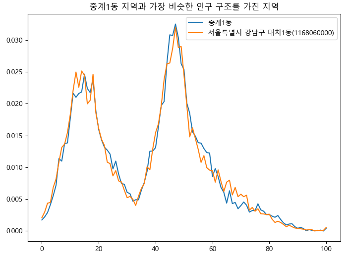


## 15. 테이블 형태의 데이터를 쉽게 다루도록 도와주는 pandas 라이브러리

### 15-1) 위키피디아 데이터 엑셀로 저장하기

```python
import pandas as pd
# 헤더 : 열 이름, 인덱스 : 나라이름
df = pd.read_html('https://en.wikipedia.org/wiki/All-time_Olympic_Games_medal_table', header=0, index_col=0)
# iloc: 데이터의 순서에 따라 접근하는 슬라이싱 방식, 첫번째는 행, 두번째는 열
summer = df[1].iloc[:, :5]
# 열이름을 바꾸자
summer.columns = ['경기수', '금', '은', '동', '계']
# sort_values() 함수 이용
# ascending - True: 오름차순, False: 내림차순
print(summer.sort_values('금', ascending=False))
# 엑셀 파일 저장
summer.to_excel('하계올림픽메달.xlsx')
```


### 15-2) pandas란

> panel datas(패널 자료)의 약자, numpy기반으로 만들어짐


### 15-3) 데이터 프레임 기초

```python
# 15-3 데이터 프레임 기초
# 행을 구분해주는 인덱스, 열을 구분해주는 컬럼
# 별도로 지정하지 않으면 인덱스는 리스트처럼 정수로 설정이 됨
# 한 번 설정된 인덱스는 변경되지 않는다.
index = pd.date_range('1/1/2000', periods=8)
print(index)

df = pd.DataFrame(np.random.rand(8, 3), index=index, columns=list('ABC'))
print(df)
# 열을 지정하면 series 데이터 구조(1차원 배열)로 표현됨
print(df['B'])
# 마스크 기능 가능
print(df['B'] > 0.4)
print(df[df['B'] > 0.4])

# 만약 행과 열을 뒤집으려면?? -> 전치행렬이라고 한다.
# 전치행렬의 약자 : T(transpose)
print(df[df['B'] > 0.4].T)

# 2차원 배열 형태의 데이터 프레임 연산
# 1. 행 방향 축을 기준으로 한 연산 (axis=0) default 위에서 아래 - 열 우선 계산
# 2. 열 방향 축을 기준으로 한 연산 (axis=1) 왼쪽에서 오른쪽 -> 행 우선 계산
# 어떠한 열과 다른 열이 행마다 연산 되어서 값이 나와야 한다면 axis = 0
# 1행을 쭉쭉 계산해서 새로운 열의 1행이 나온다면 axis = 1
# 헷갈리니 개념을 자주 보자
# A열의 값을 B열의 값으로 나눈 후 , 그 결과를 새로 만든 D열에 저장
index = pd.date_range('1/1/2020', periods=8)
df = pd.DataFrame(np.random.rand(8, 3), index=index, columns=list('ABC'))
df['D'] = df['A'] / df['B'] # A열의 값을 B열의 값으로 나눈 값을 D열에 저장
df['E'] = np.sum(df, axis=1)    # 행 우선 계산 값을 E열에 저장
df = df.sub(df['A'], axis=0)    # A열의 데이터를 기준으로 열 우선 계산
df = df.div(df['C'], axis=0)    # C열의 데이터를 기준으로 열 우선 계산산df.to_csv('test.csv')
# df.to_csv('test.csv')
df.head()
```


### 15-4) pandas로 인구 구조 분석하기

1. 데이터를 읽어온다.
   1. 전체 데이터를 총 인구수로 나누어 비율로 변환한다.
   2. 총인구수와 연령구간 인구수를 삭제한다.
2. 궁금한 지역의 이름을 입력받는다.
3. 궁금한 지역의 인구 구조를 저장한다.
4. 궁금한 지역의 인구 구조와 가장 비슷한 인구 구조를 가진 지역을 찾는다.
   1. 전국의 모든 지역 중 한 곳(B)을 선택한다.
   2. 궁금한 지역 A의 0세 인구 비율에서 B의 0세 인구 비율을 뺀다.
   3. 2를 100세 이상 인구수에 해당하는 값까지 반복한 후 차이의 제곱을 모두 더한다.
   4. 전국의 모든 지역에 대해 반복하며 그 차이가 가장 작은 지역을 찾는다.
5. 가장 비슷한 곳의 인구 구조와 궁금한 지역의 인구 구조를 시각화한다.

```python
# 15-4 pandas로 인구 구조 분석하기
# 1. 데이터 읽어오기
df = pd.read_csv('../3_인구공공데이터/age.csv', encoding='cp949', index_col=0)
df = df.div(df['2019년02월_계_총인구수'], axis=0)    # 전체 데이터를 총인구수로 나눠서 비율로 변환
del df['2019년02월_계_총인구수'], df['2019년02월_계_연령구간인구수']
plt.rc('font', family="Malgun Gothic")
# 2 ~ 3 궁금한 지역 이름 입력받고 해당 지역의 인구 구조 저장하기
name = input('원하는 지역의 이름을 입력해주세요 : ')   # 2. 지역이름 입력
host = df.index.str.contains(name)  # 3. 해당 행을 찾아서 해당 지역의 인구 구조를 저장
df2 = df[host]

# # 4 ~ 5 궁금한 지역의 인구 구조와 가장 비슷한 인구 구조를 가진 지역 시각화하기
# # 궁금한 지역 인구 비율에서 선택 지역 인구 비율을 뺀다.
# x = df.sub(df2.iloc[0], axis=1)
# # x의 값을 제곱한다.
# y = np.power(x, 2)
# # 혹은 절댓값 이용
# # y = np.abs(x)
# # 한 행마다 모든 열의 값을 다 더한 값이 z
# z = y.sum(axis=1)
# # z를 정렬하여 5번째 까지의 인덱스(여기서는 동이름)를 뽑는다.
# i = z.sort_values().index[:5]
# # 구조가 가장 가까운 5번째 까지의 인덱스(동이름)을 데이터프레임에 넣어 전치하고
# # 그래프로 출력
# df.loc[i].T.plot()
# 위의 4 ~ 5과정을 한줄로 적으면 -> 그냥 식변형
df.loc[np.power(df.sub(df2.iloc[0],axis=1),2).sum(axis=1).sort_values().index[:5]].T.plot()
plt.show()
```


