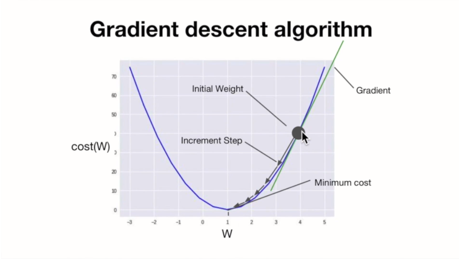
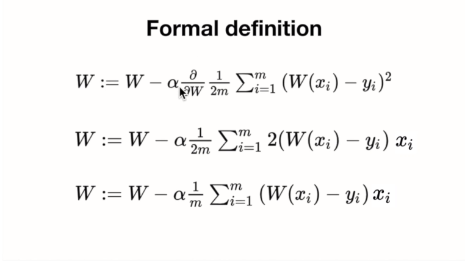

## Machine Learning (ML)

> 선형 회귀(Linear Regression)
>
> 가설 (Hypothesis)
>
> 비용함수(Cost function)

### 1. Regression

> "Regression toward the mean"
>
> 전체의 평균으로 되돌아간다.

### 2. Linear Regression(선형 회귀)

> 데이터를 가장 잘 표현하는 직선의 방정식을 찾는 것
>
> 방법은 오차의 제곱의 합의 평균이 제일 작은 것을 찾는것이다.


- 파란점이 데이터를 표현한다면 그 데이터를 가장 잘 대변하는 직선의 방정식을 찾는 것
- 직선의 방정식의 기울기(a)와 y절편(b) 값을 찾아가는 것

- 예시


- 가설


- 비용


- 비용이 가작 적은 것을 어떻게 알 수 있을 까?
- (가설 - 실제값) 으로 구하자!
- 그런데 음수값과 양수값으로 나누어진다.
  - 제곱으로 해결!!


- 오차 제곱의 평균으로 정의!


- 결국 우리의 목표는 Cost를 최대한 작게하는 것!

  


### 3. Simple Linear Regression(단순 선형 회귀) 맛보기

```python
import tensorflow as tf

# Linear : 선형, regression : 회귀
# Hypothesis : 가설
# Cost function : 비용 함수

# H(x) Wx + b

x_data = [1, 2, 3, 4, 5]
y_data = [1, 2, 3, 4, 5]

# constant : 상수 선언
# Variable : 변수


w = tf.Variable(2.9)
b = tf.Variable(0.5)

hypothesis = w * x_data + b

# cost(W, b) = ((H(x**i) - (y**2))**2)의 합 * 1/m
# 가설에서 실제값을 뺀 것의 제곱들의 평균을 나타냄
# hypothesis - y_data : 에러 값
cost = tf.reduce_mean(tf.square(hypothesis - y_data))

# tf.reduce_mean()에 대해서 알아보자.
# reduce : 줄어든다의 의미로 차원을 하나 줄인다라고 생각
# 1차원
v = [1., 2., 3., 4.]
# 0차원
tf.reduce_mean(v)   # 2.5

# tf.square() : 넘겨받은 값을 제곱함
tf.square(3)    # 9


# Gradient(경사) descent(하강) : 경사 하강 알고리즘
# Cost가 최소가 되도록 하는 미니마이즈 알고리즘 중 가장유명함
# 경사를 하강하면서 minimize cost(W,b)의 W, b를 찾는 알고리즘이다.
learning_rate = 0.01
for i in range(100):
    # with ... as 파일 객체:
    # 파일이나 함수를 열고 해당 구문이 끝나면 자동으로 닫는다.
    # close같은 것을 빼먹는 경우를 위해 만들어졌음
    # GradientTape()은 보통 with 구문과 같이 쓰임
    # with 블럭 안에 있는 변수들의 변화, 정보를 tape에 기록한다.
    # tape의 gradient 메서드를 호출해서 이후에 경사도값 즉, 미분값(기울기)을 구함
    with tf.GradientTape() as tape:
        hypothesis = w * x_data + b
        cost = tf.reduce_mean(tf.square(hypothesis - y_data))

    # gradient는 변수들에 대한 개별 미분값(기울기)을 구해서 tuple로 반환한다.
    # w_grad : cost함수에서 w의 미분값(기울기), b_grad : cost함수에서 b의 미분값(기울기)
    w_grad, b_grad = tape.gradient(cost, [w, b])
    # w, b의 값을 업데이트
    # assign_sub는 뺀값을 다시 그 값에 할당해줌
    # ex) A.assign_sub(B)
    # A = A-B, A -= B
    # learning_rate는 w_grad(gradient)값을 얼마나 반영할 지 정한다.
    # 작은 값이 쓰임
    # 기울기를 구했을 때 그 기울기를 얼마만큼 반영할 것인가이다.
    w.assign_sub(learning_rate * w_grad)
    b.assign_sub(learning_rate * b_grad)
    if i % 10 == 0:
        print('{:5}|{:10.4f}|{:10.4}|{:10.6f}'.format(i, w.numpy(), b.numpy(), cost))

# 우리가 만든 가설이 얼마나 맞는지 새로운 데이터로 해보자.
# 거의 근사한 값이 나온다는 것을 알 수 있다.
print(w*5 + b)  # tf.Tensor(5.0066934, shape=(), dtype=float32)
print(w*2.5 + b)    # tf.Tensor(2.4946523, shape=(), dtype=float32)
```


### 4. Linear Regression과 어떻게 Cost를 줄일 수 있을까?

> 경사하강법(Gradient Descent)과 볼록함수(Convex function)

#### 4-1) 경사 하강법(Gradient Descent algorithm)

- Cost를 최소화하는 방법
- 변수가 여러개일 때도 사용 가능
- 최초의 추정 또는 랜덤값을 통해 w, b값을 지정
- W나 b값을 cost(W, b)값이 줄어들 수 있도록 w와 b값을 기울기 값을 통해서 지속적으로 바꾼다.
- 최소값에 도달했다 라고 판단될 때까지 반복한다.
- 미분계산은 tensor에서 지원하므로 미분하는 코드는 작성할일 없음.



- m으로 나눠도되고 2m으로 나눠도 되고, 3m... 다 가능하다.
- cost특성에는 큰 영향을 주지 않기 때문에
- 미분할 때 뒤의 지수가 앞으로 나오게 되므로 약분을 통해 식이 좀 더 간략해짐
- 큰의미 둘 필요 없음 


- weight값을 지속적으로 업데이트
- 알파값은 우리가 구한 기울기를 얼마나 반영할 것인지 정해줌
- 0.001이나 0.0001같이 작은값을 주로 이용함
- 라운드는 편미분기호임.
- W에 대해서만 미분한다 라는 표시




#### 4-2) 볼록 함수(Convex function)

- 로컬 미니멈 : 기울기가 0인 지점, 주변을 둘러봤을 때 주변에 비해서 가장 낮은 지점이라고 생각하면됨.
- 시작점에 따라 최저점이 아닌 로컬미니멈에 도달하면 나올 수 없기 때문에
- 경사하강법은 로컬미니멈이 많은경우 사용 불가


- 볼록 함수란 로컬미니멈과 글로벌미니멈이 일치하는 경우를 말한다.
- 즉, 로컬미니멈이 여러개 존재하지 않는 경우를 말한다.
- 이 경우 어디서 시작하든 항상 최저점에 도달하리란 것을 보장하기 때문에 경사하강법을 쓸수있다.


- 미분하는 식을 보여주거나 미분그래프를 그려주는 사이트가 있다는 걸 알아두자.


### 5. 선형회귀와 비용최소화를 Tensor Flow로 구현하기

- 비용함수(cost function)를 순수 python으로 구현해보기

```python
# 비용 함수
def cost_func(w, x, y):
    c = 0
    for i in range(len(x)):
        c += (w*x[i] - y[i]) ** 2
    return c/len(x)

# feed_w : -3~5까지 15개의 구간값
for feed_w in np.linspace(-3, 5, num=15):
    curr_cost = cost_func(feed_w, x, y)
    print("{:6.3f} | {:10.5f}".format(feed_w, curr_cost))
    
# -3.000 |   74.66667
# -2.429 |   54.85714
# -1.857 |   38.09524
# -1.286 |   24.38095
# -0.714 |   13.71429
# -0.143 |    6.09524
#  0.429 |    1.52381
#  1.000 |    0.00000
#  1.571 |    1.52381
#  2.143 |    6.09524
#  2.714 |   13.71429
#  3.286 |   24.38095
#  3.857 |   38.09524
#  4.429 |   54.85714
#  5.000 |   74.66667
```

- cost function의 그래프


- 비용함수(cost function)를 Tensor Flow로 구현

```python
x = np.array([1, 2, 3])
y = np.array([1, 2, 3])
def cost_func(w, x, y):
    hypothesis = x * w
    return tf.reduce_mean(tf.square(hypothesis - y))
w_values = np.linspace(-3, 5, 15)
cost_values= []
for feed_w in w_values:
    curr_cost = cost_func(feed_w, x, y)
    cost_values.append(curr_cost)
    print("{:6.3f} | {:10.5f}".format(feed_w, curr_cost))

# -3.000 | 74.66667
# -2.429 | 54.85714
# -1.857 | 38.09524
# -1.286 | 24.38095
# -0.714 | 13.71429
# -0.143 | 6.09524
# 0.429 | 1.52381
# 1.000 | 0.00000
# 1.571 | 1.52381
# 2.143 | 6.09524
# 2.714 | 13.71429
# 3.286 | 24.38095
# 3.857 | 38.09524
# 4.429 | 54.85714
# 5.000 | 74.66667
```

- Gradient descent(경사하강법)을 Tensor Flow로 구현


```python
alpha = 0.01
# reduce_mean : 평균, multiply : 곱하기
# ((w*x -y)x)/m
gradient = tf.reduce_mean(tf.multiply(tf.multiply(w, x) - y, x))
# descent : 새로운 w 값
# 기울기에 alpha값을 곱하고 w에서 뺀다.
descent= w - tf.multiply(alpha, gradient)
w.assign(descent)
```


- 전체코드

```python
tf.random.set_seed(0)

x = [1., 2., 3., 4.]
y = [1., 3., 5., 7.]
w = tf.Variable(tf.random.normal([1], -100., 100.))
for step in range(300):
    hypothesis = w*x
    cost = tf.reduce_mean(tf.square(hypothesis - y))
    alpha = 0.01
    gradient = tf.reduce_mean(tf.multiply(tf.multiply(w, x) - y, x))
    descent= w - tf.multiply(alpha, gradient)
    w.assign(descent)

    if step % 10 == 0:
        print('{:5} | {:10.4f} | {:10.6f}'.format(step, cost.numpy(), w.numpy()[0]))
```

