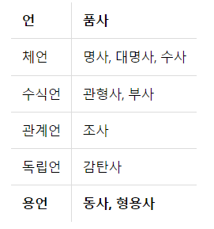

# 텍스트 전처리

## 1. 토큰화(Tokenization)

### 1-1) 단어 토큰화

> 토큰의 기준이 단어(word)인 경우
>
> 다만, 여기서 단어(word)는 단어 단위 외에도 단어구, 의미를 갖는 문자열로도 간주되기도 함

#### 1-1-1) 예제

- 구두점과 같은 문자는 제외시키는 간단한 토큰화 작업
- 입력 : Time is an illusion. Lunchtime double so!
- 출력 : "Time", "is", "an", "illusion", "Lunchtime", "double", "so"
- 구두점을 지운 뒤 띄어쓰기를 기준으로 잘라낸 기초적인 예제


### 1-2) 토큰화에서 고려해야 할 사항

#### 1-2-1) 구두점이나 특수 문자를 단순 제외해서는 안 된다.

- 마침표(.)와 같은 경우 문장의 경계를 알 수 있다.
- 단어 자체에 구두점을 갖고 있는 경우 ex) ph.D, AT&T, m.p.h
- 특수 문자의 달러나 슬래쉬 ex) $45.55, 01/02/06
- 숫자 사이에 컴마(,) ex) 123,456,789

#### 1-2-2) 줄임말과 단어 내의 띄어쓰기가 있는 경우

- 영어권의 아포스트로피(')
  - what're = whar are의 줄임말
  - re : 접어(clitic)
    - ex ) i'm => 접어: m, we're => 접어:re
- New York, rock 'n' roll
  - 하나의 단어이지만 중간에 띄어쓰기가 존재
  - 이러한 단어를 하나로 인식할 수 있는 능력도 있어야 한다.

#### 1-2-3) 표준 토큰화 예제

- penn Treebank Tokenization
  - 규칙 1: 하이푼으로 구성된 단어는 하나로 유지
  - doesn't와 같이 아포스트로피로 '접어'가 함께하는 단어는 분리'

```python
from nltk.tokenize import TreebankWordTokenizer

tokenizer = TreebankWordTokenizer()

text = "Starting a home-based restaurant may be an ideal. it doesn't have a food chain or restaurant of their own."
print('트리뱅크 워드토크나이저 :',tokenizer.tokenize(text))

# 트리뱅크 워드토크나이저 : ['Starting', 'a', 'home-based', 'restaurant', 'may', 'be', 'an', 'ideal.', 'it', 'does', "n't", 'have', 'a', 'food', 'chain', 'or', 'restaurant', 'of', 'their', 'own', '.']
```


### 1-3) 문장 토큰화

- 한국어의 경우 박상길님이 개발한 KSS(Korean Sentence Splitter)를 추천

```python
# pip install kss

import kss

text = '딥 러닝 자연어 처리가 재미있기는 합니다. 그런데 문제는 영어보다 한국어로 할 때 너무 어렵습니다. 이제 해보면 알걸요?'
print('한국어 문장 토큰화 :',kss.split_sentences(text))

# 한국어 문장 토큰화 : ['딥 러닝 자연어 처리가 재미있기는 합니다.', '그런데 문제는 영어보다 한국어로 할 때 너무 어렵습니다.', '이제 해보면 알걸요?']
```


### 1-4) 한국어에서의 토큰화의 어려움

> 어절 : 띄어쓰기 단위가 되는 단위
>
> 교착어: 조사, 어미 등을 붙여서 말을 만드는 언어
>
> 한국어 NLP에서 어절 토큰화는 단어토큰화와 같지 않기 때문에 지양된다.

#### 1-4-1) 교착어의 특성

- ex ) 그(he/him)라는 주어나 목적어가 들어간 문장이 있다고 하면
  - '그가', '그에게', '그를', '그와', '그는'과 같은 다양한 조사가 '그'라는 글자 뒤에 띄어쓰기 없이 바로 붙게됨
  - 따라서 한국어 NLP에서 조사는 분리해줄 필요가 있음

- 자립형태소 : 접사, 어미, 조사와 상관없이 자립하여 사용할 수 있는 형태서. 그 자체로 단어가 된다. 체언(명사, 대명사, 수사), 수식언(관형사, 부사), 감탄사 등이 있다.
- 의존 형태소 : 다른 형태소와 결합하여 사용되는 형태소. 접사, 어미, 조사, 어간을 말한다.
- ex) 에디가 책을 읽었다.
  - 띄어쓰기 단위 토큰화 : ['에디가', '책을', '읽었다']
  - 형태소단위 분해
    - 자립형태소 : 에디, 책
    - 의존형태소 : -가, -을, 읽-, -었, -다
- 즉, 한국어에서 영어에서의 단어토큰화와 유사한 형태를 얻으려면 어절 토큰화가 아니라 형태소 토큰화를 수행해야 한다.

#### 1-4-2) 한국어는 띄어쓰기가 영어보다 잘 지켜지지 않는다.

- 한국어는 영어권언어보다 띄어쓰기가 어렵고 잘 지켜지지 않는 경향이 있다.
- 그 이유로 가장 기본적인 견해는 한국어의 경우 띄어쓰기가 지켜지지 않아도 글을 쉽게 이해할 수 있는 언어라는 점이다.
- ex) 제가이렇게띄어쓰기를전혀하지않고글을썼다고하더라도글을이해할수있습니다.
- ex) Tobeornottobethatisthequestion
- 한국어(모아쓰기 방식)와 영어(풀어쓰기 방식)의 언어적 특성의 차이에 기인한다.


### 1-5) 품사 태깅(part-of-speech tagging)

- 단어는 표기는 같지만 품사에 따라서 단어의 의미가 달라지기도 한다.
- ex) fly: 동사-날다, 명사-파리
- ex) 못: 명사-망치를 사용해서 목재 따위를 고정하는 물건, 부사-'먹는다', '달린다'와 같은 동작 동사를 할 수 없다
- 각 단어가 어떤 품사로 쓰였는지를 구분해 놓는 작업을 품사 태깅이라 한다.


### 1-6) NLTK와 KoNLPy를 이용한 영어, 한국어 토큰화 실습

```python
from nltk.tokenize import word_tokenize
from nltk.tag import pos_tag

text = "I am actively looking for Ph.D. students. and you are a Ph.D. student."
tokenized_sentence = word_tokenize(text)

print('단어 토큰화 :',tokenized_sentence)
print('품사 태깅 :',pos_tag(tokenized_sentence))

# 단어 토큰화 : ['I', 'am', 'actively', 'looking', 'for', 'Ph.D.', 'students', '.', 'and', 'you', 'are', 'a', 'Ph.D.', 'student', '.']
# 품사 태깅 : [('I', 'PRP'), ('am', 'VBP'), ('actively', 'RB'), ('looking', 'VBG'), ('for', 'IN'), ('Ph.D.', 'NNP'), ('students', 'NNS'), ('.', '.'), ('and', 'CC'), ('you', 'PRP'), ('are', 'VBP'), ('a', 'DT'), ('Ph.D.', 'NNP'), ('student', 'NN'), ('.', '.')]
```

- VBP : 동사, RB: 부사, VBG: 현재부사, IN: 전치사, NNP: 고유명사, NNS: 복수형 명사, CC: 접속사, DT: 관사

- 한국어 자연어 처리: KoNLPy(코엔엘파이) 패키지 사용
  - 각 형태소 분석기는 성능과 결과가 다르게 나오기 때문에, 필요 용도에 어떤 형태소 분석기가 가장 적절한지 판단하고 사용
    - ex) 속도를 중시한다면 메캅을 사용할 수 있다.
  - 형태소 분석기 : Okt(Open Korea Text), 메캅(Mecab), 코모란(Komoran), 한나눔(Hannanum), 꼬꼬마(Kkma)

```python
from konlpy.tag import Okt
from konlpy.tag import Kkma

okt = Okt()
kkma = Kkma()

print('OKT 형태소 분석 :',okt.morphs("열심히 코딩한 당신, 연휴에는 여행을 가봐요"))
print('OKT 품사 태깅 :',okt.pos("열심히 코딩한 당신, 연휴에는 여행을 가봐요"))
print('OKT 명사 추출 :',okt.nouns("열심히 코딩한 당신, 연휴에는 여행을 가봐요")) 

# OKT 형태소 분석 : ['열심히', '코딩', '한', '당신', ',', '연휴', '에는', '여행', '을', '가봐요']
# OKT 품사 태깅 : [('열심히', 'Adverb'), ('코딩', 'Noun'), ('한', 'Josa'), ('당신', 'Noun'), (',', 'Punctuation'), ('연휴', 'Noun'), ('에는', 'Josa'), ('여행', 'Noun'), ('을', 'Josa'), ('가봐요', 'Verb')]
# OKT 명사 추출 : ['코딩', '당신', '연휴', '여행']
```

- morphs : 형태소 추출
- pos : 품사 태깅(part-of-speech tagging)
- nouns : 명사 추출

```python
print('꼬꼬마 형태소 분석 :',kkma.morphs("열심히 코딩한 당신, 연휴에는 여행을 가봐요"))
print('꼬꼬마 품사 태깅 :',kkma.pos("열심히 코딩한 당신, 연휴에는 여행을 가봐요"))
print('꼬꼬마 명사 추출 :',kkma.nouns("열심히 코딩한 당신, 연휴에는 여행을 가봐요"))  

# 꼬꼬마 형태소 분석 : ['열심히', '코딩', '하', 'ㄴ', '당신', ',', '연휴', '에', '는', '여행', '을', '가보', '아요']
# 꼬꼬마 품사 태깅 : [('열심히', 'MAG'), ('코딩', 'NNG'), ('하', 'XSV'), ('ㄴ', 'ETD'), ('당신', 'NP'), (',', 'SP'), ('연휴', 'NNG'), ('에', 'JKM'), ('는', 'JX'), ('여행', 'NNG'), ('을', 'JKO'), ('가보', 'VV'), ('아요', 'EFN')]
# 꼬꼬마 명사 추출 : ['코딩', '당신', '연휴', '여행']
```


## 2) 정제(Cleaning) and 정규화(Normalization)

> 정제(Cleaning) : 갖고 있는 코퍼스로부터 노이즈 데이터를 제거
>
> 정규화(Normalization) : 표현 방법이 다른 단어들을 통합시켜서 같은 단어로 만들어준다.

### 2-1) 규칙에 기반한 표기가 다른 단어들의 통합

- ex) 같은 의미이지만 표기가 다른 단어들을 하나의 단어로 정규화
  - USA와 US 같은 의미를 가지므로 하나의 단어로 정규화
  - uh-huh와 uhhuh는 형태는 다르지만 여전히 같은 의미
- 정규화를 거치면 US를 찾아도 USA도 함께 찾을 수 있을 것이다.
- 어간 추출(stemming)과 표제어 추출(lemmatizaiton)


### 2-2) 대, 소문자 통합

- 대부분의 글은 소문자로 작성되기 때문에 대,소문자 통합 작업은 대부분 대문자를 소문자로 변환하는 소문자 변환작업으로 이루어진다.
- 대문자와 소문자가 구분되어야 하는 경우도 생각
  - US(미국), us(우리), 회사 이름, 사람 이름


### 2-3) 불필요한 단어의 제거

> 노이즈 데이터(noise data) - 자연어가 아니면서 아무 의미도 갖지 않는 글자들(특수 문자 등)을 의미하기도 하지만, 분석하고자 하는 목적에 맞지 않는 불필요 단어들을 노이즈 데이터라고 하기도 한다.

#### 2-3-1) 등장 빈도가 적은 단어

- 만약 100,000개의 데이터에서 총 합 5번 밖에 등장하지 않은 단어가 있다면 이 단어는 직관적으로 분류에 거의 도움이 되지 않을 것이다.

#### 2-3-2) 길이가 짧은 단어

- 영어권에서는 효율적
- 하지만 한국어에서는 유효하지 않을 수 있다.
- 영어 단어의 평균 길이는 6~7정도, 한국어 단어의 평균 길이는 2~3정도로 추정
- dragon(6글자) - 용(1글자), school(6글자) - 학교(2글자)
- 영어에서 길이가 1인 단어를 제거하면 대부분 자연어처리에서 의미를 갖지 못하는 관사'a'와 주어'I'가 제거된다.
- 마찬 가지로 길이가 2인 단어를 제거한다고 하면 it, at, to, on, in, by 등과 같은 대부분 불용어에 해당하는 단어들이 제거된다.


#### 2-4) 정규 표현식(Regular Expression)

- 만약 뉴스 기사를 크롤링 했다면, 기사마다 게재 시간이 적혀져 있을 수 있따.
- 정규 표현식은 이러한 코퍼스 내에 계속해서 등장하는 글자들을 규칙에 기반하여 한 번에 제거하는 방식으로서 매우 유용하다.


## 3) 어간 추출(Stemming) and 표제어 추출(Lemmatization)

> 이 두 작업이 가진 의미는 눈으로 봤을 때는 서로 다른 단어들이지만, 하나의 단어로 일반화시킬 수 있다면 하나의 단어로 일반화시켜서 문서 내의 단어 수를 줄이겠다는 것

### 3-1) 표제어 추출(Lemmatization)

> Lemma : 표제어 or 기본 사전형 단어
>
> 문맥을 고려하며 수행했을 때의 결과는 해당 단어의 품사 정보를 보존한다.

- 단어들로부터의 표제어를 찾아가는 과정
- ex) am, are, is는 서로 다른 스펠링이지만 그 뿌리 단어는 be라고 볼 수 있다. 이때 이 단어들의 표제어는 be라고 한다.
- 표제어 추출을 하는 가장 섬세한 방법 : 형태학적 파싱을 먼저 진행하는 것

#### 3-1-1) 형태학적 파싱

- 형태소 : 의미를 가진 가장 작은 단위
- 형태학 : 형태소로부터 단어들을 만들어가는 학문
- 형태소의 종류
  - 어간(stem) : 단어의 의미를 담고 있는 단어의 핵심 부분
  - 접사(affix) : 단어에 추가적인 의미를 주는 부분
- 형태학적 파싱은 어간과 접사를 분리하는 작업을 말한다.
- ex ) cats라는 단어에 형태학적 파싱을 수행 => cat(어간), -s(접사)를 분리


### 3-2) 어간 추출(stemming)

> 품사 정보가 보존되지 않는다. 즉 어간 추출을 한 결과는 사전에 존재하지 않는 단어일 경우가 많다.
>
> 어간을 추출하는 것

- 어간 추출 속도는 표제어 추출보다 일반적으로 빠르다.
- 포터 어간 추출기는 정확도가 높으므로 영어 자연어 처리에서 어간 추출을 하고자 한다면 가장 준수한 선택
- NLTK에서는 포터 알고리즘을 외에 랭커스터 스태머(Lancaster stemmer) 알고리즘을 지원한다.


### 3-3) 한국에서의 어간 추출

- 5언 9품사



#### 3-3-1) 활용(conjugation)

> 용언의 어간(stem)이 어미(ending)를 가지는 일

- 어간 : 용언(동사, 형용사)을 활용할 때 원칙적으로 모양이 변하지 않는 부분. 활용에서 어미에 선행하는 부분. 때론 어간의 모양도 바뀔 수 있음

- 어미 : 용언의 어간 뒤에 붙어서 활용하면서 변하는 부분. 
- 활용 : 어간이 어미를 취할 때, 어간의 모습이 일정하다면 규칙 활용, 어간이나 어미의 모습이 변하는 불규칙 활용으로 나뉜다.

#### 3-3-2) 규칙 활용

- 어간이 어미를 취할 때, 어간의 모습이 일정
- 잡/어간 + 다/어미

#### 3-3-3) 불규칙 활용

- 어간이 어미를 취할 때 어간의 모습이 바뀌거나 취하는 어미가 특수한 어미일 경우를 말한다.
- ex) 듣-,돕-,곱-,잇-,오르-,노랗-등이 듣/들-, 돕/도우-, 곱/고우-, 잇/이-, 올/올-, 노랗/노라~와 같이 어간의 형식이 달라지는 일이 있거나  ‘오르+ 아/어→올라, 하+아/어→하여, 이르+아/어→이르러, 푸르+아/어→푸르러’와 같이 일반적인 어미가 아닌 특수한 어미를 취하는 경우 불규칙활용을 하는 예에 속한다.


## 4) 불용어(stopword)

>  자주 등장하지만 실제 분석을 하는것에 있어서는 큰 도움이 되지 않는 단어

#### 4-1) NLTK에서 불용어 확인하기

```python
from nltk.corpus import stopwords
from nltk.tokenize import word_tokenize 
from konlpy.tag import Okt
stop_words_list = stopwords.words('english')
print('불용어 개수 :', len(stop_words_list))
print('불용어 10개 출력 :',stop_words_list[:10])
# 불용어 개수 : 179
# 불용어 10개 출력 : ['i', 'me', 'my', 'myself', 'we', 'our', 'ours', 'ourselves', 'you', "you're"]
```

#### 4-2) NLTK를 통해서 불용어 제거하기

```python
example = "Family is not an important thing. It's everything."
stop_words = set(stopwords.words('english')) 

word_tokens = word_tokenize(example)

result = []
for word in word_tokens: 
    if word not in stop_words: 
        result.append(word) 

print('불용어 제거 전 :',word_tokens) 
print('불용어 제거 후 :',result)

# 불용어 제거 전 : ['Family', 'is', 'not', 'an', 'important', 'thing', '.', 'It', "'s", 'everything', '.']
# 불용어 제거 후 : ['Family', 'important', 'thing', '.', 'It', "'s", 'everything', '.']
```

#### 4-3) 한국어에서 불용어 제거하기

- 직접 불용어를 정의해보고, 주어진 문장으로 부터 사용자가 정의한 불용어 사전으로부터 불용어를 제거

```python
okt = Okt()

example = "고기를 아무렇게나 구우려고 하면 안 돼. 고기라고 다 같은 게 아니거든. 예컨대 삼겹살을 구울 때는 중요한 게 있지."
stop_words = "를 아무렇게나 구 우려 고 안 돼 같은 게 구울 때 는"

stop_words = set(stop_words.split(' '))
word_tokens = okt.morphs(example)

result = [word for word in word_tokens if not word in stop_words]

print('불용어 제거 전 :',word_tokens) 
print('불용어 제거 후 :',result)

# 불용어 제거 전 : ['고기', '를', '아무렇게나', '구', '우려', '고', '하면', '안', '돼', '.', '고기', '라고', '다', '같은', '게', '아니거든', '.', '예컨대', '삼겹살', '을', '구울', '때', '는', '중요한', '게', '있지', '.']
# 불용어 제거 후 : ['고기', '하면', '.', '고기', '라고', '다', '아니거든', '.', '예컨대', '삼겹살', '을', '중요한', '있지', '.']
```


## 5) 정규 표현식(Regular Expression)

> 파이썬에서 지원하는 정규 표현식 모듈 re

### 5-1) 정규 표현식 문법과 모듈 함수

#### 5-1-1) 정규 표현식 문법

| 특수 문자      | 설명                                                         |
| -------------- | ------------------------------------------------------------ |
| .              | 한 개의 임의의 문자를 나타낸다.(줄바꿈 문자인 \n는 제외)     |
| ?              | 앞의 문자가 존재할 수도 있고, 존재하지 않을 수도 있다.(문자가 0개 또는 1개) |
| *              | 앞의 문자가 무한개로 존재할 수도 있고, 존재하지 않을 수도 있다.(문자가 0개 이상) |
| +              | 앞의 문자가 최소 한 개 이상 존재한다. (문자가 1개 이상)      |
| ^              | 뒤의 문자열로 문자열이 시작된다.                             |
| $              | 앞의 문자열로 문자열이 끝난다                                |
| {숫자}         | 숫자만큼 반복한다                                            |
| {숫자1, 숫자2} | 숫자1 이상 숫자2 이하만큼 반복한다. ?, *, +를 이것으로 대체할 수 있다 |
| {숫자,}        | 숫자 이상만큼 반복한다                                       |
| []             | 대괄호 안의 문자들 중 한 개의 문자와 매치한다. [amk]라고 한다면 a 또는 m 또는 k 중 하나라도 존재하면 매치를 의미한다. <br />[a-z]와 같이 범위를 지정할 수도 있다. [a-zA-Z]는 알파벳 전체를 의미하는 범위이며, 문자열에 알파벳이 존재하면 매치를 의미한다. |
| [^문자]        | 해당 문자를 제외한 문자를 매치한다                           |
| \|             | A\|B와 같이 쓰이며 A 또는 B의 의미를 가진다                  |

| 문자 규칙 | 설명                                                         |
| --------- | ------------------------------------------------------------ |
| \         | 역 슬래쉬 문자 자체를 의미한다.                              |
| \d        | 모든 숫자를 의미한다. [0-9]와 의미가 동일하다.               |
| \D        | 숫자를 제외한 모든 문자를 의미한다. `[^0-9]`와 의미가 동일하다. |
| \s        | 공백을 의미한다. [\t\n\r\f\v]와 의미가 동일하다              |
| \S        | 공백을 제외한 모든 문자를 의미한다. `[^ \t\n\r\f\v]`와 의미가 동일하다 |
| \w        | 문자 또는 숫자를 의미한다. [a-zA-Z0-9]와 의미가 동일하다.    |
| \W        | 문자 또는 숫자가 아닌 문자를 의미한다. `[^a-zA-Z0-9]`와 의미가 동일하다. |

#### 5-1-2) 정규 표현식 모듈 함수

| 모듈 함수     | 설명                                                         |
| ------------- | ------------------------------------------------------------ |
| re.compile()  | 정규표현식을 컴파일하는 함수이다. 다시 말해, 파이썬에게 전해주는 역할을 한다. 찾고자 하는 패턴이 빈번한 경우에는 미리 컴파일해놓고 사용하면 속도와 편의성면에서 유리하다 |
| re.search()   | 문자열 전체에 대해서 정규표현식과 매치되는지를 검색한다.     |
| re.match()    | 문자열의 처음이 정규표현식과 매치되는지를 검색한다.          |
| re.split()    | 정규 표현식을 기준으로 문자열을 분리하여 리스트로 리턴한다.  |
| re.findall()  | 문자열에서 정규 표현식과 매치되는 모든 경우의 문자열을 찾아서 리스트로 리턴한다. 만약, 매치되는 문자열이 없다면 빈 리스트가 리턴된다. |
| re.finditer() | 문자열에서 정규 표현식과 매치되는 모든 경우의 문자열에 대한 이터레이터 객체를 리턴한다. |
| re.sub()      | 문자열에서 정규 표현식과 일치하는 부분에 대해서 다른 문자열로 대체한다. |


### 5-2) 정규 표현식 실습

```python
import re
```

#### 5-2-1) .기호

> .은 한 개의 임이의 문자를 나타낸다. 예를 들어 정규표현식이 a.c라고 한다면 a와 c 사이에는 어떤 1개의 문자라도 올 수 있다.
>
> akc, azc, avc, a5c, a!c와 같은 형태는 모두 a.c의 정규 표현식과 매치된다.

```python
r = re.compile("a.c")
r.search("abc")
# <_sre.SRE_Match object; span=(0, 3), match='abc'>  
```

#### 5-2-2) ?기호

> ?은 ?앞의 문자가 존재할 수도 있고 존재하지 않을 수도 있는 경우를 나타낸다. 예를 들어 정규 표현식이 ab?c라고 하면 이 정규 표현식에서의 b는 있다고 취급할 수도 있고, 없다고 취급할 수 도 있다. 즉, abc와 ac 모두 매치할 수 있다.

```python
r = re.compile("ab?c")
r.search("abbc")	# 아무런 결과도 출력되지 않는다.
r.search("abc")
# <_sre.SRE_Match object; span=(0, 3), match='abc'>
r.search("ac")
# <_sre.SRE_Match object; span=(0, 2), match='ac'>  
```

#### 5-2-3) *기호

> *은 바로 앞의 문자가 0개 이상일 경우를 나타낸다. 앞의 문자는 존재하지 않을 수도 있으며, 또는 여러 개일 수도 있다.
>
> 정규 표현식이 ab*c라면 ac, abc, abbc, abbbc 등과 매치할 수 있으며 b의 개수는 무수히 많을 수 있다.

```python
r = re.compile("ab*c")
r.search("a")	# 아무런 결과도 출력되지 않는다.
r.search("ac")
# <_sre.SRE_Match object; span=(0, 2), match='ac'>  
r.search("abc")
# <_sre.SRE_Match object; span=(0, 3), match='abc'> 
r.search("abbbbc")
# <_sre.SRE_Match object; span=(0, 6), match='abbbbc'>
```

#### 5-2-4) +기호

> *와 유사하지만 앞의 문자가 최소 1개 이상이어야 하는 차이점이 있다. 정규 표현식이 ab+c라면 ac는 매칭되지 않는다.

```python
r = re.compile("ab+c")
r.search("ac") # 아무런 결과도 출력되지 않는다.
r.search("abc")
# <_sre.SRE_Match object; span=(0, 3), match='abc'>   
r.search("abbbbc")
# <_sre.SRE_Match object; span=(0, 6), match='abbbbc'>  
```

#### 5-2-5) ^기호

> ^는 시작되는 문자열을 지정한다. 정규표현식이 ^ab라면 문자열 ab로 시작되는 경우 매치한다.

```python
r = re.compile("^ab")
r.search("bbc")	# 아무런 결과도 출력되지 않는다.
r.search("zab")	# 아무런 결과도 출력되지 않는다.
r.search("abz")
# <re.Match object; span=(0, 2), match='ab'>
```

#### 5-2-6) {숫자} 기호

> 문자에 해당 기호를 붙이면, 해당 문자를 숫자만큼 반복한 것을 나타낸다. 예를들어 정규 표현식이 ab{2}c라면 a와 c 사이에 b가 존재하면서 b가 2개인 문자열에 대해서 매치한다.

```python
r.compile("ab{2}c")
r.search("ac")	# 아무런 결과도 출력되지 않는다.
r.search("abc")	# 아무런 결과도 출력되지 않는다.
r.search("abbbbbc")	# 아무런 결과도 출력되지 않는다.
r.search("abbc")
# <_sre.SRE_Match object; span=(0, 4), match='abbc'>
```

#### 5-2-7) {숫자1, 숫자2} 기호

> 문자에 해당 기호를 붙이면 해당 문자를 숫자1 이상 숫자2 이하만큼 반복한다. 예를 들어 정규 표현식이 ab{2,8}c라면 a와 c사이에 b가 존재하면서 b는 2개 이상 8개 이하인 문자열에 대해서 매치한다.

```python
r = re.compile("ab{2,8}c")

r.search("ac")	# 아무런 결과도 출력되지 않는다.
r.search("abc")	# 아무런 결과도 출력되지 않는다.
r.search("abbbbbbbbbc")	# 아무런 결과도 출력되지 않는다.
r.search("abbc")
# <_sre.SRE_Match object; span=(0, 4), match='abbc'>
r.search("abbbbbbbbc")
# <_sre.SRE_Match object; span=(0, 10), match='abbbbbbbbc'>
```

#### 5-2-8) {숫자,} 기호

> 문자에 해당 기호를 붙이면 해당 문자를 숫자 이상만큼 반복한다. 예를들어 정규 표현식이 a{2,}bc라면 뒤에 bc가 붙으면서 a의 개수가 2개 이상인 경우에만 문자열과 매치한다. 또한 만약 {0,}을 쓴다면 *와 동일한 의미이며, {1,)은 +와 동일한 의미이다.

```python
r = re.compile("a{2,}bc")

r.search("bc")	# 아무런 결과도 출력되지 않는다.
r.search("aa")	# 아무런 결과도 출력되지 않는다.
r.search("aabc")
# <_sre.SRE_Match object; span=(0, 4), match='aabc'>
r.search("aaaaaaaabc")
# <_sre.SRE_Match object; span=(0, 10), match='aaaaaaaabc'> 
```

#### 5-2-9) []기호

> []안에 문자들을 넣으면 그 문자들 중 한 개의 문자와 매치라는 의미를 가진다. 예를들어 정규표현식이 [abc]라면 a 또는 b 또는 c가 들어가있는 문자열과 매치된다. 범위를 지정하는 것도 가능하다. [a-zA-Z]는 알파벳 전부를 의미하며, [0-9]는 숫자 전부를 의미한다.

```python
r = re.compile("[abc]")	#[abc]는 [a-c]와 같다
r.search("zzz") # 아무런 결과도 출력되지 않는다.
r.search("a")
# <_sre.SRE_Match object; span=(0, 1), match='a'> 
r.search("aaaaaaa")
# <_sre.SRE_Match object; span=(0, 1), match='a'> 
r.search("baac")
# <_sre.SRE_Match object; span=(0, 1), match='b'>
```

```python
r = re.compile("[a-z]")

r.search("AAA")		# 아무런 결과도 출력되지 않는다.
r.search("111") 	# 아무런 결과도 출력되지 않는다.

r.search("aBC")
# <_sre.SRE_Match object; span=(0, 1), match='a'>
```

#### 5-2-10) `[^문자] `기호

> ^기호 뒤에 붙은 문자들을 제외한 모든 문자를 매치하는 역할을 한다. 예를들어 `[^abc]`라는 정규표현식이 있다면, a 또는 b 또는 c가 들어간 문자열을 제외한 모든 문자열을 매치한다.

```python
r = re.compile("[^abc]")

r.search("a")	# 아무런 결과도 출력되지 않는다.
r.search("ab") 	# 아무런 결과도 출력되지 않는다.
r.search("b")	# 아무런 결과도 출력되지 않는다.
r.search("d")
# <_sre.SRE_Match object; span=(0, 1), match='d'>
r.search("1")                                                                                                
# <_sre.SRE_Match object; span=(0, 1), match='1'> 
```

### 5-3) 정규 표현식 모듈 함수 예제

#### 5-3-1) re.match() 와 re.search()의 차이

> search()가 정규 표현식 전체에 대해서 문자열이 매치하는지를 본다면, match()는 문자열의 첫 부분부터 정규 표현식과 매치하는 지를 확인한다.
>
> 문자열 중간에 찾을 패턴이 있더라도 match 함수는 문자열의 시작에서 패턴이 일치하지 않으면 찾지 않는다.

```python
r = re.compile("ab.")
r.match("kkkabc")	# 아무런 결과도 출력되지 않는다.
r.search("kkkabc")
# <_sre.SRE_Match object; span=(3, 6), match='abc'>   
r.match("abckkk")  
# <_sre.SRE_Match object; span=(0, 3), match='abc'>  
```

#### 5-3-2) re.split()

> 입력된 정규 표현식을 기준으로 문자열들을 분리하여 리스트로 리턴한다. 토큰화에 유용하게 쓰일 수 있다.

```python
# 공백 기준 분리
text = "사과 딸기 수박 메론 바나나"
re.split(" ", text)
# ['사과', '딸기', '수박', '메론', '바나나']

# 줄바꿈 기준 분리
text = """사과
딸기
수박
메론
바나나"""
re.split("\n", text)
# ['사과', '딸기', '수박', '메론', '바나나']  

# '+'를 기준으로 분리
text = "사과+딸기+수박+메론+바나나"
re.split("\+", text)
# ['사과', '딸기', '수박', '메론', '바나나']  
```

#### 5-3-3) re.findall()

> 정규 표현식과 매치되는 모든 문자열들을 리스트로 리턴한다. 단, 매치되는 문자열이 없다면 빈 리스트를 리턴한다. 임의의 텍스트에 정규 표현식으로 숫자를 의미하는 규칙으로 findall()을 수행하면 전체 텍스트로부터 숫자만 찾아내서 리스트로 리턴한다.

```python
text = """이름 : 김철수
전화번호 : 010 - 1234 - 1234
나이 : 30
성별 : 남"""

re.findall("\d+", text)
# ['010', '1234', '1234', '30']

re.findall("\d+", "문자열입니다.")
# []
```

#### 5-3-4) re.sub()

> 정규 표현식 패턴과 일치하는 문자열을 찾아 다른 문자열로 대체할 수 있다. 아래와 같은 정제 작업에 많이 사용 되는데, 영어 문장에 각주 등과 같은 이유로 특수 문자가 섞여있는 경우에 특수 문자를 제거하고 싶다면 알파벳 외의 문자는 공백으로 처리하는 등의 용도로 쓸 수 있다.

```python
text = "Regular expression : A regular expression, regex or regexp[1] (sometimes called a rational expression)[2][3] is, in theoretical computer science and formal language theory, a sequence of characters that define a search pattern."

preprocessed_text = re.sub('[^a-zA-Z]', ' ', text)
print(preprocessed_text)
# 'Regular expression   A regular expression  regex or regexp     sometimes called a rational expression        is  in theoretical computer science and formal language theory  a sequence of characters that define a search pattern '  
```

### 5-4) 정규 표현식 텍스트 전처리 예제

```python
text = """100 John    PROF
101 James   STUD
102 Mac   STUD"""

# \s는 공백을 찾아내는 정규표현식
re.split('\s+', text)
# ['100', 'John', 'PROF', '101', 'James', 'STUD', '102', 'Mac', 'STUD']

# 숫자만 가져오기
re.findall('\d+',text)  
# ['100', '101', '102]

# 대문자 가져오기
re.findall('[A-Z]',text)
# ['J', 'P', 'R', 'O', 'F', 'J', 'S', 'T', 'U', 'D', 'M', 'S', 'T', 'U', 'D']

# 대문자가 연속적으로 네 번 등장하는 조건
re.findall('[A-Z]{4}',text)  
# ['PROF', 'STUD', 'STUD']

# 대문자 뒤에 소문자가 여러번 등장하는 경우 매치
re.findall('[A-Z][a-z]+',text)
# ['John', 'James', 'Mac'] 
```

### 5-5) 정규 표현식을 이용한 토큰화

> NLTK \에서는 정규 표현식을 사용해서 단어 토큰화를 수행하는 RegexpTokenizer를 지원한다.
>
> RegexpTokenizer()에서 괄호 안에 하나의 토큰으로 규정하기를 원하는 정규 표현식을 넣어서 토큰화를 수행한다.

```python
from nltk.tokenize import RegexpTokenizer

text = "Don't be fooled by the dark sounding name, Mr. Jone's Orphanage is as cheery as cheery goes for a pastry shop"

# 문자 또는 숫자가 1개 이상인 경우
tokenizer1 = RegexpTokenizer("[\w]+")
# 공백을 기준으로 토큰화
tokenizer2 = RegexpTokenizer("\s+", gaps=True)

print(tokenizer1.tokenize(text))
print(tokenizer2.tokenize(text))

# ['Don', 't', 'be', 'fooled', 'by', 'the', 'dark', 'sounding', 'name', 'Mr', 'Jone', 's', 'Orphanage', 'is', 'as', 'cheery', 'as', 'cheery', 'goes', 'for', 'a', 'pastry', 'shop']
# ["Don't", 'be', 'fooled', 'by', 'the', 'dark', 'sounding', 'name,', 'Mr.', "Jone's", 'Orphanage', 'is', 'as', 'cheery', 'as', 'cheery', 'goes', 'for', 'a', 'pastry', 'shop']
```


## 6) 정수 인코딩(Integer Encoding)

### 6-1) 정수 인코딩(Integer Encoding)

#### 6-1-1) dictionary 사용하기

```python
from nltk.tokenize import sent_tokenize
from nltk.tokenize import word_tokenize
from nltk.corpus import stopwords

raw_text = "A barber is a person. a barber is good person. a barber is huge person. he Knew A Secret! The Secret He Kept is huge secret. Huge secret. His barber kept his word. a barber kept his word. His barber kept his secret. But keeping and keeping such a huge secret to himself was driving the barber crazy. the barber went up a huge mountain."

# 문장 토큰화
sentences = sent_tokenize(raw_text)
print(sentences)
# ['A barber is a person.', 'a barber is good person.', 'a barber is huge person.', 'he Knew A Secret!', 'The Secret He Kept is huge secret.', 'Huge secret.', 'His barber kept his word.', 'a barber kept his word.', 'His barber kept his secret.', 'But keeping and keeping such a huge secret to himself was driving the barber crazy.', 'the barber went up a huge mountain.']

vocab = {}
preprocessed_sentences = []
stop_words = set(stopwords.words('english'))

for sentence in sentences:
    # 단어 토큰화
    tokenized_sentence = word_tokenize(sentence)
    result = []

    for word in tokenized_sentence: 
        word = word.lower() # 모든 단어를 소문자화하여 단어의 개수를 줄인다.
        if word not in stop_words: # 단어 토큰화 된 결과에 대해서 불용어를 제거한다.
            if len(word) > 2: # 단어 길이가 2이하인 경우에 대하여 추가로 단어를 제거한다.
                result.append(word)
                if word not in vocab:
                    vocab[word] = 0 
                vocab[word] += 1
    preprocessed_sentences.append(result) 
print(preprocessed_sentences)
# [['barber', 'person'], ['barber', 'good', 'person'], ['barber', 'huge', 'person'], ['knew', 'secret'], ['secret', 'kept', 'huge', 'secret'], ['huge', 'secret'], ['barber', 'kept', 'word'], ['barber', 'kept', 'word'], ['barber', 'kept', 'secret'], ['keeping', 'keeping', 'huge', 'secret', 'driving', 'barber', 'crazy'], ['barber', 'went', 'huge', 'mountain']]

# vocab에는 각 단어의 빈도수가 기록되어 있다.
print('단어 집합 :',vocab)
# 단어 집합 : {'barber': 8, 'person': 3, 'good': 1, 'huge': 5, 'knew': 1, 'secret': 6, 'kept': 4, 'word': 2, 'keeping': 2, 'driving': 1, 'crazy': 1, 'went': 1, 'mountain': 1}

# 빈도수가 높은 순서대로 정렬
vocab_sorted = sorted(vocab.items(), key = lambda x:x[1], reverse = True)
print(vocab_sorted)
# [('barber', 8), ('secret', 6), ('huge', 5), ('kept', 4), ('person', 3), ('word', 2), ('keeping', 2), ('good', 1), ('knew', 1), ('driving', 1), ('crazy', 1), ('went', 1), ('mountain', 1)]

# 높은 빈도수를 가진 단어일수록 낮은 정수를 부여한다.
word_to_index = {}
i = 0
for (word, frequency) in vocab_sorted :
    if frequency > 1 : # 빈도수가 작은 단어는 제외.
        i = i + 1
        word_to_index[word] = i

print(word_to_index)
# {'barber': 1, 'secret': 2, 'huge': 3, 'kept': 4, 'person': 5, 'word': 6, 'keeping': 7}

# 상위 5개의 단어를 사용하고 싶을 때
vocab_size = 5
# 인덱스가 5 초과인 단어 제거
words_frequency = [word for word, index in word_to_index.items() if index >= vocab_size + 1]

# 해당 단어에 대한 인덱스 정보를 삭제
for w in words_frequency:
    del word_to_index[w]
print(word_to_index)
{'barber': 1, 'secret': 2, 'huge': 3, 'kept': 4, 'person': 5}

# Out-Of-Vocabulary(단어 집합에 없는 단어) 문제 해결
word_to_index['OOV'] = len(word_to_index) + 1
print(word_to_index)
# {'barber': 1, 'secret': 2, 'huge': 3, 'kept': 4, 'person': 5, 'OOV': 6}

encoded_sentences = []
for sentence in preprocessed_sentences:
    encoded_sentence = []
    for word in sentence:
        try:
            # 단어 집합에 있는 단어라면 해당 단어의 정수를 리턴.
            encoded_sentence.append(word_to_index[word])
        except KeyError:
            # 만약 단어 집합에 없는 단어라면 'OOV'의 정수를 리턴.
            encoded_sentence.append(word_to_index['OOV'])
    encoded_sentences.append(encoded_sentence)
print(encoded_sentences)
# [[1, 5], [1, 6, 5], [1, 3, 5], [6, 2], [2, 4, 3, 2], [3, 2], [1, 4, 6], [1, 4, 6], [1, 4, 2], [6, 6, 3, 2, 6, 1, 6], [1, 6, 3, 6]]
```

#### 6-1-2) Counter 사용하기

```python
from collections import Counter
print(preprocessed_sentences)
# [['barber', 'person'], ['barber', 'good', 'person'], ['barber', 'huge', 'person'], ['knew', 'secret'], ['secret', 'kept', 'huge', 'secret'], ['huge', 'secret'], ['barber', 'kept', 'word'], ['barber', 'kept', 'word'], ['barber', 'kept', 'secret'], ['keeping', 'keeping', 'huge', 'secret', 'driving', 'barber', 'crazy'], ['barber', 'went', 'huge', 'mountain']]

# 단어집합을 만들기 위해서 sentences에서 문장의 경계인 [,]를 제거하고 단어들을 하나의 리스트로 만든다.
# words = np.hstack(preprocessed_sentences)으로도 수행 가능.
all_words_list = sum(preprocessed_sentences, [])
print(all_words_list)
# ['barber', 'person', 'barber', 'good', 'person', 'barber', 'huge', 'person', 'knew', 'secret', 'secret', 'kept', 'huge', 'secret', 'huge', 'secret', 'barber', 'kept', 'word', 'barber', 'kept', 'word', 'barber', 'kept', 'secret', 'keeping', 'keeping', 'huge', 'secret', 'driving', 'barber', 'crazy', 'barber', 'went', 'huge', 'mountain']

# 파이썬의 Counter 모듈을 이용하여 단어의 빈도수 카운트
vocab = Counter(all_words_list)
print(vocab)
# Counter({'barber': 8, 'secret': 6, 'huge': 5, 'kept': 4, 'person': 3, 'word': 2, 'keeping': 2, 'good': 1, 'knew': 1, 'driving': 1, 'crazy': 1, 'went': 1, 'mountain': 1})

vocab_size = 5
vocab = vocab.most_common(vocab_size) # 등장 빈도수가 높은 상위 5개의 단어만 저장
vocab
[('barber', 8), ('secret', 6), ('huge', 5), ('kept', 4), ('person', 3)]

# 높은 빈도수를 가진 단어일수록 낮은 정수 인덱스를 부여한다.
word_to_index = {}
i = 0
for (word, frequency) in vocab :
    i = i + 1
    word_to_index[word] = i

print(word_to_index)
# {'barber': 1, 'secret': 2, 'huge': 3, 'kept': 4, 'person': 5}
```

#### 6-1-3) NLTK의 FreqDist 사용하기

> NLTK에서는 빈도수 계산 도구인 FreqDist()를 지원한다. 위에서 사용한 Counter()랑 같은 방법으로 사용할 수 있다.

```python
from nltk import FreqDist
import numpy as np
# np.hstack으로 문장 구분을 제거
vocab = FreqDist(np.hstack(preprocessed_sentences))

vocab_size = 5
vocab = vocab.most_common(vocab_size) # 등장 빈도수가 높은 상위 5개의 단어만 저장
print(vocab)
# [('barber', 8), ('secret', 6), ('huge', 5), ('kept', 4), ('person', 3)]

# enumerate이용하기
word_to_index = {word[0] : index + 1 for index, word in enumerate(vocab)}
print(word_to_index)
# {'barber': 1, 'secret': 2, 'huge': 3, 'kept': 4, 'person': 5}
```

#### 6-1-4) enumerate 이해하기

> 순서가 있는 자료형을 입력으로 받아 인덱스를 순차적으로 함게 리턴한다.

```python
test_input = ['a', 'b', 'c', 'd', 'e']
for index, value in enumerate(test_input): # 입력의 순서대로 0부터 인덱스를 부여함.
  print("value : {}, index: {}".format(value, index))

# value : a, index: 0
# value : b, index: 1
# value : c, index: 2
# value : d, index: 3
# value : e, index: 4
```


### 6-2) 케라스(Keras)의 텍스트 전처리

> 케라스의 전처리도구 토크나이저(Tokenizer)

```python
from tensorflow.keras.preprocessing.text import Tokenizer
preprocessed_sentences = [['barber', 'person'], ['barber', 'good', 'person'], ['barber', 'huge', 'person'], ['knew', 'secret'], ['secret', 'kept', 'huge', 'secret'], ['huge', 'secret'], ['barber', 'kept', 'word'], ['barber', 'kept', 'word'], ['barber', 'kept', 'secret'], ['keeping', 'keeping', 'huge', 'secret', 'driving', 'barber', 'crazy'], ['barber', 'went', 'huge', 'mountain']]

tokenizer = Tokenizer()

# fit_on_texts()안에 코퍼스를 입력으로 하면 빈도수를 기준으로 단어 집합을 생성.
tokenizer.fit_on_texts(preprocessed_sentences)

# 빈도수가 높은 순서대로 인덱스가 부여된 것을 확인할 수 있다.
print(tokenizer.word_index)
# {'barber': 1, 'secret': 2, 'huge': 3, 'kept': 4, 'person': 5, 'word': 6, 'keeping': 7, 'good': 8, 'knew': 9, 'driving': 10, 'crazy': 11, 'went': 12, 'mountain': 13}

# 각 단어가 카운트를 수행하였을 때 몇개였는지를 보자.
print(tokenizer.word_counts)
# OrderedDict([('barber', 8), ('person', 3), ('good', 1), ('huge', 5), ('knew', 1), ('secret', 6), ('kept', 4), ('word', 2), ('keeping', 2), ('driving', 1), ('crazy', 1), ('went', 1), ('mountain', 1)])

# 입력으로 들어온 코퍼스에 대해서 각 단어를 이미 정해진 인덱스로 변환
print(tokenizer.texts_to_sequences(preprocessed_sentences))
# [[1, 5], [1, 8, 5], [1, 3, 5], [9, 2], [2, 4, 3, 2], [3, 2], [1, 4, 6], [1, 4, 6], [1, 4, 2], [7, 7, 3, 2, 10, 1, 11], [1, 12, 3, 13]]
```

- 상위 5개 단어만 쓰고 싶다면??
- 토크나이저의 num_words인자를 사용

```python
vocab_size = 5
tokenizer = Tokenizer(num_words = vocab_size + 1) # 상위 5개 단어만 사용
tokenizer.fit_on_texts(preprocessed_sentences)

print(tokenizer.word_index)
# {'barber': 1, 'secret': 2, 'huge': 3, 'kept': 4, 'person': 5, 'word': 6, 'keeping': 7, 'good': 8, 'knew': 9, 'driving': 10, 'crazy': 11, 'went': 12, 'mountain': 13}

print(tokenizer.word_counts)
# OrderedDict([('barber', 8), ('person', 3), ('good', 1), ('huge', 5), ('knew', 1), ('secret', 6), ('kept', 4), ('word', 2), ('keeping', 2), ('driving', 1), ('crazy', 1), ('went', 1), ('mountain', 1)])

# texts_to_sequences를 할때 적용됨
print(tokenizer.texts_to_sequences(preprocessed_sentences))
# [[1, 5], [1, 5], [1, 3, 5], [2], [2, 4, 3, 2], [3, 2], [1, 4], [1, 4], [1, 4, 2], [3, 2, 1], [1, 3]]

tokenizer = Tokenizer()
tokenizer.fit_on_texts(preprocessed_sentences)
vocab_size = 5
words_frequency = [word for word, index in tokenizer.word_index.items() if index >= vocab_size + 1] 

# 인덱스가 5 초과인 단어 제거
for word in words_frequency:
    del tokenizer.word_index[word] # 해당 단어에 대한 인덱스 정보를 삭제
    del tokenizer.word_counts[word] # 해당 단어에 대한 카운트 정보를 삭제

print(tokenizer.word_index)
print(tokenizer.word_counts)
print(tokenizer.texts_to_sequences(preprocessed_sentences))
# {'barber': 1, 'secret': 2, 'huge': 3, 'kept': 4, 'person': 5}
# OrderedDict([('barber', 8), ('person', 3), ('huge', 5), ('secret', 6), ('kept', 4)])
# [[1, 5], [1, 5], [1, 3, 5], [2], [2, 4, 3, 2], [3, 2], [1, 4], [1, 4], [1, 4, 2], [3, 2, 1], [1, 3]]
```

- 케라스 토크나이저는 기본적으로 단어 집합에 없는 단어인 OOV에 대해서는 단어를 정수로 바꾸는 과정에서 아예 단어를 제거한다는 특징이 있다.
- 단어 집합에 없는 단어들은 OOV로 간주하여 보존하고 싶다면 oov_token인자를 사용한다.

```python
# 
# 숫자 0과 OOV를 고려해서 단어 집합의 크기는 +2
vocab_size = 5
tokenizer = Tokenizer(num_words = vocab_size + 2, oov_token = 'OOV')
tokenizer.fit_on_texts(preprocessed_sentences)

# 토크나이저는 기본적으로 OOV의 인덱스를 1로 한다.
print('단어 OOV의 인덱스 : {}'.format(tokenizer.word_index['OOV']))
# 단어 OOV의 인덱스 : 1

print(tokenizer.texts_to_sequences(preprocessed_sentences))
# [[2, 6], [2, 1, 6], [2, 4, 6], [1, 3], [3, 5, 4, 3], [4, 3], [2, 5, 1], [2, 5, 1], [2, 5, 3], [1, 1, 4, 3, 1, 2, 1], [2, 1, 4, 1]]
```


## 7) 패딩(Padding)

> 자연어 처리를 하다보면 각 문장은 서로 길이가 다를 수 있다. 그런데 기계는 길이가 전부 전부 동일한 문서들에 대해서는 하나의 행렬로 보고, 한꺼번에 묶어서 처리할 수 있다.
>
> 병렬 연산을 위해서 여러 문장의 길이를 임의로 동일하게 맞춰주는 작업
>
> 숫자 0을 사용하고 있다면 제로 패딩 이라고 한다.

### 7-1) Numpy로 패딩하기

```python
import numpy as np
from tensorflow.keras.preprocessing.text import Tokenizer

# 정수 인코딩 실습 반복
preprocessed_sentences = [['barber', 'person'], ['barber', 'good', 'person'], ['barber', 'huge', 'person'], ['knew', 'secret'], ['secret', 'kept', 'huge', 'secret'], ['huge', 'secret'], ['barber', 'kept', 'word'], ['barber', 'kept', 'word'], ['barber', 'kept', 'secret'], ['keeping', 'keeping', 'huge', 'secret', 'driving', 'barber', 'crazy'], ['barber', 'went', 'huge', 'mountain']]
tokenizer = Tokenizer()
tokenizer.fit_on_texts(preprocessed_sentences)
encoded = tokenizer.texts_to_sequences(preprocessed_sentences)
print(encoded)
# [[1, 5], [1, 8, 5], [1, 3, 5], [9, 2], [2, 4, 3, 2], [3, 2], [1, 4, 6], [1, 4, 6], [1, 4, 2], [7, 7, 3, 2, 10, 1, 11], [1, 12, 3, 13]]

# 동일한 길이로 맞춰주기 위해 가장 길이가 긴 문장의 길이를 계산
max_len = max(len(item) for item in encoded)
print('최대 길이 :',max_len)
# 최대 길이 : 7

for sentence in encoded:
    while len(sentence) < max_len:
        sentence.append(0)

padded_np = np.array(encoded)
padded_np
# array([[ 1,  5,  0,  0,  0,  0,  0],
#        [ 1,  8,  5,  0,  0,  0,  0],
#        [ 1,  3,  5,  0,  0,  0,  0],
#        [ 9,  2,  0,  0,  0,  0,  0],
#        [ 2,  4,  3,  2,  0,  0,  0],
#        [ 3,  2,  0,  0,  0,  0,  0],
#        [ 1,  4,  6,  0,  0,  0,  0],
#        [ 1,  4,  6,  0,  0,  0,  0],
#        [ 1,  4,  2,  0,  0,  0,  0],
#        [ 7,  7,  3,  2, 10,  1, 11],
#        [ 1, 12,  3, 13,  0,  0,  0]])
```


### 7-3) 케라스 전처리 도구로 패딩하기