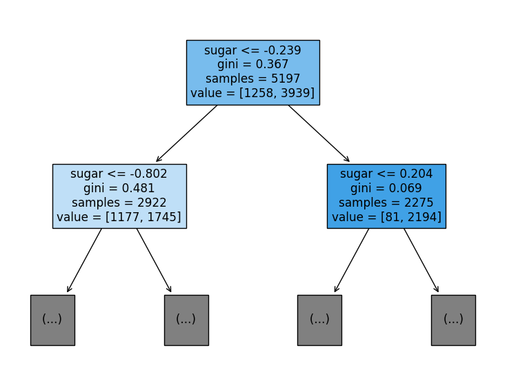
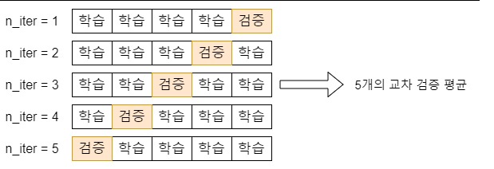

# 2 데이터 다루기

## 2-1 훈련 세트와 테스트 세트

> 핵심 키워드
> 
> - 지도 학습
> 
> - 비지도 학습
> 
> - 훈련 세트
> 
> - 테스트 세트

### 2-1-1) 지도 학습과 비지도 학습

- 지도 학습(supervised learning)
  
  - 데이터와 그에 따른 정답을 가지고 알고리즘이 정답을 맞히는 것을 학습하는 것
  
  - 훈련 데이터
    
    - 데이터 : 입력
      
      - 입력으로 사용된 방어의 길이, 무게 : 특성
    
    - 정답 : 타깃

- 비지도 학습(unsupervised learning)
  
  - 입력 데이터만 가지고 알고리즘이 학습하는 것

### 2-1-2) 훈련 세트와 테스트 세트

- 훈련 세트 : 훈련에 사용되는 데이터

- 테스트 세트 : 평가에 사용되는 데이터
  
  - 보통 훈련 세트에서 일부를 떼어 내어 활용

- 샘플 : 하나의 데이터
  
  - 49마리의 도미와 빙어 데이터가 있다면 각자 하나하나가 샘플이다. 즉, 49개의 샘플이 있는 것이다.

- 샘플링 편향 : 훈련 세트와 테스트 세트에 샘플이 골고루 섞여 있지 않은 것
  
  - 49마리의 도미와 빙어 데이터를 35마리의 도미로 구성된 훈련 세트와 14마리의 빙어로 구성된 테스트 세트로 나눈다면 샘플링 편향이다.

## 2-2 데이터 전처리

> 표준 점수로 특성의 스케일을 변환하는 방법을 알자
> 
> 핵심 키워드
> 
> - 데이터 전처리
> 
> - 표준 점수
> 
> - 브로드 캐스팅

### 2-2-1) 사이킷런으로 훈련 세트와 테스트 세트 나누기

- train_test_split() : 전달되는 리스트나 배열을 섞어서 비율에 맞게 훈련 세트와 테스트 세트로 나누어 줌.

### 표준 점수와 표준 편차

# 3 회귀 알고리즘과 모델 규제

> 농어의 무게를 예측하라

## 3-1 K-최근접 이웃 회귀

## 3-2 선형 회귀

## 3-3 특성 공학과 규제

# 4 다양한 분류 알고리즘

> 럭키백의 확률을 계산하라!

## 4-1 로지스틱 회귀

## 4-2 확률적 경사 하강법

# 5 트리 알고리즘

> 화이트 와인을 찾아라!

## 5-1 결정 트리

> 핵심 키워드
> 
> - 결정 트리
> 
> - 불순도
> 
> - 정보 이득
> 
> - 가지치기
> 
> - 특성 중요도

### 5-1-1) 로지스틱 회귀로 와인 분류하기

- [와인샘플데이터](https://bit.ly/wine_csv_data) 가져오기

```py
from sklearn.model_selection import train_test_split
from sklearn.preprocessing import StandardScaler
from sklearn.linear_model import LogisticRegression
import pandas as pd
import numpy as np


wine = pd.read_csv('https://bit.ly/wine_csv_data')

# 데이터 분석
# 각 열의 데이터 타입과 누락된 데이터가 있는지 확인
wine.info()
# 열에 대한 간략한 통계를 출력
wine.describe()

# 데이터 분류
# 넘파일 배열로 교체, 데이터(입력)와 타겟(정답)으로 분류
data = wine[['alcohol', 'sugar', 'pH']].to_numpy()
target = wine['class'].to_numpy()
# 훈련 세트와 테스트 세트로 분류
# 훈련 세트 : 5197개, 테스트 세트 : 1300개
train_input, test_input, train_target, test_target = train_test_split(data, target, test_size=0.2, random_state=42)

# 데이터 전처리
# StandardScaler 클래스를 사용한 훈련 세트 전처리
# 표준 점수로 변환됨
ss = StandardScaler()
ss.fit(train_input)
train_scaled = ss.transform(train_input)
test_scaled = ss.transform(test_input)

# 로지스틱 회귀 모델 훈련
lr = LogisticRegression()
lr.fit(train_scaled, train_target)
print(lr.score(train_scaled, train_target))
print(lr.score(test_scaled, test_target))
# 0.7808350971714451
# 0.7776923076923077
# 과소적합이라 볼 수 있다.
print(lr.coef_, lr.intercept_)
# [[ 0.51270274  1.6733911  -0.68767781]] [1.81777902]
```

### 5-1-2) 결정트리(Decision Tree)

> 스무고개
> 
> 표준화 전처리를 할 필요가 없다.
> 
> 이유를 설명하기 쉽다.

```python
from sklearn.model_selection import train_test_split
from sklearn.preprocessing import StandardScaler
from sklearn.tree import DecisionTreeClassifier
import pandas as pd


wine = pd.read_csv('https://bit.ly/wine_csv_data')

# 데이터 분석
# 각 열의 데이터 타입과 누락된 데이터가 있는지 확인
wine.info()
# 열에 대한 간략한 통계를 출력
wine.describe()

# 데이터 분류
# 넘파일 배열로 교체, 데이터(입력)와 타겟(정답)으로 분류
data = wine[['alcohol', 'sugar', 'pH']].to_numpy()
target = wine['class'].to_numpy()
# 훈련 세트와 테스트 세트로 분류
# 훈련 세트 : 5197개, 테스트 세트 : 1300개
train_input, test_input, train_target, test_target = train_test_split(data, target, test_size=0.2, random_state=42)
# 데이터 전처리
# StandardScaler 클래스를 사용한 훈련 세트 전처리
# 표준 점수로 변환됨
ss = StandardScaler()
ss.fit(train_input)
train_scaled = ss.transform(train_input)
test_scaled = ss.transform(test_input)

dt = DecisionTreeClassifier()
dt.fit(train_scaled, train_target)
print(dt.score(train_scaled, train_target))
print(dt.score(test_scaled, test_target))
# 0.996921300750433
# 0.8515384615384616
# 과대 적합
```

- max_depth 설정하기

- filled=True : 클래스 마다 색깔을 부여, 어떤 클래스의 비율이 높아지면 점점 진한색으로 표시

- feature_names: 특성의 이름을 전달

```python
plt.figure(figsize=(10, 7))
plot_tree(dt, max_depth=1, filled=True, feature_names=['alcohol', 'sugar', 'pH'])
plt.show()
```



### 5-1-3) 불순도

> gini : 지니 불순도(Gini impurity)

- DecisionTreeClassifier 클래스의 critertion 매개변수의 기본값이 gini이다.

- 결정 트리 모델은 부모 노드와 자식 노드의 불순도 차이가 가능한 크도록 트리를 성장 시킨다.

- 즉, 정보 이득이 최대가 되도록 데이터를 나눈다.

- 지니 불순도
  
  - 지니 불순도 = 1 - (음성 클래스 비율**2 + 양성 클래스 비율 ** 2)

- 엔트로피 불순도
  
  - -음성클래스 비율 * log(2)(음성클래스 비율) - 양성클래스 비율 * log(2)(양성 클래스 비율)

- 정보 이득
  
  - 부모와 자식 노드 사이의 불순도 차이
  
  - 결정 트리 모델은 정보이득이 최대가 되도록 데이터를 나눈다.
  
  - 정보이득 = 부모의 불순도 - (왼쪽 노드 샘플 수 / 부모의 샘플 수) * 왼쪽 노드의 불순도 - (오른쪽 노드의 샘플 수 / 부모의 샘플 수) * 오른쪽 노드의 불순도

### 5-1-4) 가지치기

> 트리의 최대 깊이를 지정하는 것

- max_depth 로 지정가능

- 결정트리는 표준화 전처리가 필요 없다.

```python
dt = DecisionTreeClassifier(max_depth=3, random_state=42)
dt.fit(train_input, train_target)
print(dt.score(train_input, train_target))
print(dt.score(test_input, test_target))
```

### 5-1-5. 특성 중요도

- 결정 트리는 어떤 특성이 가장 유용한지 나타내는 특성 중요도를 계산해 준다.

```python
print(dt.feature_importances_)

# [0.12345626 0.86862934 0.0079144 ]
```

## 5-2 교차 검증과 그리드 서치

> 핵심 키워드
> 
> - 검증 세트
> 
> - 교차 검증
> 
> - 그리드 서치
> 
> - 랜덤 서치

- 나오게된 배경을 살펴보자!
  
  - 위에서 작성된 결정트리가 max_depth를 3 말고 다른 값으로 하면 성능이 달라진다.
  
  - 모든 값을 다 시도할 수는 없지만 많은 값을 테스트 해보며 맞춰간다 하면
  
  - 이런 저런 값으로 모델을 많이 만들어서 테스트 세트로 평가하면 결국 테스트 세트에 잘 맞는 모델이 만들어 지는 것이 아닌가?
  
  - 즉, 테스트 세트는 모델을 만들고 나서 마지막에 딱 한 번만 사용하는 것이 좋다.

### 5-2-1) 검증 세트

- 테스트 세트를 사용하지 않으면 모델이 과대적합인지 과소적합인지 판단하기 어렵다.

- 테스트 세트를 사용하지 않고 이를 측정하는 간단한 방법은 훈련 세트를 또 나누는 것!

- 이 데이터를 **검증세트**라 부른다.

- 즉 전체 데이터에서 훈련세트 : 검증세트 : 테스트세트를 6:2:2의 비율로 만드는 것이다.
  
  - 훈련 데이터가 아주 많다면 단 몇 %만 떼어 놓아도 전체 데이터를 대표하는데 문제가 없다.

```python
import pandas as pd
from sklearn.model_selection import train_test_split
from sklearn.tree import DecisionTreeClassifier

# 데이터 불러오기
wine = pd.read_csv('https://bit.ly/wine_csv_data')
data = wine[['alcohol', 'sugar', 'pH']].to_numpy()
target = wine['class'].to_numpy()

# 세트 나누기
# 훈련 세트와 테스트 세트 분배
train_input, test_input, train_target, test_target = train_test_split(data, target, test_size=0.2, random_state=42)
# 훈련 세트를 다시 훈련 세트와 검증 세트로 분배
sub_input, val_input, sub_target, val_target = train_test_split(train_input, train_target, test_size=0.2, random_state=42)
# 즉 sub : 훈련 세트, val : 검증 세트, test : 테스트 세트

dt = DecisionTreeClassifier(random_state=42)
dt.fit(sub_input, sub_target)
print(dt.score(sub_input, sub_target))
print(dt.score(val_input, val_target))

# 0.9971133028626413
# 0.864423076923077
```

### 5-2-2) 교차 검증

> 검증 세트를 만드느라 훈련 세트가 줄었다.
> 
> 교차 검증을 이용하면 안정적인 검증 점수를 얻고 훈련에 더 많은 데이터를 사용할 수 있다.
> 
> cross_validate()

- k-폴드 교차 검증
  
  - 아래는 다섯개의 부분으로 나눴으므로
    
    - 5-폴드 교차 검증
- 교차 검증을 수행하면 입력한 모델에서 얻을 수 있는 최상의 검증 점수를 가늠해 볼 수 있다.



```python
# 교차 검증
from sklearn.model_selection import cross_validate
scores = cross_validate(dt, train_input, train_target)
print(scores)
#{'fit_time': array([0.00700116, 0.00801253, 0.00597191, 0.00602841, 0.00600123]),
# 'score_time': array([0.00099945, 0.        , 0.00100088, 0.        , 0.        ]),
# 'test_score': array([0.86923077, 0.84615385, 0.87680462, 0.84889317, 0.83541867])}

# test_score : 검증 폴드의 점수, 여기선 5개로 나누었으니 5개의 평균이 된다.
print(np.mean(scores['test_score']))
# 0.855300214703487
```

- 주의점 : cross_validate()는 훈련 세트를 섞어 폴드를 나누지 않는다.

- 만약 교차 검증을 할 때 훈련 세트를 섞으려면 splitter(분할기)를 지정

- cross_validate()는 기본적으로 회귀 모델일 경우 KFold 분할기를 사용

- 분류 모델일 경우 타깃 클래스를 골고루 나누기 위해 StratifiedKFold를 사용

```python
# 기본적으로 회귀 모델일 경우 KFold 분할기를 사용하고
# 분류 모델일 경우 타깃 클래스를 골고루 나누기 위해 StratifiedKFold를 사용
from sklearn.model_selection import StratifiedKFold
# splitter(분할기) 지정
scores = cross_validate(dt, train_input, train_target, cv=StratifiedKFold())
print(np.mean(scores['test_score']))
# 0.855300214703487

# 만약 훈련 세트를 섞은 후 10-폴드 교차 검증을 수행하려면
splitter = StratifiedKFold(n_splits=10, shuffle=True, random_state=42)
scores = cross_validate(dt, train_input, train_target, cv=splitter)
print(np.mean(scores['test_score']))
# 0.8574181117533719
```

### 5-2-3) 하이퍼파라미터 튜닝

> 모델이 학습할 수 없어서 사용자가 지정해야만 하는 파라미터
> 
> 사람의 개입 없이 하이퍼파라미터 튜닝을 자동으로 수행하는 기술을 AutoML이라고 한다.

- 한 매개변수의 최적값을 찾고 다른 매개변수의 최적값을 찾는 것은 안된다!

- 한 매개변수의 최적값은 다른 매개변수의 값이 바뀌면 함께 달라진다.

- 따라서 동시에 바꿔가며 최적의 값을 찾아야 한다.

#### 5-2-3-1) 그리드 서치(Grid Search)

> GridSearchCV 클래스는 하이퍼파라미터 탐색과 교차 검증을 한 번에 수행한다!

- GridSearchCV의 cv매개변수 기본값은 5이다.

- n_jobs를 통해 작업을 진행할 cpu코어수를 지정할 수 있다.
  
  - 기본값: 1 , 전체 : -1

- 검증 점수가 가장 높은 모델은 gs객체의 best_estimator_속성에 저장되어 있다.

- 매개변수는 best_params_속성에 저장되어 있다.

- 각 매개변수에서 수행한 교차 검증의 평균 점수는 cv_results_속성의 'mean_test_score_'키에 저장되어 있다.

- 넘파이 argmax() 함수를 사용하면 가장 큰 값의 인덱스를 추출할 수 있다.

- min_impurity_decrease는 노드를 분할하기 위한 불순도 감소 최소량을 지정

- max_depth는 트리의 깊이를 제한

- min_samples_split은 노드를 나누기 위한 최소 샘플 수

- min_samples_leaf : 리프 노드가 되기 위한 최소 샘플의 개수
  
  - 어떤 노드가 분할하여 만들어질 자식 노드의 샘플 수가 이 값보다 작을 경우 분할하지 않는다.
1. 탐색할 매개변수를 지정

2. 훈련 세트에서 그리드 서치를 수행하여 최상의 평균 검증 점수가 나오는 매개변수 조합을 찾는다. 이 조합은 그리드 서치 객체에 저장된다.

3. 그리드 서치는 최상의 매개변수에서 (교차 검증에 사용한 훈련 세트가 아니라) 전체 훈련 세트를 사용해 최종 모델을 훈련한다. 이 모델도 그리드 서치 객체에 저장된다.

```python
from sklearn.model_selection import GridSearchCV
# 기본 매개변수를 사용한 결정 트리 모델에서 min_impurity_decrease 매개변수의 최적값을 찾자.
# 0.0001부터 0.0005까지 0.0001씩 증가하는 5개의 값을 시도하겠음
params = {'min_impurity_decrease': [0.0001, 0.0002, 0.0003, 0.0004, 0.0005]}
# GridSearchCV 클래스에 탐색 대상 모델과 params 변수를 전달하여 그리드서치 객체를 생성
# 그리드 서치 객체는 결정트리 모델 min_impurity_decrease 값을 바꿔가며 총 5번 실행
# GridSearchCV의 cv 매개변수 기본값은 5
# 따라서 min_impurity_decrease 값마다 5-폴드 교차 검증을 수행하므로
# 결국 총 5 * 5 = 25개의 모델을 훈련!
gs = GridSearchCV(DecisionTreeClassifier(random_state=42), params, n_jobs=-1)
gs.fit(train_input, train_target)
# 25개의 모델 중에서 검증 점수가 가장 높은 모델의 매개변수 조합으로
# 전체 훈련 세트에서 자동으로 다시 모델을 훈련한다.
dt = gs.best_estimator_

# 검증 점수가 가장 높은 모델
print(dt.score(train_input, train_target))
# 0.9615162593804117

# 검증 점수가 가장 높은 모델의 매개변수
print(gs.best_params_)
# {'min_impurity_decrease': 0.0001}

# 각 매개변수에서 수행한 교차 검증의 평균 점수
print(gs.cv_results_['mean_test_score'])
# [0.86819297 0.86453617 0.86492226 0.86780891 0.86761605]

# 가장 큰 값의 인덱스를 추출하여 확인해보기
best_index = np.argmax(gs.cv_results_['mean_test_score'])
print(gs.cv_results_['params'][best_index])
# {'min_impurity_decrease': 0.0001}
```

- 좀 더 복잡한 매개변수 조합 탐색해보기

```python
# min_impurity_decrease : 노드를 분할하기 위한 불순도 감소 최소량
# max_depth : 트리의 깊이를 제한
# min_samples_split: 노드를 나누기 위한 최소 샘플 수
params = {'min_impurity_decrease': np.arange(0.0001, 0.001, 0.0001),
          'max_depth': range(5, 20, 1),
          'min_samples_split': range(2, 100, 10)}
# 교차 검증 횟수 : 9 * 15 * 10 = 1350개
# 기본 5-폴드 교차 검증을 수행하므로 만들어지는 모델의 수는 6,750개
gs = GridSearchCV(DecisionTreeClassifier(random_state=42), params, n_jobs=-1)
gs.fit(train_input, train_target)
print(gs.best_params_)
# {'max_depth': 14, 'min_impurity_decrease': 0.0004, 'min_samples_split': 12}
print(np.max(gs.cv_results_['mean_test_score']))
# 0.8683865773302731
```

- 매개변수의 간격을 0.0001 혹은 1로 설정했는데 이렇게 간격을 둔 것에 특별한 근거가 없다

#### 5-2-3-2) 랜덤 서치(Random search)

> 매개변수의 값이 수치일 때 값의 범위나 간격을 미리 정하기 어려울 수 있다.
> 
> 너무 많은 매개변수 조건이 있어 그리드 서치 수행 시간이 오래 걸릴 수 있다.
> 
> 이럴 때 랜덤 서치를 사용한다.

- 랜덤 서치는 매개변수 값의 목록을 전달하는 것이 아니라 매개변수를 샘플링할 수 있는 확률 분포 객체를 전달한다.

- 싸이파이의 stats 서브 패키지에 있는 uniform과 randint 클래스는 모두 주어진 범위에서 고르게 값을 뽑는데, 이를 '균등 분포에서 샘플링한다' 라고 한다.
  
  - randint : 정숫값
  
  - uniform : 실숫값

- n_iter : 샘플링 횟수 지정

```python
# 랜덤 서치
from scipy.stats import uniform, randint
from sklearn.model_selection import RandomizedSearchCV
params = {'min_impurity_decrease': uniform(0.0001, 0.001),
          'max_depth': randint(20, 50),
          'min_samples_split': randint(2, 25),
          'min_samples_leaf': randint(1, 25)}
gs = RandomizedSearchCV(DecisionTreeClassifier(random_state=42), params, n_iter=100, n_jobs=-1, random_state=42)
gs.fit(train_input, train_target)
# 검증 점수가 가장 높은 모델의 매개변수
print(gs.best_params_)
# {'max_depth': 39, 'min_impurity_decrease': 0.00034102546602601173, 'min_samples_leaf': 7, 'min_samples_split': 13}

# 교차 검증의 평균점수 중 최고값
print(np.max(gs.cv_results_['mean_test_score']))
# 0.8695428296438884

# 검증 점수가 가장 높은 모델
dt = gs.best_estimator_
print(dt.score(test_input, test_target))
# 0.86
```

## 5-3 트리의 앙상블

> 핵심 키워드
> 
> - 앙상블 학습
> 
> - 랜덤 포레스트
> 
> - 부트스트랩 샘플
> 
> - 엑스트라 트리
> 
> - 그레디언트 부스팅

### 5-3-1) 정형 데이터와 비정형 데이터

- 정형 데이터
  
  - 생선의 길이, 높이, 무게 등
  
  - 어떤 구조로 되어 있다는 뜻
  
  - 앙상블 학습이 최적화

- 비정형 데이터
  
  - 정형 데이터와 반대되는 데이터
  
  - 데이터베이스나 엑셀로 표현하기 어려운 것
  
  - 텍스트 데이터, 디지털카메라로 찍은 사진, 핸드폰으로 듣는 디지턱 음악 등
  
  - 신경망 알고리즘을 이용!

- 앙상블 학습
  
  - 정형 데이터를 다루는 데 가장 뛰어난 성과를 내는 알고리즘
  
  - 대부분 결정 트리를 기반으로 만들어져 있다.

### 5-3-2) 랜덤 포레스트

> 안정적인 성능 덕분에 널리 사용되고 있다.
> 
> 결정 트리를 랜덤하게 만들어 결정 트리(나무)의 숲을 만든다.
> 
> 각 결정 트리의 예츨을 사용해 최종 예측을 만든다.

- 부트스트랩 샘플
  
  - 훈련 세트의 크기와 같게 만든다
  
  - n개에서 중복하여 n개의 샘플을 뽑는 것
  
  - ex)1000개 가방에서 뽑고 다시 넣은 다음 뽑고 다시넣고를 반복 

- 각 노드를 분할할 때 전체 특성 중에서 일부 특성을 무작위로 고른 다음 이 중에서 최선의 분할을 찾는다.

- 분류 모델인 RandomForestClassifier는 기본적으로 전체 특성 개수의 제곱근만큼의 특성을 선택
  
  - 즉, 4개의 특성이 있다면 노드마다 2개를 랜덤하게 선택하여 사용
  
  - 다만, 회귀모델인 RandomForestRegressor는 전체 특성을 사용

- 분류 : 샘플을 몇 개의 클래스 중 하나로 분류
  
  - 각 트리의 클래스별 확률을 평균하여 가장 높은 확률을 가진 클래스를 예측으로 삼는다.

- 회귀 : 임의의 어떤 숫자를 예측하는 문제
  
  - 단순히 각 트리의 예측을 평균한다.

- 장점 : 랜덤하게 선택한 샘플과 특성을 사용하기 때문에 훈련 세트에 과대적합되는 것을 막아주고 검증 세트와 테스트 세트에서 안정적인 성능을 얻을 수 있다.

- return_train_score : True - 검증 점수 + 훈련 세트에 대한 점수도 같이 반환

- RandomForestClassifier는 기본적으로 100개의 결정 트리를 사용

- DecisionTreeClassifier가 제공하는 중요한 매개변수를 모두 제공
  
  - criterion, max_depth, max_features, min_samples_split, min_impurity_decrease, min_samples_leaf 등
  
  - 랜덤 포레스트는 결정 트리의 앙상블이기 때문이다.

- 하나의 특성에 과도하게 집중하지 않고 좀 더 많은 특성이 훈련에 기여할 기회를 얻는다

- 이는 과대적합을 줄이고 일반화 성능을 높이는 데 도움이 된다.

```python
from sklearn.model_selection import cross_validate
from sklearn.ensemble import RandomForestClassifier
# return_train_score : True - 검증 점수 + 훈련 세트에 대한 점수도 같이 반환
# RandomForestClassifier는 기본적으로 100개의 결정 트리를 사용
# oob_score=True : 각 결정 트리의 OOB 점수를 평균하여 출력
rf = RandomForestClassifier(oob_score=True, n_jobs=-1, random_state=42)
scores = cross_validate(rf, train_input, train_target, return_train_score=True, n_jobs=-1)
print(np.mean(scores['train_score']), np.mean(scores['test_score']))
# 0.9973541965122431 0.8905151032797809

# 앞의 랜덤 포레스트 모델을
# 훈련 세트에 훈련한 후 특성 중요도 출력
rf.fit(train_input, train_target)
print(rf.feature_importances_)
# [0.23167441 0.50039841 0.26792718]

print(rf.oob_score_)
```

- 랜덤 포레스트는 자체적으로 모델을 평가하는 점수를 얻을 수 있다.

- OOB(out of bag) 샘플: 부트스트랩 샘플에 포함되지 않고 남는 샘플

- OOB샘플을 사용하여 부트스트랩 샘플로 훈련한 결정 트리를 평가할 수 있다.
  
  - 마치 검증 세트의 역할
  - OOB 점수를 사용하면 교차 검증을 대신할 수 있어서 결과적으로 훈련 세트에 더 많은 샘플을 사용할 수 있다.

```py
from sklearn.model_selection import cross_validate
from sklearn.ensemble import RandomForestClassifier
# return_train_score : True - 검증 점수 + 훈련 세트에 대한 점수도 같이 반환
# RandomForestClassifier는 기본적으로 100개의 결정 트리를 사용
# oob_score=True : 각 결정 트리의 OOB 점수를 평균하여 출력
rf = RandomForestClassifier(oob_score=True, n_jobs=-1, random_state=42)

print(rf.oob_score_)
# 0.8934000384837406
```

### 5-3-3) 엑스트라 트리

> 랜덤 포레스트와 매우 비슷하게 동작
> 
> But, 부트스트랩 샘플을 사용하지 않는다.

- 즉각 결정 트리를 만들 때 전체 훈련 세트를 사용

- 노드를 분할할 때 가장 좋은 분할을 찾는 것이 아니라 무작위로 분할

- 엑스트라 트리가 사용하는 결정 트리는 DecisionTreeClassifier의 splitter='random'인 결정 트리이다.

- 장점 : 랜덤하게 노드를 분할하기 때문에 계산속도가 빠르다

```python
# 엑스트라 트리
from sklearn.ensemble import ExtraTreesClassifier
et = ExtraTreesClassifier(n_jobs=-1, random_state=42)
scores = cross_validate(et, train_input, train_target, return_train_score=True, n_jobs=-1)
print(np.mean(scores['train_score']), np.mean(scores['test_score']))
# 0.9974503966084433 0.8887848893166506

# 훈련 세트에 훈련한 후 특성 중요도 출력
et.fit(train_input, train_target)
print(et.feature_importances_)
```

### 5-3-4) 그레이디언트 부스팅(Gradient Boosting)

>  깊이가 얕은 결정 트리를 사용하여 이전 트리의 오차를 보완하는 방식으로 앙상블 하는 방법

- GradientBoostingClassifier는 기본적으로 깊이가 3인 결정 트리를 100개 사용

- 경사 하강법을 사용하여 트리를 앙상블에 추가

- 분류 : 로지스틱 함수, 회귀 : 평균 제곱 오차 함수를 사용

- 장점
  
  - 결정 트리의 개수를 늘려도 과대적합에 매우 강함
  
  - 학습률을 증가시키고 트리의 개수를 늘리면 조금 더 성능이 향상될 수 있음

```python
# 그레이디언트 부스팅
from sklearn.ensemble import GradientBoostingClassifier

gb = GradientBoostingClassifier(random_state=42)
scores = cross_validate(gb, train_input, train_target, return_train_score=True, n_jobs=-1)
print(np.mean(scores['train_score']), np.mean(scores['test_score']))
# 0.8881086892152563 0.8720430147331015

# 트리의 개수를 늘리고 학습률을 증가시켜 보자!
gb = GradientBoostingClassifier(n_estimators=500, learning_rate=0.2, random_state=42)
scores = cross_validate(gb, train_input, train_target, return_train_score=True, n_jobs=-1)
print(np.mean(scores['train_score']), np.mean(scores['test_score']))
# 0.9464595437171814 0.8780082549788999

gb.fit(train_input, train_target)
print(gb.feature_importances_)
# [0.15872278 0.68011572 0.16116151]
```

#### 히스토그램 기반 그레이디언트 부스팅(Histogram-based Gradient Boos)

>  그레이디언트 부스팅의 속도와 성능을 더욱 개선한 것
> 
> 정형 데이터를 다루는 머신러닝 알고리즘 중에 가장 인기가 높다.

- 입력 특성을 256개의 구간으로 나눈다
  
  - 노드를 분할할 때 최적의 분할을 매우 빠르게 찾을 수 있다.
  
  - 256개의 구간 중에서 하나를 떼어 놓고 누락된 값을 위해서 사용
  
  - 따라서 입력에 누락된 특성이 있더라도 이를 따로 전처리할 필요가 없다.

- 트리의 개수를 지정하는데 n_estimators 대신 부스팅 반복 횟수를 지정하는 max_iter를 사용
  
  - 성능을 높이려면 max_iter 매개변수를 테스트

- permutation_importance
  
  - 특성을 하나씩 랜덤하게 섞어서 모델의 성능이 변화하는지 관찰하여 어떤 특성이 중요한지를 계산
  
  - 훈련 세트 뿐 아니라 테스트 세트에도 적용가능
  
  - 사이킷런에서 제공하는 추정기 모델에 모두 사용 가능
  
  - n_repeats : 랜덤하게 섞을 횟수 지정(default = 5)
  
  - 반환 객체
    
    - 중요도(importances)
    
    - 평균(importances_mean)
    
    - 표준편차(importances_std)

```python
# 히스토그램 기반 그레이디언트 부스팅
# from sklearn.experimental import enable_hist_gradient_boosting
from sklearn.inspection import permutation_importance
from sklearn.ensemble import HistGradientBoostingClassifier

hgb =HistGradientBoostingClassifier(random_state=42)
scores = cross_validate(hgb, train_input, train_target, return_train_score=True)
print(np.mean(scores['train_score']), np.mean(scores['test_score']))
# 0.9321723946453317 0.8801241948619236

hgb.fit(train_input, train_target)
# permutation_importance : 특성을 하나씩 랜덤하게 섞어서 모델의 성능이 변화하는지
# 관찰하여 어떤 특성이 중요한지를 계산
# 훈련 세트 뿐 아니라 테스트 세트에도 적용가능
# 사이킷런에서 제공하는 추정기 모델에 모두 사용 가능
# n_repeats : 랜덤하게 섞을 횟수 지정(default = 5)
result = permutation_importance(hgb, train_input, train_target,
                                n_repeats=10, random_state=42, n_jobs=-1)
print(result.importances_mean)
# [0.08876275 0.23438522 0.08027708]

result = permutation_importance(hgb, test_input, test_target,
                                n_repeats=10, random_state=42, n_jobs=-1)
print(result.importances_mean)
# [0.05969231 0.20238462 0.049     ]

print(hgb.score(test_input, test_target))
# 0.8723076923076923
```
